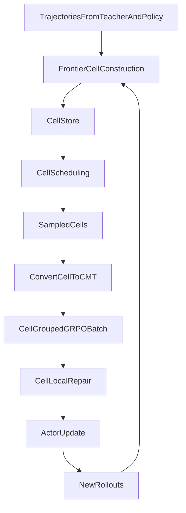

# Frontier Replay Cells (FRC) 设计文档

> **设计状态**: ✅ `FRC-lite` 已在仓库中接入主训练链；本文档同步记录设计意图与当前实现口径
>
> **设计日期**: 2026-03-06
>
> **主推方案**: `FRC-Lite`（memory-based frontier replay，无环境 checkpoint/restore）
>
> **扩展方案**: `Full FRC`（frontier 状态恢复后继续 rollout）
>
> **目标**: 将当前仓库从 whole-trajectory replay + GRPO 升级为以 frontier-conditioned continuation cells 为基本经验单位的 sparse-reward agent RL 框架。

---

## 0. 当前实现快照

以下内容描述的是**当前仓库里已经落地的 FRC-lite 版本**，后续章节若讲到更强实现，会明确标注为“建议 / 扩展”。

- 训练入口：
  - `scripts/run_alfworld_frc_lite.sh`
  - 该脚本会调用 `python launcher.py --with-alfworld --conf config/paper_alfworld_frc_lite.yaml`
- 当前主配置：
  - `config/paper_alfworld_frc_lite.yaml`
- replay 池初始化：
  - 启动时读取 teacher trajectory，并在 `ExperienceManager` 中构建 `frontier_task2cells`
- 当前 batch 中的 FRC 调度：
  - `frontier task` 只会从**当前 mini-batch**里选择，不会拿全局 replay task 替换原始 batch
  - 被选中的 frontier task 会减少 on-policy rollout 数；减少出来的预算用于 cell continuation replay
- 当前 FRC 的训练语义：
  - 对被选中的 frontier task，先正常 rollout，再把其中一部分当前 on-policy trajectory 投影成 frontier-conditioned continuation
  - replay continuation 与这些 projected on-policy continuation 一起进入 GRPO
- 当前 grouping 语义：
  - 优先使用 `cell_id` 对 continuation 分组
  - 若某个 replay cell 在当前 step 没有匹配到 on-policy continuation，且该 cell 目前仍是 teacher-only/无 on-policy 历史，则回退到 task-level group，避免 teacher-only cell 组内 advantage 退化为 0
- 当前 repair 实现：
  - `none / similarity_gated / mixture / dr3_local`
  - 其中 `dr3_local` 是 lightweight local-ratio proxy，不是单独训练的 local discriminator
  - 默认 `exp_is_correct=false`，不复用 whole-trajectory 级别 recorded old log prob 对齐
- 当前 frontier abstraction：
  - FRC-lite 第一版使用“最近 user/assistant 文本归一化”构造 `frontier_hash`
  - 还没有实现 inventory / object-state 级显式 abstraction

---

## 1. 一句话定义

Frontier Replay Cells 的核心思想是：

> 在 long-horizon、sparse-reward 的 agent RL 中，真正值得反复复用的经验不是整条轨迹，而是“从某个关键中间状态出发的一段 continuation 经验”。

形式化地，一个 cell 定义为：

\[
c_k = (h_k, \mathcal{S}_k, m_k)
\]

其中：

- \(h_k\): frontier prefix，表示到达某个关键中间状态的历史上下文
- \(\mathcal{S}_k\): 从该 frontier 出发收集到的 continuation / suffix 经验池
- \(m_k\): 该 frontier 的统计量，例如成功率、可恢复性、学习进展、来源占比等

---

## 2. 与当前系统的关系

当前仓库已经有 replay 与 mixed-policy GRPO 主干，但经验粒度仍然是 `trajectory`。

### 2.1 当前 replay 与样本单位

在 `ExperienceManager` 中，当前 replay 存储仍是按 `task_id -> trajectories`：

```331:420:agentevolver/module/exp_manager/exp_manager.py
def save_trajectories_to_memory(self, trajectories: List[Trajectory]) -> None:
    for traj in trajectories:
        task_id = traj.task_id
        ...
        self.task2trajectories[task_id].append(traj)

def get_offpolicy_trajectories_from_memory(
    self,
    task_id: str,
    num_trajectories: int = 1,
    use_saved_entropy: bool = True
) -> List[Trajectory]:
    available_trajectories = self.task2trajectories.get(task_id, [])
    ...
```

在 `Linear_CMT` 中，当前训练样本单位也是整条 trajectory：

```546:581:agentevolver/module/context_manager/cmt_linear.py
def group_tokenize(self):
    sample_arr = []
    ext_steps=self.full_context
    cmt_tokenized = self.tokenize_steps(ext_steps=ext_steps)
    sample = Sample(
        data_id=self.data_id,
        rollout_id=self.rollout_id,
        task_id=self.task_id,
        ...
        reward_scores=self.reward.model_dump(),
    )
    sample.truncate_output_ids()
    sample_arr += [sample]
    return sample_arr
```

### 2.2 当前 GRPO grouping

当前仓库原始 GRPO advantage 分组依赖 `group_ids -> uid`，本质上仍是 task 级 grouping：

```2806:2815:agentevolver/module/trainer/ae_ray_trainer.py
if "group_ids" in batch.batch:
    group_ids = batch.batch["group_ids"].cpu().numpy()
    batch.non_tensor_batch["uid"] = np.array([str(int(gid)) for gid in group_ids], dtype=object)
else:
    batch.non_tensor_batch["uid"] = np.array([str(uuid.uuid4()) for _ in range(len(batch.batch))], dtype=object)
```

FRC 的核心改动不是重写 GRPO，而是把：

- replay 单位：`trajectory -> cell`
- grouping 单位：`task -> frontier cell`

在当前实现里，这个“frontier cell grouping”进一步细化为：

- 默认：同一 `cell_id` 的 projected on-policy continuation + replay continuation 在同一组比较
- 早期 fallback：若某个 cell 当前没有匹配到 on-policy continuation，则允许该 replay continuation 暂时退回 task-level 组，避免 teacher-only cell 直接形成零 advantage 组

---

## 3. 为什么 FRC 更适合当前问题

在 `AlfWorld` 和当前训练口径下的 `ScienceWorld` 中，关键问题不是“模型不会输出 expert token”，而是：

> 模型经常到不了有学习价值的中间状态，因此后续高价值 continuation 很难被复用。

当前训练 reward 也体现了这一点。训练时最终 reward 被压缩为 trajectory-level 的终局 outcome，并仅打到 response 末尾：

```318:323:agentevolver/module/trainer/ae_ray_trainer.py
reward_scores_list = [item["outcome"] for item in data.non_tensor_batch["reward_scores"]]
reward_scores = torch.tensor(reward_scores_list, device=reward_tensor.device, dtype=torch.float32)
reward_tensor[torch.arange(len(data)), response_lengths - 1] = reward_scores
```

因此 whole-trajectory replay 的问题在于：

- 前半段很多步骤模型可能已经学会，重复 replay 成本高
- 真正难的往往是某个局部 continuation
- 以整条轨迹为单位进行 repair / scheduling，不够聚焦

FRC 将训练重心迁移到：

- 哪些 frontier 值得建成 memory
- 哪些 frontier 最值得当前训练预算
- 同一 frontier 下，哪些 continuation 值得信，哪些需要修正

---

## 4. FRC-Lite：主推落地方案

`FRC-Lite` 的目标是在**不改环境接口、不引入 checkpoint/restore** 的前提下，把 replay 粒度升级为 frontier cell。

### 4.1 核心定义

一个 `FrontierCell` 是一个 memory object，表示：

- 一个 frontier prefix
- 一个 continuation pool
- 一组 cell stats

建议的数据结构如下：

```python
FrontierCell(
    cell_id: str,
    task_id: str,
    frontier_hash: str,
    frontier_depth: int,
    prefix_steps: list[dict],
    suffix_pool: list[CellContinuation],
    stats: CellStats,
)

CellContinuation(
    continuation_id: str,
    source: str,  # teacher | onpolicy_success | onpolicy_partial | replay
    suffix_steps: list[dict],
    success_label: float,
    final_reward: float,
    progress_score: float,
    old_log_probs: list[float] | None,
    metadata: dict,
)
```

### 4.2 主流程



### 4.3 与 Full FRC 的边界

`FRC-Lite` 不做以下事情：

- 不从环境中间状态恢复
- 不从 frontier 真正继续 rollout
- 不要求环境提供 snapshot / restore

它做的是：

- 从历史轨迹中识别 frontier
- 将 prefix 作为上下文，将 suffix 作为 continuation 进行 replay
- 将 replay / repair / scheduling 的粒度迁移到 cell

因此主文中应明确表述为：

> A memory-based frontier replay framework over frontier-conditioned continuations.

而不是过度声称在线状态恢复。

---

## 5. 用 AlfWorld 解释一个 cell 如何构建、如何 replay、如何更新 GRPO

### 5.1 例子任务

以 `put a hot apple in fridge` 为例，一个成功 trajectory 可能是：

1. `go to kitchen`
2. `open microwave`
3. `put apple in microwave`
4. `close microwave`
5. `toggle microwave on`
6. `open microwave`
7. `take apple from microwave`
8. `open fridge`
9. `put apple in fridge`

### 5.2 构建 cell

假设模型早期常见现象是：

- 能找到 apple
- 能完成加热
- 但最后不会去 fridge 或放入 fridge

那么一个自然的 frontier 是：

- `hot apple already in inventory`

这个 frontier 对应的 cell 为：

- `prefix_steps`:
  - `go to kitchen`
  - `open microwave`
  - `put apple in microwave`
  - `close microwave`
  - `toggle microwave on`
  - `open microwave`
  - `take apple from microwave`
- `suffix_pool`:
  - 成功 suffix: `open fridge -> put apple in fridge`
  - 失败 suffix: `look -> inventory -> stop`
  - teacher suffix
  - 后续训练中从该 frontier 派生的新 continuation

### 5.3 replay

在 `FRC-Lite` 中，replay 的含义是：

- 将 `prefix_steps` 作为 prompt/context
- 将 `suffix_steps` 作为 off-policy continuation
- 送入当前 `CMT -> Sample -> DataProto -> actor loss` 管线

也就是说：

- 旧方法在学“从任务起点到终点”
- FRC 在学“从当前 frontier 之后怎么接”

### 5.4 GRPO 更新

当前 GRPO 是“同一个 task 的多 rollout 做组内比较”。  
FRC 中的理想语义应改为：

- 同一个 `cell_id` 的多条 continuation 构成一个 group

例如同一个 cell 采样到以下 continuation：

- 4 条当前策略 continuation
- 2 条 self replay continuation
- 1 条 teacher continuation
- 1 条历史成功 continuation

这些 continuation 的 outcome 在 cell 内进行组间比较，得到该 frontier 下的 advantage。

因此：

- 旧 grouping：同 task，多条完整 trajectory
- 新 grouping：同 frontier，多条 continuation suffix

当前仓库里的 FRC-lite 采用的是这一语义的工程化版本：

- replay continuation 优先进入 `cell_id` group
- 被选中的 frontier task 会从当前 rollout 中投影出 frontier-conditioned on-policy continuation，与 replay continuation 对齐
- 对于当前 step 没有成功投影出 matching on-policy continuation 的 cell，允许暂时按 task fallback 分组，保证训练稳定性而不破坏主方法

这就是当前实现中的核心训练语义。

---

## 6. Frontier Cell Construction

### 6.1 Frontier 来源

推荐三类来源：

1. `teacher-seeded frontier`
   - 从 expert trajectory 切出高质量 frontier + suffix
2. `on-policy success frontier`
   - 当前策略成功 trajectory 中切出的 frontier
3. `partial-progress frontier`
   - 未最终成功，但已明显推进任务的 trajectory

第三类尤其重要，因为 sparse-reward 任务里很多高价值 frontier 首先来自“接近成功但未完成”的 trajectory，而不是最终成功。

### 6.2 Frontier 切分原则

第一版不追求完美 MDP state 等价，而采用轻量 state abstraction。

当前实现中的 `frontier_hash` 规则是：

- task 相同
- 取 prefix 中最近的 `user` 文本与最近的 `assistant` 文本
- 做大小写归一化、空白压缩、字符裁剪后拼成 hash key

也就是说，当前版本使用的是**text-conditioned frontier abstraction**，而不是显式的 inventory/object-state abstraction。

这是一种 FRC-lite 的工程折中，优点是：

- 不依赖环境额外接口
- 可直接复用已有 trajectory 文本
- 便于快速在 AlfWorld / ScienceWorld 主链中接通

后续若需要更强版本，可再升级为：

- task template / task type
- 当前 observation 的归一化表示
- inventory
- 关键对象状态关键词
  - `microwave open/closed`
  - `fridge open/closed`
  - `apple hot/cold/in inventory`

### 6.3 Cell 合并原则

两段 prefix 若满足：

- 任务相同
- frontier abstraction 相同

则聚合进同一个 cell 的 `suffix_pool`。

这样 cell 不再是“固定的一条切片”，而是“围绕同一 frontier 聚合出来的一组 continuation memory”。

---

## 7. Cell-Conditioned Replay Repair

### 7.1 作用

repair 的作用不是定义 cell，而是控制：

> 同一 frontier 下的历史 continuation 应该以什么可信度进入当前策略更新。

它要解决的问题包括：

- off-policy 偏差
- teacher / replay lock-in
- 局部 continuation 过窄导致的过拟合
- 高方差、不稳定更新

### 7.2 为什么是 local repair

FRC 不是在全局上修：

\[
\pi(\tau) \text{ vs } q(\tau)
\]

而是在固定 frontier 条件下修：

\[
\pi(\tau_{k:T}\mid h_k) \text{ vs } q_k(\tau_{k:T}\mid h_k)
\]

因此 repair 的范围更局部、语义更自然、方差更小。

### 7.3 备选 repair 方案

#### A. `no-repair`

- 作为最朴素 baseline
- 直接把 replay continuation 当 off-policy continuation 使用

#### B. `DR3-local`

- 将当前 DR3 从全局 mixed-policy correction 改为 cell-conditioned correction
- 在同一个 cell 内估计当前 continuation 与历史 continuation 的 relative density ratio
- 优点：统计语义最强，容易与现有 DR3 实现衔接

当前仓库里的 `dr3_local` 实现口径需要明确区分：

- 已实现：lightweight local-ratio proxy + cell 内归一化 + advantage scaling
- 未实现：单独训练 local discriminator 的完整 DR3-local

#### C. `similarity-gated repair`

- 不显式估 density ratio
- 只估计 replay suffix 与当前策略在该 frontier 下的接近程度
- 可用信号：
  - 当前 policy 对该 suffix 的平均 logprob
  - continuation embedding similarity
  - entropy / recoverability proxy
- 输出一个 gate `w in [0, 1]`

#### D. `mixture repair`

- 将 replay continuation 视作 cell-level reference policy
- 在该 cell 内进行局部混合，而不是严格 importance correction
- 适合作为更简洁的 repair baseline

### 7.4 主文建议

主文中推荐：

- 主方案：`DR3-local`
- 备选消融：`no-repair`、`similarity-gated`、`mixture repair`

这样既保留当前仓库在 DR3 上的积累，又避免整篇论文重新退化成“DR3 的另一个版本”。

---

## 8. Progress-Driven Cell Scheduling

### 8.1 为什么需要 scheduling

在低交互预算下，决定样本效率的不只是 replay 有没有用，而是：

> 训练预算打在哪些 frontier 上。

太难的 frontier：

- 当前策略几乎不可能学到

太容易的 frontier：

- 已经基本掌握，再 replay 收益有限

最有价值的是：

- “差一点突破”的 frontier

### 8.2 第一版 utility

推荐从最简单的二项式不确定性分数开始：

\[
u_k = \hat p_k (1 - \hat p_k)
\]

其中 \(\hat p_k\) 为从 cell \(k\) 出发成功的经验成功率。

### 8.3 可增强的 utility

在此基础上加入：

- `recent_improvement`
- `novelty`
- `teacher_seed_bonus`
- `source_diversity`

对于 `ScienceWorld`，还可以额外加：

- `raw score`
- `goal progress`
- `delta score`

### 8.4 调度消融

必须至少做两档：

- `uniform cell replay`
- `progress-driven cell replay`

否则 reviewer 很容易质疑 scheduling 只是包装性概念。

---

## 9. 代码结构改造建议

### 9.1 数据结构层

建议新增文件：

- `agentevolver/schema/frontier_cell.py`

定义：

- `FrontierCell`
- `CellContinuation`
- `CellStats`

不建议继续把 cell 语义全部塞进 `Trajectory.metadata`，否则类型边界会越来越模糊。

### 9.2 ExperienceManager

重点修改文件：

- `agentevolver/module/exp_manager/exp_manager.py`

当前已实现的关键成员 / 接口包括：

- `frontier_task2cells`
- `frontier_cell_id2cell`
- `build_frontier_cells_from_trajectories()`
- `select_frontier_cells_for_tasks()`
- `sample_frontier_replay_samples_from_cells()`
- `project_trajectories_to_frontier_samples()`

保留：

- `task2trajectories`

用于：

- baseline
- fallback
- whole-trajectory ablation

### 9.3 EnvManager / CMT

重点修改文件：

- `agentevolver/module/env_manager/env_manager.py`
- `agentevolver/module/context_manager/cmt_linear.py`

新增接口：

- `convert_cell_to_cmt()`

设计原则：

- `prefix_steps -> prompt`
- `suffix_steps -> response`
- 保持现有 tokenization 主干尽量不变

当前实现补充：

- 通过 `frontier_response_start_index` 明确 prefix/response 切分点
- projected on-policy frontier sample 不会被标记为 replay
- replay frontier sample 会保留 `frontier_cell_id / frontier_group_id / frontier_source`

### 9.4 Trainer / GRPO

重点修改文件：

- `agentevolver/module/trainer/ae_ray_trainer.py`

改动要点：

- `group_ids / uid` 的主语义从 `task` 改成 `cell`
- 一个 GRPO group 表示“同一 frontier 下的一组 continuation”
- repair 插在 off-policy continuation 进入 actor loss 前

当前实现补充：

- frontier task 在当前 batch 内选择，而不是替换 batch 为全局 replay tasks
- rollout 后会把当前 on-policy trajectory 投影成 frontier-conditioned continuation，再与 replay continuation 合并
- `frontier_repair_scale` 作用在 advantage 上

### 9.5 Repair 接口设计

建议新增：

- `agentevolver/module/exp_manager/cell_repair.py`

提供统一接口：

```python
repair_weight = repair_module.compute_weight(
    cell=batch_cell,
    continuation=batch_continuation,
    current_policy_stats=...,
)
```

从而支持：

- `none`
- `dr3_local`
- `similarity_gate`
- `mixture`

### 9.6 配置建议

当前已落地：

- `config/paper_alfworld_frc_lite.yaml`

该配置中已经包含：

- `frontier_replay.enable`
- `exp_ratio`
- `num_cells_per_task`
- `continuations_per_cell`
- `schedule_mode`
- `repair_mode`
- `exp_is_correct`

后续若做论文型消融，再扩展为多份配置文件：

- `config/paper_alfworld_frc_no_repair.yaml`
- `config/paper_alfworld_frc_dr3local.yaml`
- `config/paper_alfworld_frc_simgate.yaml`
- `config/paper_alfworld_frc_mixture.yaml`

### 9.7 训练脚本建议

当前 paper 实验入口已经存在：

- `scripts/run_paper_alfworld.sh`
- `scripts/run_paper_sciworld.sh`
- `config/paper_alfworld_dr3.yaml`
- `config/paper_sciworld_dr3.yaml`

当前已落地：

- `scripts/run_alfworld_frc_lite.sh`

其行为是：

- 激活 `agentevolver` 环境
- 检查 teacher 数据路径
- 通过 `launcher.py --with-alfworld --conf config/paper_alfworld_frc_lite.yaml` 启动训练

后续若做论文型批量实验，再扩展为统一管理脚本：

- `scripts/run_paper_alfworld_frc.sh`
- `scripts/run_paper_sciworld_frc.sh`

---

## 10. 实验方案

### 10.1 数据设定

统一设定：

- `AlfWorld`: `800 tasks`, `800 expert trajectories`
- `ScienceWorld`: `800 tasks`, `800 expert trajectories`

这意味着 teacher/expert 覆盖到每个训练 task。

teacher 数据路径可以沿用当前 paper 配置风格，例如：

- `data/teacher_trajectories/qwen72b/alfworld_qwen72b_filtered.pkl`
- `data/teacher_trajectories/sciworld_gold_qwen72b_800_filtered.pkl`

### 10.2 为什么不能只看 100 steps

当前 `batch_size=8` 时：

- `100 training steps` 大致等价于 `800 task exposures`
- 平均每个 task 只被看到约 1 次

这非常适合研究极低预算样本效率，但也容易把结论限制在“只看一次任务”的 regime。

因此推荐同时报告：

- `100 steps`
- `200 steps`

其中：

- `100 steps` 反映极低预算
- `200 steps` 反映方法是否在更长训练中仍有优势

因此建议采用“三段式”预算：

- `50 steps`: pilot / low-budget 曲线起点
- `100 steps`: 主文低预算表
- `200 steps`: 主文或补充中的中预算表

### 10.3 主结果口径：固定交互预算

主文应优先强调：

> 在相同环境交互预算下的方法比较。

原因：

- FRC / replay 类方法本来就主打 sample efficiency
- 若只对齐 optimizer steps，不同方法实际消耗的 on-policy env interaction 可能不同
- 这会让“更有效”与“看得更多”混淆

推荐两个预算轴同时记录：

1. `prompt/task exposures`
2. `actual environment steps`

若只能保留一个主轴，优先保留：

- `actual environment steps`

推荐做法：

- 训练时记录每个 update 中真实发生的 on-policy env transitions
- 所有主曲线统一画成 `success rate vs actual env steps`
- 同时在附录中给出 `success rate vs optimizer steps`

### 10.4 补充结果口径：固定训练步数

补充实验用：

- `100 steps`
- `200 steps`

用于回答：

- FRC 是否只在低预算 regime 有效
- 更长训练下是否仍优于 whole-trajectory replay / DR3

### 10.5 推荐预算表述

建议在论文中明确区分两个预算概念：

| 预算类型 | 推荐用途 | 说明 |
|------|------|------|
| `optimizer steps` | 补充实验 | 与当前 `100/200 steps` 设定保持连续 |
| `task exposures` | 辅助统计 | 对应 `batch_size=8` 时见过多少个 task 实例 |
| `actual env steps` | 主结果 | 最能体现 replay 方法的 sample efficiency |

对当前设定，一个直观解释是：

- `800 tasks`, `batch_size=8`, `100 steps` 约等于“每个 task 平均见 1 次”
- `200 steps` 约等于“每个 task 平均见 2 次”

但对于 replay 方法，真正公平的比较仍应回到 `actual env steps`，因为 replay continuation 不消耗新的环境交互。

### 10.6 推荐实验矩阵

#### 主对比方法

- `On-policy GRPO`
- `Whole-trajectory teacher replay`
- `DR3`（当前主方案）
- `FRC-Lite + no-repair`
- `FRC-Lite + DR3-local`
- `FRC-Lite + similarity-gated repair`
- `FRC-Lite + mixture repair`

#### 调度消融

- `uniform replay`
- `progress-driven replay`

#### 粒度消融

- `whole trajectory`
- `random sub-trajectory`
- `frontier replay cell`

#### 训练预算

- fixed training steps: `100`, `200`
- fixed interaction budget: 与上述训练过程对应的等总 env interactions

### 10.7 推荐主表与附表

主表建议：

- 两环境下固定交互预算结果
- 每个方法最终 success rate

附表建议：

- `100 steps`
- `200 steps`
- 不同 repair 的 ablation
- 不同 scheduling 的 ablation

### 10.8 推荐曲线

至少绘制：

- success rate vs env steps
- success rate vs training steps
- per-cell success estimate 演化
- replay source composition 演化
- repair 权重分布

对 `100 -> 200` 的扩展实验，推荐额外报告：

- AUC over env-step curve
- 在 `100 steps` 和 `200 steps` 的 success rate 增益
- 同一 budget 下的平均 active cell 数

### 10.9 推荐日志指标

建议新增记录：

- `frc/num_cells_total`
- `frc/num_active_cells`
- `frc/replay_cell_depth_mean`
- `frc/replay_cell_success_mean`
- `frc/replay_teacher_ratio`
- `frc/replay_self_ratio`
- `frc/progress_score_mean`
- `frc/cell_sampling_entropy`
- `frc/repair_weight_mean`
- `frc/repair_weight_p90`

另外，建议保留当前 DR3 相关指标以支持 `DR3-local` 分析：

- `dr3/disc_acc`
- `dr3/w_off_mean`
- `dr3/w_off_p99`
- `dr3/ess_off_window`

---

## 11. 论文叙事建议

### 11.1 正确主线

主线应写成：

> 我们重新定义 sparse-reward agent RL 中 replay 的基本经验单位：从 whole trajectories 转为 frontier-conditioned continuation cells。

而不是：

> 我们再做一个更稳的 prefix guidance / off-policy correction。

### 11.2 三个核心模块

主文最好只保留三个模块：

1. `Frontier Cell Construction`
2. `Cell-Conditioned Replay Repair`
3. `Progress-Driven Cell Scheduling`

DR3、ESS、dual、gap gate 等具体技巧应在主线下作为实现选择或 appendix 增强，不要盖过 cell granularity 本身。

### 11.3 teacher 的定位

teacher 在 FRC 中不应是训练主角，而应作为：

- frontier 初始化来源
- 极难 frontier 的高质量 seed continuation
- 早期 calibration signal

这比把 expert prefix 写成方法中心更不容易撞到已有工作。

---

## 12. Reviewer 视角的风险与应对

### 风险 1：只是 sub-trajectory replay 换名

应对：

- 强调 cell 有自己的 identity、stats 与 scheduling
- 不只是切片，而是“围绕 frontier 聚合 continuation memory”

### 风险 2：frontier 定义过于 heuristic

应对：

- 采用轻量统一的 state abstraction
- 提供 frontier construction ablation
- 显示方法对 frontier hash 细节有一定鲁棒性

### 风险 3：收益其实来自 teacher 更多或训练更久

应对：

- 固定交互预算比较
- teacher source 对齐
- fixed-step 补充实验

### 风险 4：没有环境恢复，不够“真 frontier”

应对：

- 明确当前版本是 `memory-based frontier replay`
- 将 `Full FRC` 作为后续扩展讨论
- 不夸大为 online state restoration

---

## 13. Full FRC：后续增强路线

`Full FRC` 的目标是：

- 从某个 frontier 的环境状态恢复
- 直接从该状态继续 rollout
- 将新 continuation 回填到 cell

这需要环境层支持：

- checkpoint
- restore
- 可序列化状态

当前以下接口尚未提供此能力：

- `AgentGym/agentenv-alfworld/agentenv_alfworld/env_wrapper.py`
- `env_service/environments/sciworld/sciworld_env.py`

因此建议路线为：

1. 先实现并验证 `FRC-Lite`
2. 若效果成立，再推进 `Full FRC`

---

## 14. 推荐实施顺序

### 第一阶段：研究验证版

1. 新增 `FrontierCell` schema
2. 在 `exp_manager.py` 中加入 cell store
3. 实现 `convert_cell_to_cmt()`
4. 将 `group_ids` 从 task 改为 cell
5. 先完成 `no-repair` + `DR3-local`
6. 跑 `AlfWorld` 小规模验证

### 第二阶段：完整实验版

1. 加入 `similarity-gated repair`
2. 加入 `mixture repair`
3. 加入 `progress-driven scheduling`
4. 跑 `AlfWorld` / `ScienceWorld` 800-task 正式实验

### 第三阶段：增强版

1. 分析 frontier 可解释性
2. 视情况增加 `Full FRC` 环境恢复路线

---

## 15. 最终建议

对于当前仓库，最合理的研究推进路径是：

- **方法中心**：FRC，而不是 DR3
- **落地版本**：FRC-Lite，而不是一步到位做 Full FRC
- **repair 方案**：主推 `DR3-local`，同时保留 `no-repair`、`similarity-gated`、`mixture repair` 作为实验备选
- **实验口径**：主文强调 fixed interaction budget，补充 fixed training steps (`100`, `200`)

这条路线兼顾了：

- 方法创新性
- 与现有代码的兼容性
- 工程可落地性
- 对 ICML / NeurIPS reviewer 的叙事清晰度

---

## 16. 预期产物

本设计文档之后，下一步应产出：

- `FrontierCell` 数据结构实现
- cell replay 与 repair 模块
- FRC 训练配置
- 800-task / 800-expert 实验脚本
- 论文方法图、主表、消融表

本文件作为后续实现与写论文的统一蓝图。
