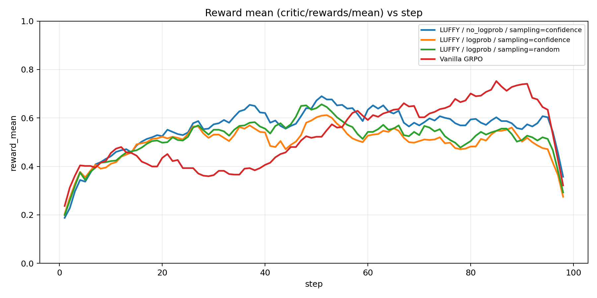
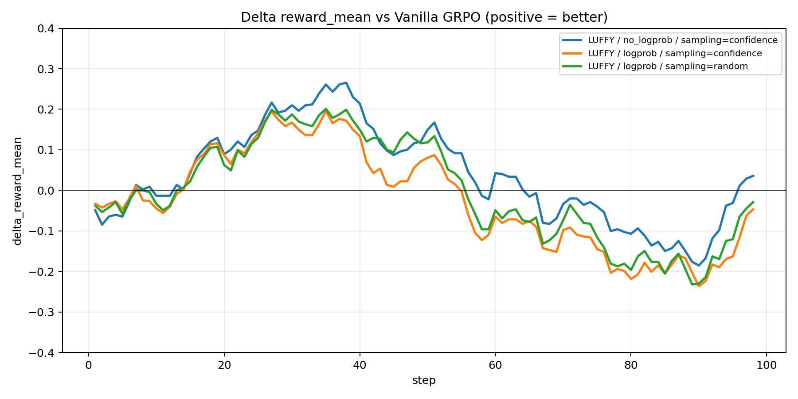

### 2026-01-10：LUFFY Teacher Replay 对比分析（with/wo log_prob × confidence/random）

### 0. 实验与数据来源

- **对比对象（4 runs）**：
  - **LUFFY / no_logprob / sampling=confidence**：`uk74oszd`  
    - 本地轨迹：`/home/qisheng/agent/AgentEvolver/checkpoints/agentevolver/alfworld_3b_grpo_teacher72b_only_bz8_mix1_no_logprob_confidence_analysis_v1`
  - **LUFFY / logprob / sampling=confidence**：`nj1g3tzx`  
    - 本地轨迹：`/home/qisheng/agent/AgentEvolver/checkpoints/agentevolver/alfworld_3b_grpo_teacher72b_only_bz8_mix1_logprob_confidence_analysis_v1`
  - **LUFFY / logprob / sampling=random**：`6iuti28h`  
    - 本地轨迹：`/home/qisheng/agent/AgentEvolver/checkpoints/agentevolver/alfworld_3b_grpo_teacher72b_only_bz8_mix1_logprob_random_analysis_v1`
  - **Vanilla GRPO**：`9ggix50f`（W&B 对照基线；本地未落盘到 `checkpoints/`）

- **关键配置确认（来自 W&B config）**：
  - **teacher 使用量**：`n_teacher_rollouts_per_task=1`（每 task 替换 1/8 rollout 为 teacher）
  - **teacher 策略 shaping**：`policy_shaping.enable=true, mode=p_div_p_beta, beta=0.1`
  - **teacher clipping**：`teacher_use_clip=false`
  - **sampling**：`select_mode ∈ {confidence, random}`
  - **log_prob**：`use_log_prob ∈ {true,false}`

- **本报告的数据源**：W&B history（包含 reward、loss、ratio 等），并已导出到本地：
  - 脚本：`analysis/new_runs_2026_01_10_wandb_compare/collect_and_plot.py`
  - 导出目录：`analysis/new_runs_2026_01_10_wandb_compare/out/`

### 1. 总览结论（先给结论，再给证据）

- **结论 1（整体 vs GRPO）**：三组 LUFFY 都能在中期明显超过 GRPO（最高可到 +0.40 左右），但 **late 段出现回落**；最终 step（98）均 **低于** GRPO。
- **结论 2（with vs wo log_prob，confidence sampling 下）**：`uk74oszd`（no_logprob）在 **AUC 与峰值** 上明显优于 `nj1g3tzx`（logprob），并且 late 段更稳一些（logprob 在 step 93 出现更深的跌落）。
- **结论 3（confidence vs random，在 log_prob=True 下）**：random 相比 confidence 的 **AUC 更接近 GRPO**，且在 late 段某些 step 更稳，但 **最终 reward 更低**（更“飘”，且可能更偏探索/更难收敛到高回报稳态）。

### 2. 核心量化对比（Summary）

（AUC 是对 98 个 step 的 `critic/rewards/mean` 做简单平均；`reward_auc_delta_vs_grpo` 是相对 GRPO 的平均差。）

| run_id   | label                                    |   teacher_use_log_prob | teacher_sampling   |   steps_logged |   reward_auc |   reward_auc_delta_vs_grpo |   reward_best |   reward_last |   reward_onpolicy_last |   reward_teacher_last |   teacher_token_ratio_last |   teacher_rollouts_last |   entropy_loss_last |   kl_loss_last |
|:---------|:-----------------------------------------|-----------------------:|:-------------------|---------------:|-------------:|---------------------------:|--------------:|--------------:|-----------------------:|----------------------:|---------------------------:|------------------------:|--------------------:|---------------:|
| 6iuti28h | LUFFY / logprob / sampling=random        |                      1 | random             |             98 |     0.525989 |                -0.00526148 |      0.828125 |      0.4375   |               0.357143 |                     1 |                 0.005817   |                       8 |           0.0582815 |       0.32927  |
| 9ggix50f | Vanilla GRPO                             |                    nan | nan                |             98 |     0.53125  |                 0          |      0.921875 |      0.65625  |             nan        |                   nan |               nan          |                     nan |           0.10274   |       0.466972 |
| nj1g3tzx | LUFFY / logprob / sampling=confidence    |                      1 | confidence         |             98 |     0.505899 |                -0.0253508  |      0.8125   |      0.546875 |               0.482143 |                     1 |                 0.00642271 |                       8 |           0.118276  |       0.45171  |
| uk74oszd | LUFFY / no_logprob / sampling=confidence |                      0 | confidence         |             98 |     0.566327 |                 0.0350765  |      0.875    |      0.578125 |               0.517857 |                     1 |                 0.00690059 |                       8 |           0.105602  |       0.508032 |

**读表要点**：
- **`uk74oszd` 的 reward_auc 明显最高**，平均意义上优于 GRPO（尽管最终点低于 GRPO）。
- 三个 LUFFY 的 `reward_teacher_last=1.0`：说明 teacher rollout 这一路几乎恒成功，训练差异主要来自 **on-policy 部分** 与 **teacher 对 baseline/探索的二阶影响**。
- `teacher_token_ratio_last ≈ 0.6%`：这解释了为什么“teacher token 比例很小但影响很大”——它不是因为 token 多，而是因为它在 GRPO 分组里**系统性抬高 baseline**、并通过 off-policy 更新路径改变梯度结构。

### 3. 关键 step 的“数据证据”（不靠肉眼看图也能定位阶段现象）

下面抽取一些典型 step（可对应你之前关心的 early/mid/late）。

|   step |     GRPO |   LUFFY_no_logprob_conf |   LUFFY_logprob_conf |   LUFFY_logprob_rand |
|-------:|---------:|------------------------:|---------------------:|---------------------:|
|      1 | 0.453125 |                0.421875 |             0.5      |             0.515625 |
|      5 | 0.53125  |                0.28125  |             0.46875  |             0.421875 |
|     10 | 0.328125 |                0.578125 |             0.46875  |             0.484375 |
|     20 | 0.515625 |                0.640625 |             0.546875 |             0.5625   |
|     22 | 0.484375 |                0.484375 |             0.515625 |             0.4375   |
|     37 | 0.359375 |                0.75     |             0.734375 |             0.765625 |
|     50 | 0.671875 |                0.875    |             0.8125   |             0.828125 |
|     63 | 0.453125 |                0.875    |             0.65625  |             0.703125 |
|     88 | 0.921875 |                0.609375 |             0.59375  |             0.5625   |
|     93 | 0.734375 |                0.609375 |             0.359375 |             0.59375  |
|     98 | 0.65625  |                0.578125 |             0.546875 |             0.4375   |

相对 GRPO 的差值（正=更好）：

|   step |   LUFFY_no_logprob_conf-GRPO |   LUFFY_logprob_conf-GRPO |   LUFFY_logprob_rand-GRPO |
|-------:|-----------------------------:|--------------------------:|--------------------------:|
|      1 |                    -0.03125  |                  0.046875 |                  0.0625   |
|      5 |                    -0.25     |                 -0.0625   |                 -0.109375 |
|     10 |                     0.25     |                  0.140625 |                  0.15625  |
|     20 |                     0.125    |                  0.03125  |                  0.046875 |
|     22 |                     0        |                  0.03125  |                 -0.046875 |
|     37 |                     0.390625 |                  0.375    |                  0.40625  |
|     50 |                     0.203125 |                  0.140625 |                  0.15625  |
|     63 |                     0.421875 |                  0.203125 |                  0.25     |
|     88 |                    -0.3125   |                 -0.328125 |                 -0.359375 |
|     93 |                    -0.125    |                 -0.375    |                 -0.140625 |
|     98 |                    -0.078125 |                 -0.109375 |                 -0.21875  |

**读表要点（对应“先超后落”）**：
- **mid 段**：step 37/50/63 三个 LUFFY 都显著领先 GRPO（尤其 `uk74oszd` 在 step 63 达到 +0.42）。
- **late 段**：step 88 GRPO 冲到 0.92，而三组 LUFFY 在同一位置整体回落（差值 -0.31 ~ -0.36）。`nj1g3tzx` 在 step 93 还出现更深下探（-0.375）。

### 4. 可视化（生成于本地，便于你直接打开对照）

（图片路径均在仓库内，可直接点开；markdown 预览如果不显示，你也可以直接打开对应 `.png`。）

- **reward 曲线（嵌入）**：

- **reward 相对 GRPO 的差值（嵌入）**：

- **reward 曲线**：`analysis/new_runs_2026_01_10_wandb_compare/out/figs/reward_mean.png`  
- **reward 相对 GRPO 的差值**：`analysis/new_runs_2026_01_10_wandb_compare/out/figs/reward_mean_delta_vs_grpo.png`
- **teacher 使用强度**：
  - `analysis/new_runs_2026_01_10_wandb_compare/out/figs/luffy_teacher_rollouts.png`
  - `analysis/new_runs_2026_01_10_wandb_compare/out/figs/teacher_token_ratio.png`
- **优化动态（entropy/kl/pg 与其 delta）**：
  - `analysis/new_runs_2026_01_10_wandb_compare/out/figs/actor_entropy_loss.png`
  - `analysis/new_runs_2026_01_10_wandb_compare/out/figs/actor_entropy_loss_delta_vs_grpo.png`
  - `analysis/new_runs_2026_01_10_wandb_compare/out/figs/actor_kl_loss.png`
  - `analysis/new_runs_2026_01_10_wandb_compare/out/figs/actor_kl_loss_delta_vs_grpo.png`
  - `analysis/new_runs_2026_01_10_wandb_compare/out/figs/actor_pg_loss.png`
  - `analysis/new_runs_2026_01_10_wandb_compare/out/figs/actor_pg_loss_delta_vs_grpo.png`

### 5. 发现与解释（围绕你关心的两条轴：log_prob 与 sampling）

- **5.1 为什么 wo log_prob（uk74oszd）更强：梯度“有界化”与方差控制**

在 teacher rollout 上，GRPO/ppo 形式的核心梯度可以写成（忽略 clip 与 mask 细节）：

$$
g_T(\theta) \;\propto\; \mathbb{E}_{(s,a_T)\sim D_T}\Big[\underbrace{\rho(s,a_T)}_{\text{off-policy ratio}}\;\underbrace{\tilde{A}(s,a_T)}_{\text{GRPO advantage}}\;\nabla_\theta \log \pi_\theta(a_T\mid s)\Big]
$$

- **先澄清（你问得非常关键）**：我们当前实现里 **with log_prob 也会走 teacher policy shaping**（只要 `teacher_policy_shaping_enable=true`，你这组实验就是 true）。
  - 在 `het_compute_teacher_aware_loss()` 里：`teacher_ratio` 先按 `teacher_use_log_prob` 选择定义，然后统一执行 `_apply_policy_shaping()`。

因此，“有界”严格来说主要来自 shaping，而不是来自“是否有 log_prob”；with/wo log_prob 的差别主要体现在 **shaping 之前 ratio 的定义不同**，从而改变 **方差/噪声敏感度/偏差**。

#### 5.1.1 “有界”到底体现在哪里？（严格形式）

当前 teacher shaping（`p_div_p_beta`）是：

$$
f(x)=\frac{x}{x+\beta},\quad \beta>0
$$

对任意 $x\ge 0$ 都有 $0\le f(x)<1$，所以 **teacher 的有效权重天然有界**（不会出现重要性权重无上界导致的爆炸）。同时它还有：

$$
f(x)\approx
\begin{cases}
\frac{x}{\beta}, & x\ll \beta \\
1, & x\gg \beta
\end{cases}
$$

也就是 **小信号被放大 $1/\beta$，大信号饱和到 1**。在你这里 $\beta=0.1$，早期最多约 **10 倍**放大，后期不会继续无限增大。

#### 5.1.2 那 with/wo log_prob 的真正差异是什么？为什么 wo log_prob 仍可能更好？

在我们实现里两者的差异是 shaping 之前的 $x$：

- **with log_prob（IS 校正）**：

$$
x=\rho_{\text{IS}}=\exp(\log\pi_\theta-\log\pi_{\text{old}})=\frac{\pi_\theta(a_T|s)}{\pi_{\text{old}}(a_T|s)}
$$

- **wo log_prob（LUFFY 近似/塑形）**：

$$
x=\pi_\theta(a_T|s)=\exp(\log\pi_\theta)
$$

两者最终都变成 $f(x)=x/(x+\beta)\in(0,1)$，所以“是否有界”不是差异点；**差异点在于 $x$ 的噪声结构**：

- **with log_prob 更高方差/更敏感**：它引入了 $1/\pi_{\text{old}}$ 因子（token 级别），会让 $x$ 的分布更“尖”，从而让 teacher 更新在部分 step 更激进；即使被 $f(\cdot)$ 截到 (0,1)，这种尖锐仍会反映为训练更易抖动。
- **with log_prob 更依赖 old_log_prob 的质量**：任何 teacher log_prob 的系统误差（对齐、截断、多轮拼接）都会直接进入 $x$；wo log_prob 完全不使用 old_log_prob，因此对这类误差更鲁棒（偏差-方差权衡里很常见：牺牲无偏换稳定）。

> 小结：wo log_prob 可能更好并不是因为它更“理论正确”，而是因为在 teacher 永远成功、GRPO baseline 强相对化、且只训练 100 step 的设定下，它可能提供了更好的稳定性/鲁棒性，从而表现出更高的 AUC 与更平滑的中期增益。

- **5.2 confidence vs random（log_prob=True）在“速度-稳态-鲁棒性”上的权衡**

这两者差异本质是：**你从每个 task 的 teacher pool（最多 6 条）里挑哪一条**。

- **confidence sampling** 更偏向"最像 teacher/最高置信"的轨迹：短期收益更直接，但多样性更低，容易让策略在 teacher 主干上更快收敛；在 LUFFY/GRPO 的组内 baseline 结构下，这会更早、更强地抬高 baseline，从而压制 $D_\pi$ 的探索与"偏离后的修复"（长尾鲁棒性）。
- **random sampling** 引入更多 teacher 轨迹多样性：可能牺牲一部分短期稳定性/最终点收敛，但对覆盖“非典型状态/动作”的帮助更大，所以你会看到它的 **AUC 更接近 GRPO**，且 late 段某些 step 不会像 confidence 那么“突然塌”。

- **5.3 统一解释：为什么三组 LUFFY 都会出现 late 回落**

把“teacher 回放”放进 GRPO 的分组相对优势结构里，等价于持续往组内塞高回报样本，从而抬高 baseline：

$$
\tilde{A}_i = R_i - \frac{1}{K}\sum_{j\in\text{group}} R_j
$$

当每组里固定有 $R_T\approx 1$ 的 teacher rollout 时，on-policy 的 $\tilde{A}$ 更容易被压成负值（尤其是那些"探索性但暂时失败"的轨迹）。这会导致：
- **探索被系统性惩罚**（entropy 下降、长尾修复变慢）
- 策略更偏向 teacher 主干（$D_T$）而不是 student 实际会遇到的偏离态分布（$D_\pi$）

因此 mid 段可以靠 teacher 快速把主干拉上去、甚至短暂超过 GRPO；但 late 段继续提升往往依赖 $D_\pi$ 上的"错误恢复/长尾修复"，这会被 baseline 抬高与 teacher 梯度占比增大所压制，最终出现回落。

### 6. 下一步建议（如果你打算继续做消融）

- **建议 1（从根上减弱 on-policy 的负优势：baseline/advantage 与 teacher 分离）**：
  - 直觉：teacher 继续提供塑形信号，但 **不再把 teacher 的高回报塞进 on-policy 的组内均值**（否则探索轨迹系统性被打成负优势）。
  - 一个最直接的形式：对 on-policy rollout，用“只含 on-policy”的组内均值：

$$
\tilde{A}^{(\pi)}_i = R^{(\pi)}_i - \frac{1}{K_\pi}\sum_{j\in \text{on-policy}} R^{(\pi)}_j
$$

teacher rollout 的优势用独立基线（例如 $R_T-1$，或 $R_T-\text{mean}(R^{(\pi)})$），但不要让它回流进 on-policy baseline。

- **建议 2（teacher 影响的自动退火/门控：不靠手写“某步关掉”）**：
  - 你现在已有诊断量：`diag/group_teacher_minus_on_reward_mean、diag/reward_onpolicy_mean、diag/onpolicy_adv_pos_ratio`。
  - 可用 gap 做门控系数，把 teacher loss 乘上 $\alpha_t$：

$$
\alpha_t=\text{clip}\Big(\frac{\text{gap}_t-\epsilon}{\tau},0,1\Big),\quad \text{gap}_t=\mathbb{E}[R_T-R_\pi]
$$

gap 大（中期）teacher 强；gap 小（late）teacher 自动弱化，释放 $D_\pi$ 的长尾修复空间。

- **建议 3（log_prob 模式稳健化）**：如果要继续用 teacher log_prob 的校正优势，建议加一层稳健化避免 token 级噪声放大：
  - **teacher 专用 ratio clamp**：先对 $\log\rho$ 做 `clamp([-\gamma,+\gamma])` 再进 shaping。
  - 或者开启 **teacher clipping**（`teacher_use_clip=true`）。

- **建议 4（sampling 改进：温度化 confidence）**：在 random 与 top-1 confidence 之间连续可调：

$$
P(\tau)\propto \exp\Big(\frac{\text{conf}(\tau)}{T}\Big)
$$

