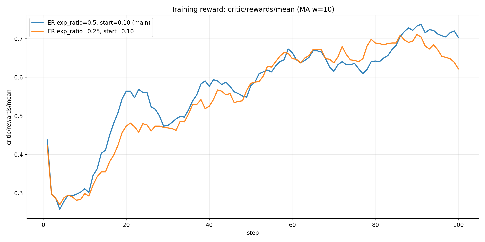
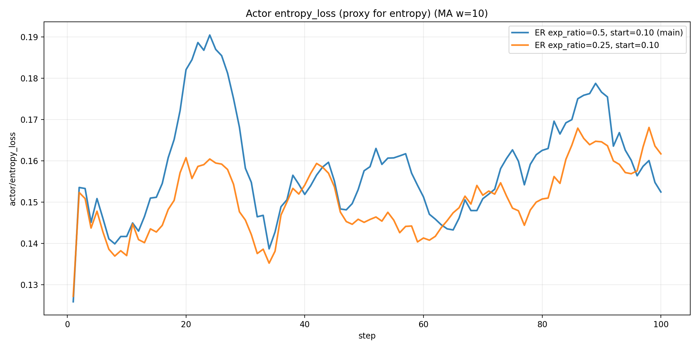
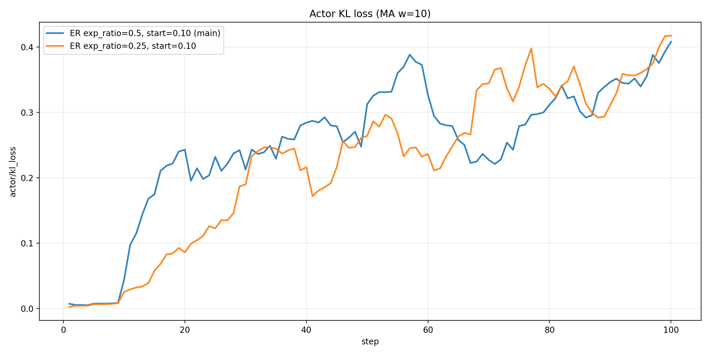
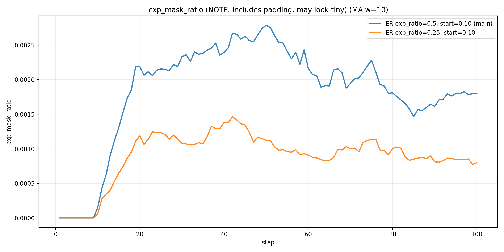
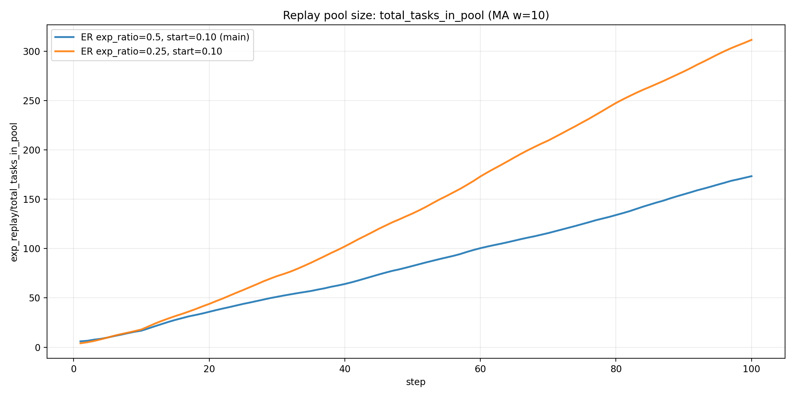
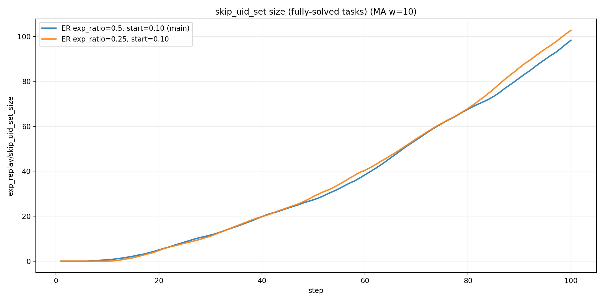
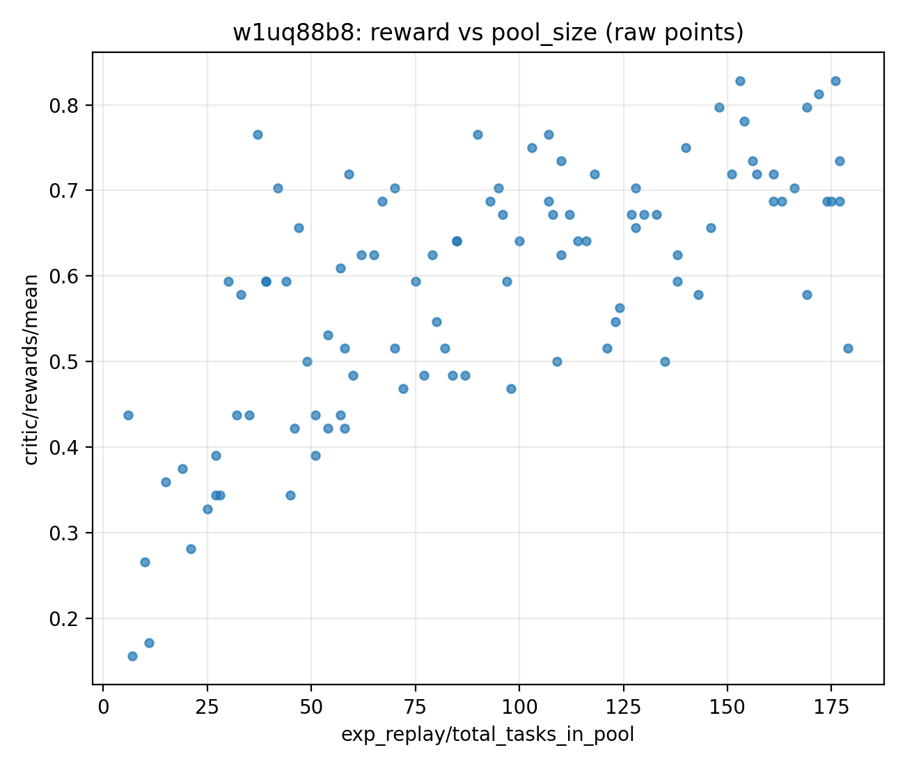

# 2026-01-13：Self-generated Experience Replay（Endogenous, ExGRPO-style）机制分析报告

## 0. 背景与目标
本报告分析 **self-generated experience replay（endogenous experience）** 在 AlfWorld + GRPO 中为什么有效，以及它可能的缺陷与可改进点。

重要现实约束：当前 W&B 中 **bz=8, rollout=8, no-teacher** 的 runs 只看到开启 replay 的版本，缺少严格的“关 replay 的纯 GRPO”对照。因此我们采用：
- **准对照 1（within-run）**：同一 run 内 `replay_start_ratio` 前后（pre vs post）对比
- **准对照 2（dose comparison）**：跨 run 对比不同 `exp_ratio / replay_start_ratio`

## 1. 实验与 run 列表
- **ER exp_ratio=0.5, start=0.10 (main)**：run id `w1uq88b8`（exp_ratio=0.5, replay_start_ratio=0.1）
- **ER exp_ratio=0.25, start=0.10**：run id `bpqipx70`（exp_ratio=0.25, replay_start_ratio=0.1）

## 2. 核心量化 summary（以最后一步为代表）

| label | run_id | replay_start_ratio | exp_ratio | reward_last | entropy_loss_last | kl_loss_last | pool_size_last | skip_uid_set_size_last | exp_mask_ratio_last | val_reward_mean@1_last | val_reward_mean@2_last | val_reward_mean@3_last |
|---|---|---|---|---|---|---|---|---|---|---|---|---|
| ER exp_ratio=0.5, start=0.10 (main) | w1uq88b8 | 0.100000 | 0.500000 | 0.515625 | 0.129289 | 0.583986 | 179.000000 | 107.000000 | 0.001433 | 0.628571 | 0.500000 | 0.708333 |
| ER exp_ratio=0.25, start=0.10 | bpqipx70 | 0.100000 | 0.250000 | 0.515625 | 0.129763 | 0.379097 | 325.000000 | 110.000000 | 0.001220 | 0.542857 | 0.416667 | 0.541667 |

## 3. 核心可视化（MA）
### 3.1 训练 reward（critic/rewards/mean）

### 3.2 entropy_loss（探索/收缩 proxy）

### 3.2.1 现象补充：熵“上冲-回落”的周期性波动（exp_ratio 越大越明显）
从两条 run 的 `actor/entropy_loss` 时间序列来看，熵并非单调下降，而是呈现“**上冲（上升）→回落（下降）**”的周期性波动；并且 **`exp_ratio=0.5` 的上冲更快、更高、波动幅度更大**。

下面是对 `actor/entropy_loss` 的简单定量统计（对序列做 5-step moving average 后检测局部峰谷，避免把纯噪声当成峰谷）：

- **波动幅度（MA5 振幅）**
  - `w1uq88b8 (exp_ratio=0.5)`：0.0797
  - `bpqipx70 (exp_ratio=0.25)`：0.0501
- **峰谷频率（周期性）**
  - 两条 run 都出现约 23 个峰 / 22 个谷；平均峰间距约 4.3 step
  - 这表明“时不时上升又下降”更像结构性周期行为，而非偶然一次性的噪声
- **平均熵水平（0.5 相对 0.25 更高）**
  - `mean(entropy_loss)`：0.1585（0.5） vs 0.1513（0.25），均值差约 +0.0072
  - `entropy_loss_0.5 - entropy_loss_0.25` 的差值最大可到 +0.0781（个别 step 会非常明显）
- **与训练信号的同向性（弱-中等正相关）**
  - `corr(entropy_loss, critic/rewards/mean)`：0.316（0.5） vs 0.303（0.25）
  - `corr(entropy_loss, actor/kl_loss)`：0.155（0.5） vs 0.036（0.25）

这一组事实支持一个直觉：**replay 强度更大（exp_ratio 更高）时，训练更容易进入“探索增强→再收敛巩固”的交替动态**。

### 3.3 KL loss（更新幅度 proxy）

### 3.4 exp_mask_ratio（注意：包含 padding，数值会偏小）

### 3.5 replay pool size（total_tasks_in_pool）

### 3.6 fully-solved tasks（skip_uid_set_size）

### 3.7 within-run：reward 与 pool size 的关系（散点）

## 4. Within-run 准对照：w1uq88b8 在 replay_start_ratio 前后的均值对比

以 `w1uq88b8` 为例：配置 `replay_start_ratio=0.1`，对应约在 **step≈10** 之后开始出现 experience tasks。

| segment | lo | hi | n | critic/rewards/mean | actor/entropy_loss | actor/kl_loss | exp_replay/num_experience_tasks | exp_replay/num_offpolicy_trajectories | exp_replay/total_tasks_in_pool | exp_mask_ratio |
|---|---|---|---|---|---|---|---|---|---|---|
| pre (step 1-10) | 1.000000 | 10.000000 | 10.000000 | 0.310937 | 0.141702 | 0.044021 | 0.400000 | 0.400000 | 16.800000 | 0.000147 |
| post (step 11-100) | 11.000000 | 100.000000 | 90.000000 | 0.616840 | 0.160381 | 0.297130 | 4.000000 | 4.000000 | 101.333333 | 0.002115 |

## 5. 数学化机制解释：为什么 ExGRPO-style replay 可能有效？
### 5.1 视角 A：把 replay 看成“分布工程（distribution engineering）”
对每个 task 的一组 rollouts（大小固定为 n_rollout），replay 机制把历史成功轨迹（off-policy）混入当前 batch，使得组内 reward 分布更偏向成功区域，从而提升学习信号的 **信噪比** 与 **样本效率**。

### 5.2 视角 B：重要性采样与 policy shaping（ExGRPO 的关键稳定化）
off-policy token 的重要性比率可写为：

$$w(\theta)=\exp(\log\pi_\theta(a|s)-\log\pi_{\text{old}}(a|s))=\frac{\pi_\theta(a|s)}{\pi_{\text{old}}(a|s)}$$

为了避免 \(w\) 的高方差导致训练不稳，ExGRPO 使用 policy shaping（例如 \(f(w)=\frac{w}{w+\beta}\in(0,1)\)）来让 off-policy 权重有界，同时放大低概率信号、抑制高概率信号，从而在“学到成功经验”和“保持熵/探索”之间做折中。

### 5.3 用一个“混合梯度”视角解释熵上冲：replay 梯度与 on-policy 梯度的拉扯
把训练看成 **on-policy 数据** 与 **replay(off-policy) 数据** 的混合优化（省略 baseline/clip/正则等实现细节），其梯度可写成一个近似的“混合梯度”形式：

$$
\nabla_\theta J(\theta)\;\approx\;
\mathbb{E}_{(s,a)\sim D_{\text{on}}}\big[\nabla\log\pi_\theta(a|s)\,\hat A\big]
\;+
\lambda\;\mathbb{E}_{(s,a)\sim D_{\text{replay}}}\big[\nabla\log\pi_\theta(a|s)\,\hat A\cdot g(w)\big]
$$

其中：
- \(\lambda\) 可理解为 replay 的"强度系数"，在实现上与 `exp_ratio`（以及实际 off-policy token 占比）同向。
- \(w=\exp(\log\pi_\theta-\log\pi_{\text{old}})\) 是重要性比率，\(g(w)\) 是有界的 shaping（例如 \(g(w)=\frac{w}{w+\beta}\in(0,1)\)）。

**为什么会导致熵“上冲→回落”？**
- **上冲（exploration phase）**：replay 提供的成功轨迹包含一些“当前策略下概率较低，但对成功重要”的 token/动作。混合梯度第二项会把这些低概率区域往上抬，从宏观上看就像把分布“摊开”→ 熵上升。
- **回落（consolidation phase）**：当这些模式被当前策略学会后，on-policy 梯度第一项更倾向于把概率质量集中到更确定的模式上→ 熵下降。

因此，熵的周期性波动可以被解释为：**replay 注入探索驱动 + on-policy 收敛驱动** 的交替主导；当 `exp_ratio` 更大时，\(\lambda\) 更大，上冲驱动更强，所以更容易出现"上冲更快、更高、波动更大"的现象。

> 重要注：要把这个机制论证到论文级别，必须把“熵上冲发生在哪里”讲清楚——它可能主要发生在 off-policy token，也可能带动 on-policy token 一起上升。两者对“是否真正促进探索”的意义完全不同。

## 6. 机制缺陷与潜在风险（为什么它也可能失败/不够稳）
- **缺陷 1：分组 baseline 污染（结构性风险）**：在 GRPO 的组内相对优势结构下，强成功轨迹会抬高 baseline，使探索性 on-policy 行为更容易变成负优势，从而压制长尾修复。
- **缺陷 2：经验陈旧（staleness）**：replay 轨迹来自旧 policy（policy_version 落后当前 step），会带来分布偏移与 \(w(\theta)\) 方差上升；若不监控 ratio 与轨迹年龄，训练风险不可见。
- **缺陷 3：选择偏置（entropy argmin）**：低熵成功轨迹更“模板化”，可能降低多样性，长期不利于鲁棒性与错误恢复。
- **缺陷 4：`exp_mask_ratio` 可解释性不足**：它对 full sequence（含 padding）求均值，数值很小不代表 replay 没起作用；更需要“只在有效 response/LLM token 上归一化”的指标。

## 7. 诊断指标（已实现）：跑 replay-on / replay-off 两份配置即可验证机制
为了把 endogenous replay 的因果链条钉死，我们已经把关键诊断指标接入训练日志（W&B）。因此下一步只需要跑两份配置：
- `config/alfworld_grpo_3b_exp_replay_endogenous_v2.yaml`（replay-on）
- `config/alfworld_grpo_3b_grpo_no_replay_baseline_v2.yaml`（replay-off 严格对照）

对应的关键指标分组如下（用于解释“熵上冲”的合理性与来源）：

- **replay 强度与有效 token 归一化占比**
  - `exp_replay/offpolicy_rollout_ratio`
  - `exp_replay/offpolicy_token_ratio_response`
  - `exp_replay/offpolicy_token_ratio_llm`（只在有效 LLM/response token 上归一化，避免 padding 污染）
- **经验陈旧度（staleness / off-policy age）**
  - `exp_replay/offpolicy_age_mean|max|min|count`
- **重要性比率与 advantage 的分布诊断（off-policy vs on-policy）**
  - `exp_replay_diag/importance_ratio/off/*`
  - `exp_replay_diag/importance_ratio_shaped/off/*`（当启用 ExGRPO shaping 时）
  - `exp_replay_diag/adv/off/*` 与 `exp_replay_diag/adv/on/*`
- **熵动态的拆分证据（回答“熵上冲发生在 on-policy 还是 off-policy？”）**
  - `exp_replay/entropy_llm_mean`
  - `exp_replay/entropy_llm_onpolicy_mean`
  - `exp_replay/entropy_llm_offpolicy_mean`
- **pool 难度分布（replay 数据分布漂移/偏置）**
  - `exp_replay/total_tasks_in_pool`
  - `exp_replay/pool_difficulty_mean`
  - `exp_replay/pool_count/d*`（每个 bucket 的 task 数量）

## 8. 面向统一框架（Exogenous + Endogenous）的下一步方向
更 solid 的 experiential GRPO 框架，应统一两类经验到同一套“可控注入 + 可解释诊断”机制：
- **Exogenous（teacher）**：强、低方差，但易 baseline 污染/探索受限 → baseline 分离 + 自适应退火
- **Endogenous（self-generated）**：更贴近 \(D_\pi\)，利于长尾修复，但受陈旧度与重要性方差影响 → age-aware weighting + ratio diagnostics + 多样性约束

## 9. 跑完 replay-on / replay-off 后，我能进一步回答的“机制问题”与“优化点”
只要这两份配置跑出来（即使不做多 seed），我们就能把当前的“现象解释”升级为更强的机制证据：

- **熵上冲是否真的促进 on-policy 探索？**
  - 看 `exp_replay/entropy_llm_onpolicy_mean` 是否随 replay-on 上升；若只在 `...offpolicy_mean` 上升，则可能是“replay token 自己更散”，未必提升真实探索。
- **熵上冲与重要性比率尾部是否绑定？（高方差 / 不稳信号）**
  - 看 `exp_replay_diag/importance_ratio/off/p99|max` 与熵波动的同步/滞后关系；若尾部变重伴随熵上冲，可能需要更强 shaping、clip 或 age-aware weighting。
- **baseline 污染是否压制了 on-policy 学习？**
  - 对比 `exp_replay_diag/adv/on/*` 在 replay-on vs replay-off 的均值/分位数变化；若 on-policy advantage 系统性变差，说明组内相对 baseline 被 replay 拉高。
- **staleness 是否是真正的瓶颈？**
  - 如果 `exp_replay/offpolicy_age_mean|max` 很大且同时出现 ratio 尾部/熵波动更剧烈，那么“age-aware weighting / age-based sampling”会是很直接的优化点。
- **replay pool 是否发生难度偏置？**
  - 用 `exp_replay/pool_count/d*` 与 `pool_difficulty_mean` 判断 pool 是否被少数 bucket 主导；若偏置明显，可以做“难度分层采样/配额”来改善泛化与稳定性。
