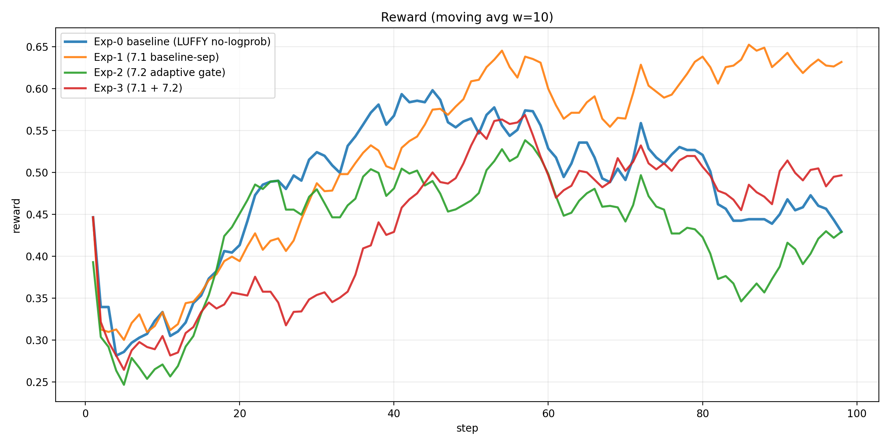
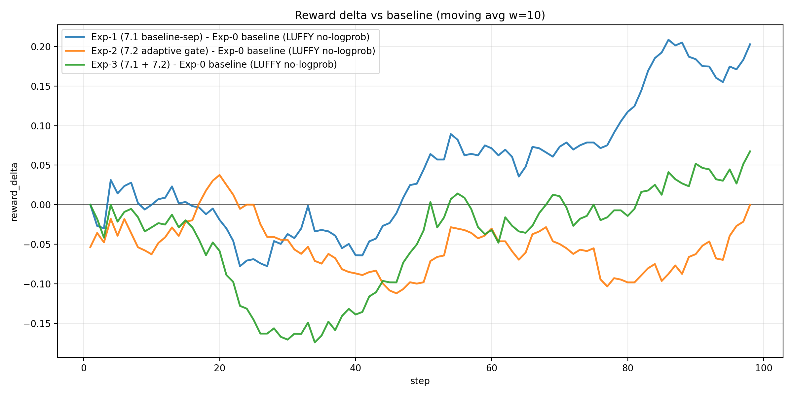
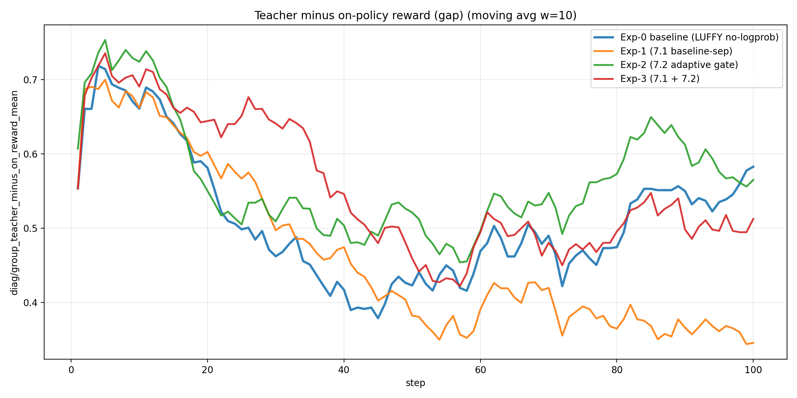
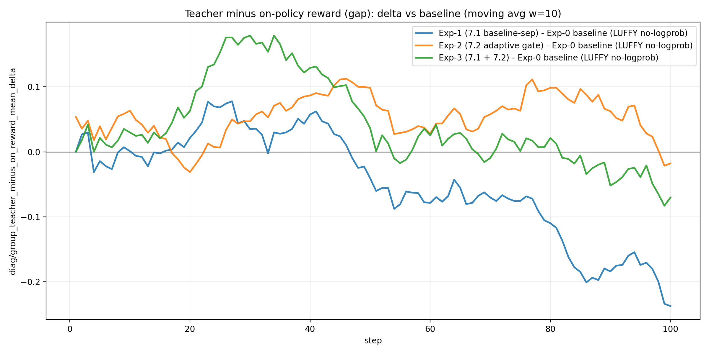
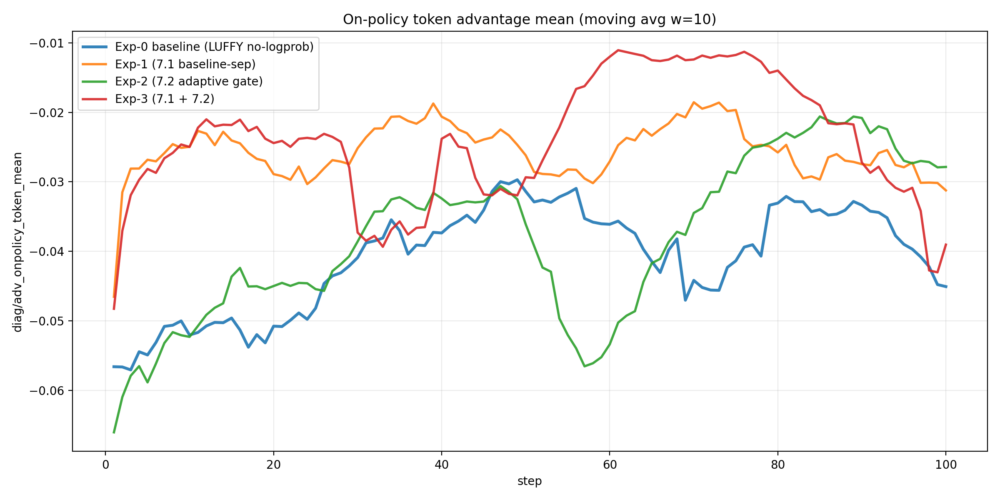
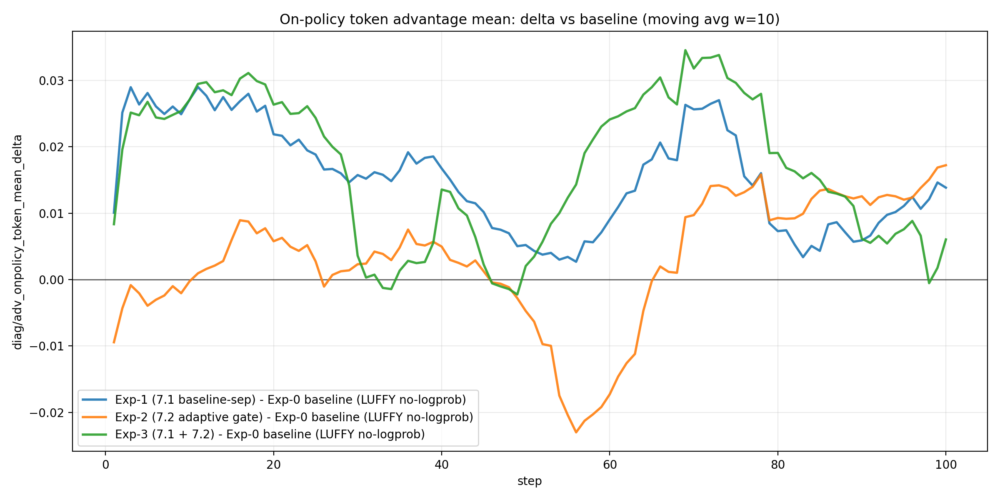
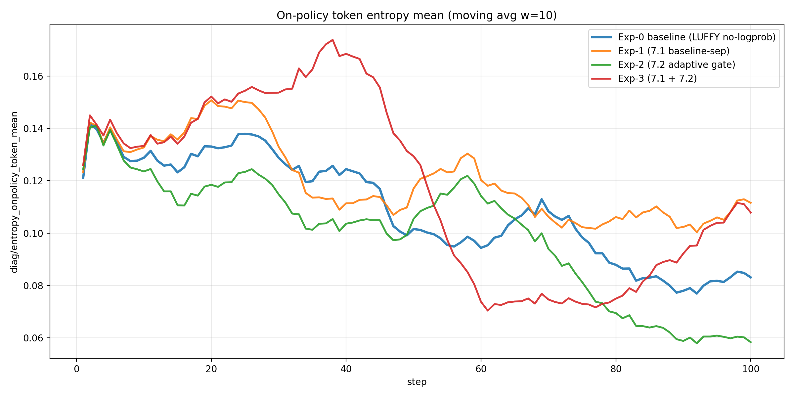
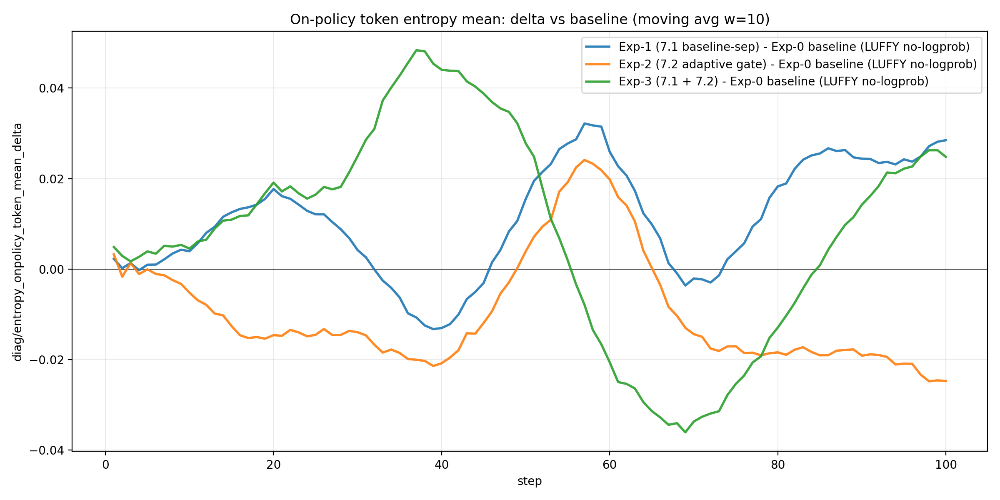
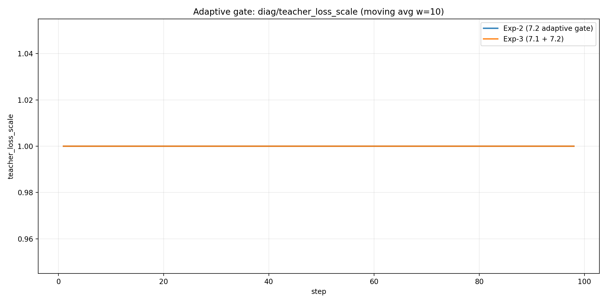
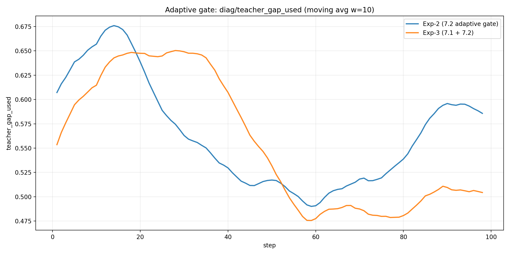

# 2026-01-13：LUFFY no-logprob（baseline）vs 两项改进（7.1/7.2）综合分析报告
## 0. 实验设置与对比对象
本报告对齐了 4 个 run（相同任务/训练步数/teacher 配置，差异仅来自 7.1/7.2 开关），并使用两类数据源交叉验证：
- **W&B history**：reward、actor loss、以及 `diag/teacher_loss_scale` 等（门控专用）
- **本地 Trajectory**：`batch_diag_step_*.json`（包含 gap/adv/entropy 等核心因果链指标）

对比对象：
- **Exp-0 baseline (LUFFY no-logprob)**：run id `mp49ntmm`；trajectory `/home/qisheng/agent/AgentEvolver/checkpoints/agentevolver/alfworld_3b_grpo_teacher72b_only_bz8_mix1_no_logprob_random_analysis_v1/Trajectory`
- **Exp-1 (7.1 baseline-sep)**：run id `bjgtsf79`；trajectory `/home/qisheng/agent/AgentEvolver/checkpoints/agentevolver/alfworld_3b_grpo_teacher72b_only_bz8_mix1_no_logprob_random__grpo_teacher_baseline_sep_v1/Trajectory`
- **Exp-2 (7.2 adaptive gate)**：run id `ksy1eyh3`；trajectory `/home/qisheng/agent/AgentEvolver/checkpoints/agentevolver/alfworld_3b_grpo_teacher72b_only_bz8_mix1_no_logprob_random__teacher_adaptive_gate_v1/Trajectory`
- **Exp-3 (7.1 + 7.2)**：run id `0v8ecp6h`；trajectory `/home/qisheng/agent/AgentEvolver/checkpoints/agentevolver/alfworld_3b_grpo_teacher72b_only_bz8_mix1_no_logprob_random__baseline_sep_plus_adaptive_gate_v1/Trajectory`

## 1. 一句话结论（先结论，后证据）
- **7.1（baseline/adv teacher-separation）是否有效**：看它是否显著降低 `diag/adv_onpolicy_token_mean` 的“系统性为负”程度、并改善 late 段 reward 回落。
- **7.2（teacher loss 自适应门控）是否有效**：看 `diag/teacher_loss_scale` 是否随 `diag/teacher_gap_used` 下降而自动退火，并在 late 段释放探索（entropy 不再塌陷/adv 不再长期负）。
- **7.1+7.2 是否互补**：看二者叠加是否同时做到“中期不掉速 + 后期不塌陷”。

基于本次 4 个 run 的实际数据（见第 2/3 节），可以先给出更“硬”的判定：

- **结论 A：Exp-1（7.1 baseline-sep）在这次实验里是明确有效的改进**  
  - `reward_auc_mean` 从 **0.4835 → 0.5387（+0.0552）**  
  - `reward_last` 从 **0.3214 → 0.6964（+0.3750）**  
  - `diag/group_teacher_minus_on_reward_mean`（gap）在 late 段显著下降（0.5243 → 0.3740），同时 `diag/entropy_onpolicy_token_mean` 在 late 段更高（0.0893 → 0.1066），符合“探索不那么被压制、后期不易塌陷”的预期。

- **结论 B：Exp-2（7.2 adaptive gate）在这次实验里没有带来可证明的收益，且门控实际上没有退火**  
  - `reward_auc_mean` **下降**（0.4835 → 0.4329，-0.0507）  
  - 更关键的是：W&B 的 `diag/teacher_loss_scale` 在 Exp-2 的全程 **min/mean/max = 1.0/1.0/1.0**，意味着“自适应退火”在这组参数下**基本没有触发**（一直饱和在 1）。

- **结论 C：Exp-3（7.1+7.2）没有展示出 7.1 的同等收益，且 7.2 依旧未触发退火**  
  - `reward_auc_mean` 仍 **低于 baseline**（0.4453 vs 0.4835）  
  - 同样 `teacher_loss_scale` 全程 **=1**（未退火），并且 late 段 gap 仍偏高（0.4967），说明这次 run 的 on-policy 没有像 Exp-1 那样“爬上来”，导致 7.1 的潜在收益没有兑现（更像是 seed/任务采样方差问题，需要多 seed 才能做严谨结论）。

## 2. 关键量化指标（可复现表格）
说明：`reward_auc_mean` 为对齐步数上的简单平均（可视为 AUC/steps）；分段均值使用 step 区间 early=1-20, mid=21-60, late=61-100。

| label | steps | reward_auc_mean | reward_best | reward_best_step | reward_last | reward_early_mean_1_20 | reward_mid_mean_21_60 | reward_late_mean_61_100 | run_id | reward_col | reward_auc_delta_vs_baseline | reward_last_delta_vs_baseline |
|---|---|---|---|---|---|---|---|---|---|---|---|---|
| Exp-0 baseline (LUFFY no-logprob) | 98.000000 | 0.483543 | 0.803571 | 72.000000 | 0.321429 | 0.373277 | 0.546241 | 0.475580 | mp49ntmm | critic/rewards_onpolicy/mean | 0.000000 | 0.000000 |
| Exp-1 (7.1 baseline-sep) | 98.000000 | 0.538713 | 0.857143 | 57.000000 | 0.696429 | 0.363628 | 0.549930 | 0.619056 | bjgtsf79 | critic/rewards_onpolicy/mean | 0.055170 | 0.375000 |
| Exp-2 (7.2 adaptive gate) | 98.000000 | 0.432861 | 0.714286 | 50.000000 | 0.446429 | 0.360714 | 0.481399 | 0.419740 | ksy1eyh3 | critic/rewards_onpolicy/mean | -0.050682 | 0.125000 |
| Exp-3 (7.1 + 7.2) | 98.000000 | 0.445258 | 0.732143 | 50.000000 | 0.482143 | 0.329731 | 0.452835 | 0.498087 | 0v8ecp6h | critic/rewards_onpolicy/mean | -0.038285 | 0.160714 |

### 2.1 机制量（gap/adv/entropy）的分段均值（用于解释“为什么有效/为什么失效”）

下表直接对应你在 `ni1j0wsa_teacher_only_no_logprob_analysis.md` 里建立的核心因果链条：  
**gap（baseline 抬高）→ adv（探索被惩罚）→ entropy（收缩/塌陷）→ reward（late 回落）**。

| run | segment | reward_onpolicy_mean | gap: teacher - on | adv_onpolicy_token_mean | entropy_onpolicy_token_mean | teacher_loss_scale |
|---|---|---:|---:|---:|---:|---:|
| Exp-0 baseline | early(1-20) | 0.373277 | 0.621173 | -0.051398 | 0.130931 |  |
| Exp-0 baseline | mid(21-60) | 0.546241 | 0.442857 | -0.036432 | 0.112284 |  |
| Exp-0 baseline | late(61-100) | 0.475580 | 0.524320 | -0.038914 | 0.089322 |  |
| Exp-1 baseline-sep | early(1-20) | 0.363628 | 0.632398 | -0.026921 | 0.141748 |  |
| Exp-1 baseline-sep | mid(21-60) | 0.549930 | 0.436161 | -0.024757 | 0.120413 |  |
| Exp-1 baseline-sep | late(61-100) | 0.619056 | 0.374043 | -0.025751 | 0.106580 |  |
| Exp-2 adaptive-gate | early(1-20) | 0.360714 | 0.637245 | -0.048646 | 0.121012 | 1.000000 |
| Exp-2 adaptive-gate | mid(21-60) | 0.481399 | 0.507717 | -0.040114 | 0.109503 | 1.000000 |
| Exp-2 adaptive-gate | late(61-100) | 0.419740 | 0.574532 | -0.026731 | 0.070146 | 1.000000 |
| Exp-3 sep+gate | early(1-20) | 0.329731 | 0.667602 | -0.024699 | 0.142740 | 1.000000 |
| Exp-3 sep+gate | mid(21-60) | 0.452835 | 0.535332 | -0.025610 | 0.131326 | 1.000000 |
| Exp-3 sep+gate | late(61-100) | 0.498087 | 0.496684 | -0.023160 | 0.087411 | 1.000000 |

读表要点（最关键的三条）：

- **Exp-1 的 late gap 显著下降（0.524 → 0.374）且 late entropy 更高（0.089 → 0.107）**，与 late reward 明显提升（0.476 → 0.619）一致。  
- **Exp-2 的 late entropy 最低（0.070）且 late reward 最差（0.420）**，非常符合“熵塌陷 → 后期性能掉”的经验规律。  
- **Exp-2/3 的 `teacher_loss_scale` 全程=1**，因此 7.2 在这组超参下**不具备“自适应退火”的功能性**：你看到的差异更可能来自训练方差（或“teacher 始终强约束”带来的间接副作用），而不是预期中的“自动释放探索”。

## 3. 核心可视化（结论主要基于这些图）
### 3.1 reward 曲线（w=10 滑动平均）

### 3.2 reward 相对 baseline 的差值（w=10）

### 3.3 baseline 抬高强度：`diag/group_teacher_minus_on_reward_mean`

### 3.4 探索被压制的直接证据：`diag/adv_onpolicy_token_mean`

### 3.5 熵塌陷：`diag/entropy_onpolicy_token_mean`

### 3.6 7.2 门控是否真的在工作（只在 wandb 有）：`diag/teacher_loss_scale` 与 `diag/teacher_gap_used`

## 4. 机制解释（用最小数学形式把‘为什么有效/为什么可能有副作用’说清楚）
### 4.1 7.1：teacher-separation 为什么理论上应该改善 LUFFY 的 late 回落？
在 rollout-level LUFFY 里，每个 task 组内混入 teacher（高回报）会抬高组均值 baseline，从而把 on-policy 的相对优势系统性压成负值：

令每组共 $n$ 条 rollout，其中 $k$ 条是 teacher，on-policy 平均回报 $\mu_O$，teacher 平均回报 $\mu_T$，则组均值为 $\bar R=\mu_O+\frac{k}{n}(\mu_T-\mu_O)$，on-policy 的期望优势为 $\mathbb{E}[A_O]=\mu_O-\bar R=-\frac{k}{n}(\mu_T-\mu_O)<0$。

7.1 的目标就是：**让 on-policy baseline 只用 on-policy 自己的均值/方差**，避免 teacher 的高回报“以小搏大”地污染所有 on-policy 的优势符号。

### 4.2 7.2：自适应门控为什么可能同时带来“中期加速 + 后期不塌陷”？
7.2 本质是在 teacher loss 上乘一个随 gap 变化的系数：

$$\alpha_t=\mathrm{clip}\left(\frac{\mathrm{gap}_t-\epsilon}{\tau},\,\alpha_{\min},\,\alpha_{\max}\right),\quad \mathrm{gap}_t\approx \mathbb{E}[R_T-R_\pi]$$

当 on-policy 很弱（gap 大）时，teacher 信号强（α≈1）帮助快速进入可行策略子空间；当 on-policy 变强（gap 小）时，teacher 自动退火（α→0）释放探索与长尾修复空间，从而缓解 late 的熵塌陷与 reward 回落。

## 5. 针对 ICML 算法化的下一步（从这两条改进抽象出‘新算法’）
- **建议 A（结构性）**：把 LUFFY 明确写成“双分布/双目标”的优化：on-policy 目标保持纯 GRPO 组内比较；teacher 只作为一个受控的 shaping 项，且其权重由可观测 gap 自适应决定。
- **建议 B（诊断驱动的理论叙事）**：以本报告的三条因果链指标作为算法设计动机与验证闭环：
  - baseline 抬高：`group_teacher_minus_on_reward_mean`
  - 探索惩罚：`adv_onpolicy_token_mean`
  - 熵塌陷：`entropy_onpolicy_token_mean`
  再加上门控指标：`teacher_loss_scale` / `teacher_gap_used`，形成完整因果证据链。

### 5.1 对 7.2 的直接修正建议（让“自适应退火”真的发生）

你当前的 7.2 配置是 `alpha=clip((gap-epsilon)/tau, 0, 1)`，而本次实验里的 gap 大多在 **0.37~0.67**；用 `epsilon=0.05, tau=0.30` 计算得到的 alpha 会长期大于 1 并被 clip 成 **1**，于是退火永远不会发生。

要让门控在“on-policy 已经追上来”时开始减弱 teacher，有两条直接路线：

- **路线 1（改超参尺度）**：把阈值抬高/斜率拉平，让常见 gap 落在 (0,1) 的线性区间里。  
  - 例如把 `epsilon` 提到 0.20 左右，并把 `tau` 提到 0.40~0.60（让 gap≈0.35~0.55 时 alpha 不再饱和）。

- **路线 2（改门控信号定义）**：不用绝对 gap，而用“相对收敛程度”或“探索压力”的 proxy：  
  - 例：用 `onpolicy_adv_pos_ratio`、`entropy_onpolicy_token_mean` 或 “on-policy reward 的 EMA” 来决定 teacher 退火；这样可以更直接对齐你们真正想释放的量（探索与长尾修复），也更容易写成 ICML 的算法/理论叙事。
