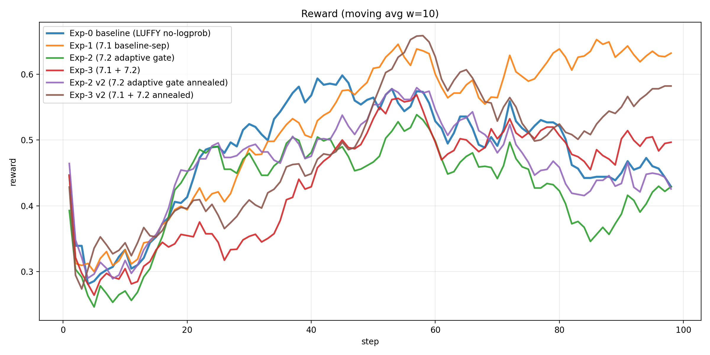
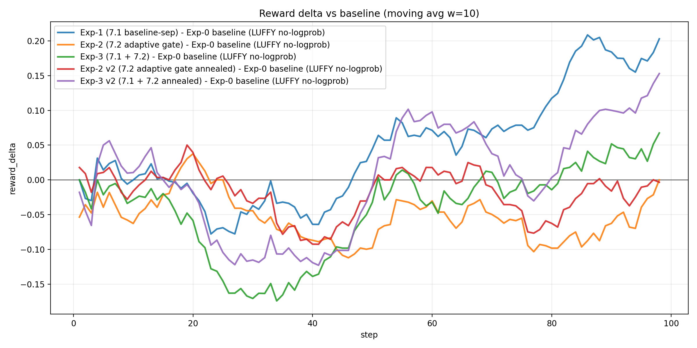
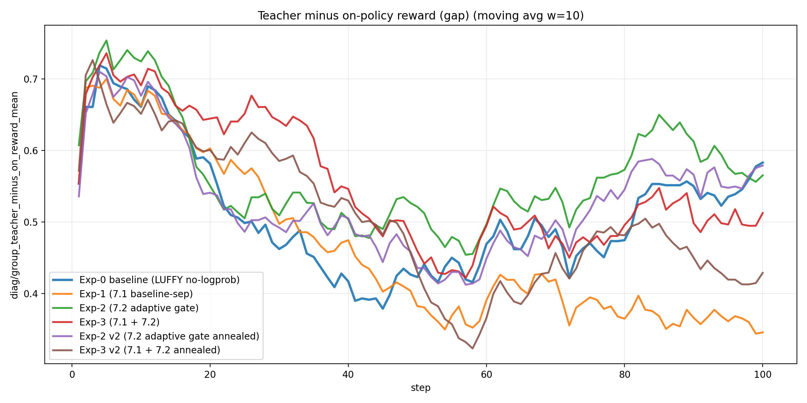
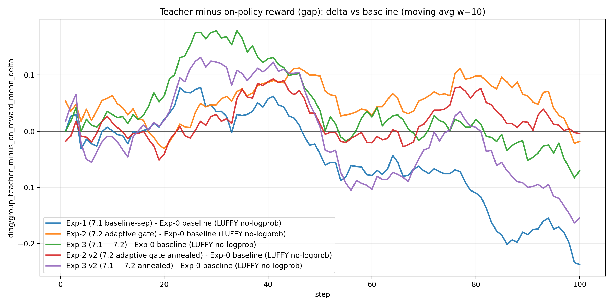
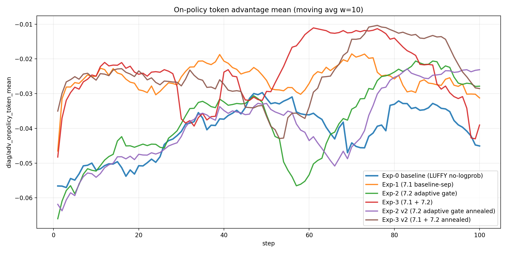
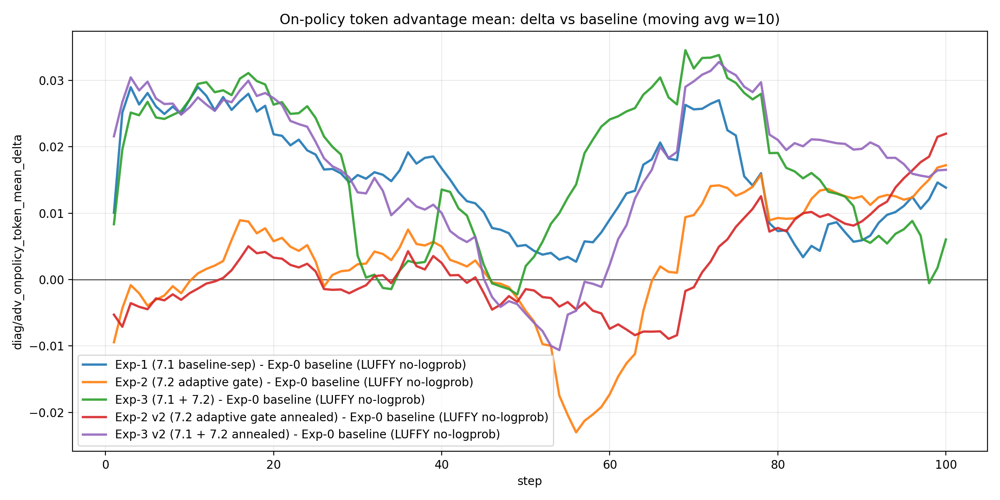
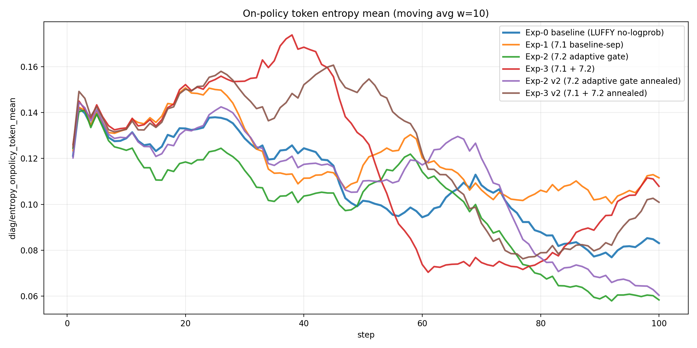
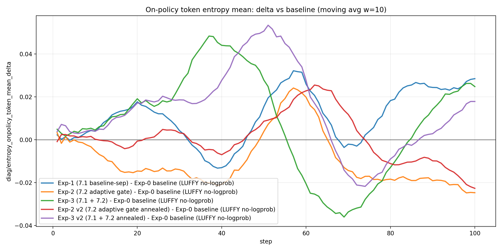
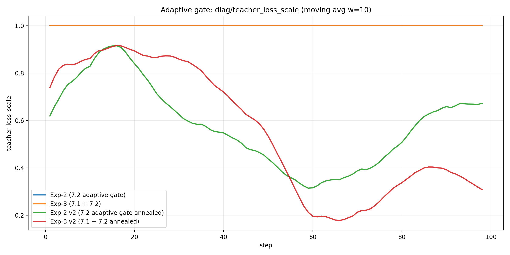
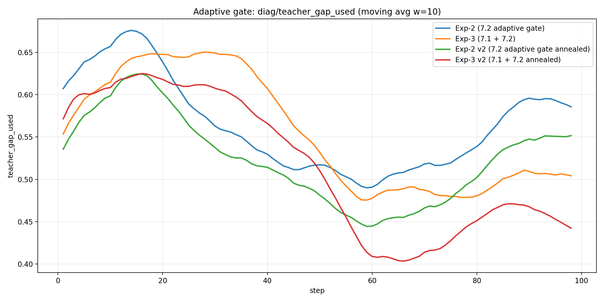

# 2026-01-13：LUFFY no-logprob（baseline）vs 两项改进（7.1/7.2）综合分析报告（含 v2 退火复跑）
## 0. 实验设置与对比对象
本报告对齐了 4 个 run（相同任务/训练步数/teacher 配置，差异仅来自 7.1/7.2 开关），并使用两类数据源交叉验证：
- **W&B history**：reward、actor loss、以及 `diag/teacher_loss_scale` 等（门控专用）
- **本地 Trajectory**：`batch_diag_step_*.json`（包含 gap/adv/entropy 等核心因果链指标）

对比对象：
- **Exp-0 baseline (LUFFY no-logprob)**：run id `mp49ntmm`；trajectory `/home/qisheng/agent/AgentEvolver/checkpoints/agentevolver/alfworld_3b_grpo_teacher72b_only_bz8_mix1_no_logprob_random_analysis_v1/Trajectory`
- **Exp-1 (7.1 baseline-sep)**：run id `bjgtsf79`；trajectory `/home/qisheng/agent/AgentEvolver/checkpoints/agentevolver/alfworld_3b_grpo_teacher72b_only_bz8_mix1_no_logprob_random__grpo_teacher_baseline_sep_v1/Trajectory`
- **Exp-2 (7.2 adaptive gate)**：run id `ksy1eyh3`；trajectory `/home/qisheng/agent/AgentEvolver/checkpoints/agentevolver/alfworld_3b_grpo_teacher72b_only_bz8_mix1_no_logprob_random__teacher_adaptive_gate_v1/Trajectory`
- **Exp-3 (7.1 + 7.2)**：run id `0v8ecp6h`；trajectory `/home/qisheng/agent/AgentEvolver/checkpoints/agentevolver/alfworld_3b_grpo_teacher72b_only_bz8_mix1_no_logprob_random__baseline_sep_plus_adaptive_gate_v1/Trajectory`
- **Exp-2 v2 (7.2 adaptive gate annealed)**：run id `pciujkve`；trajectory `/home/qisheng/agent/AgentEvolver/checkpoints/agentevolver/alfworld_3b_grpo_teacher72b_only_bz8_mix1_no_logprob_random__teacher_adaptive_gate_v2/Trajectory`
- **Exp-3 v2 (7.1 + 7.2 annealed)**：run id `t7doz8ru`；trajectory `/home/qisheng/agent/AgentEvolver/checkpoints/agentevolver/alfworld_3b_grpo_teacher72b_only_bz8_mix1_no_logprob_random__baseline_sep_plus_adaptive_gate_v2/Trajectory`

## 1. 一句话结论（先结论，后证据）
- **7.1（baseline/adv teacher-separation）是否有效**：看它是否显著降低 `diag/adv_onpolicy_token_mean` 的“系统性为负”程度、并改善 late 段 reward 回落。
- **7.2（teacher loss 自适应门控）是否有效**：看 `diag/teacher_loss_scale` 是否随 `diag/teacher_gap_used` 下降而自动退火，并在 late 段释放探索（entropy 不再塌陷/adv 不再长期负）。
- **7.1+7.2 是否互补**：看二者叠加是否同时做到“中期不掉速 + 后期不塌陷”。

## 2. 关键量化指标（可复现表格）
说明：`reward_auc_mean` 为对齐步数上的简单平均（可视为 AUC/steps）；分段均值使用 step 区间 early=1-20, mid=21-60, late=61-100。

| label | steps | reward_auc_mean | reward_best | reward_best_step | reward_last | reward_early_mean_1_20 | reward_mid_mean_21_60 | reward_late_mean_61_100 | run_id | reward_col | reward_auc_delta_vs_baseline | reward_last_delta_vs_baseline |
|---|---|---|---|---|---|---|---|---|---|---|---|---|
| Exp-0 baseline (LUFFY no-logprob) | 98.000000 | 0.483543 | 0.803571 | 72.000000 | 0.321429 | 0.373277 | 0.546241 | 0.475580 | mp49ntmm | critic/rewards_onpolicy/mean | 0.000000 | 0.000000 |
| Exp-1 (7.1 baseline-sep) | 98.000000 | 0.538713 | 0.857143 | 57.000000 | 0.696429 | 0.363628 | 0.549930 | 0.619056 | bjgtsf79 | critic/rewards_onpolicy/mean | 0.055170 | 0.375000 |
| Exp-2 (7.2 adaptive gate) | 98.000000 | 0.432861 | 0.714286 | 50.000000 | 0.446429 | 0.360714 | 0.481399 | 0.419740 | ksy1eyh3 | critic/rewards_onpolicy/mean | -0.050682 | 0.125000 |
| Exp-3 (7.1 + 7.2) | 98.000000 | 0.445258 | 0.732143 | 50.000000 | 0.482143 | 0.329731 | 0.452835 | 0.498087 | 0v8ecp6h | critic/rewards_onpolicy/mean | -0.038285 | 0.160714 |
| Exp-2 v2 (7.2 adaptive gate annealed) | 98.000000 | 0.465599 | 0.821429 | 50.000000 | 0.357143 | 0.384884 | 0.516479 | 0.454524 | pciujkve | critic/rewards_onpolicy/mean | -0.017944 | 0.035714 |
| Exp-3 v2 (7.1 + 7.2 annealed) | 98.000000 | 0.495611 | 0.839286 | 50.000000 | 0.607143 | 0.369831 | 0.509853 | 0.546818 | t7doz8ru | critic/rewards_onpolicy/mean | 0.012067 | 0.285714 |

## 3. 核心可视化（结论主要基于这些图）
### 3.1 reward 曲线（w=10 滑动平均）

### 3.2 reward 相对 baseline 的差值（w=10）

### 3.3 baseline 抬高强度：`diag/group_teacher_minus_on_reward_mean`

### 3.4 探索被压制的直接证据：`diag/adv_onpolicy_token_mean`

### 3.5 熵塌陷：`diag/entropy_onpolicy_token_mean`

### 3.6 7.2 门控是否真的在工作（只在 wandb 有）：`diag/teacher_loss_scale` 与 `diag/teacher_gap_used`

## 4. 机制解释（用最小数学形式把‘为什么有效/为什么可能有副作用’说清楚）
### 4.1 7.1：teacher-separation 为什么理论上应该改善 LUFFY 的 late 回落？
在 rollout-level LUFFY 里，每个 task 组内混入 teacher（高回报）会抬高组均值 baseline，从而把 on-policy 的相对优势系统性压成负值：

令每组共 $n$ 条 rollout，其中 $k$ 条是 teacher，on-policy 平均回报 $\mu_O$，teacher 平均回报 $\mu_T$，则组均值为 $\bar R=\mu_O+\frac{k}{n}(\mu_T-\mu_O)$，on-policy 的期望优势为 $\mathbb{E}[A_O]=\mu_O-\bar R=-\frac{k}{n}(\mu_T-\mu_O)<0$。

7.1 的目标就是：**让 on-policy baseline 只用 on-policy 自己的均值/方差**，避免 teacher 的高回报“以小搏大”地污染所有 on-policy 的优势符号。

### 4.2 7.2：自适应门控为什么可能同时带来“中期加速 + 后期不塌陷”？
7.2 本质是在 teacher loss 上乘一个随 gap 变化的系数：

$$\alpha_t=\mathrm{clip}\left(\frac{\mathrm{gap}_t-\epsilon}{\tau},\,\alpha_{\min},\,\alpha_{\max}\right),\quad \mathrm{gap}_t\approx \mathbb{E}[R_T-R_\pi]$$

当 on-policy 很弱（gap 大）时，teacher 信号强（α≈1）帮助快速进入可行策略子空间；当 on-policy 变强（gap 小）时，teacher 自动退火（α→0）释放探索与长尾修复空间，从而缓解 late 的熵塌陷与 reward 回落。

## 5. 针对 ICML 算法化的下一步（从这两条改进抽象出‘新算法’）
- **建议 A（结构性）**：把 LUFFY 明确写成“双分布/双目标”的优化：on-policy 目标保持纯 GRPO 组内比较；teacher 只作为一个受控的 shaping 项，且其权重由可观测 gap 自适应决定。
- **建议 B（诊断驱动的理论叙事）**：以本报告的三条因果链指标作为算法设计动机与验证闭环：
  - baseline 抬高：`group_teacher_minus_on_reward_mean`
  - 探索惩罚：`adv_onpolicy_token_mean`
  - 熵塌陷：`entropy_onpolicy_token_mean`
  再加上门控指标：`teacher_loss_scale` / `teacher_gap_used`，形成完整因果证据链。

### 5.2（新增）用现有日志验证“batch-mean gate 会误杀 hard group”——per-task gap 异质性证据

你问“现有日志能不能验证建议 1（per-group gate）？”答案是：**可以**。虽然当前 W&B 只记录了 batch-level 的 `diag/group_teacher_minus_on_reward_mean`（均值），但本地每步的 `Trajectory/trajectories_step_*.jsonl` 保存了 rollout-level 的 `reward.outcome` 与 `diag.is_teacher`，因此我们可以在每个 step 内重建：

- 每个 task group 的 teacher reward：\(R_{T,g}\)
- 每个 task group 的 on-policy 平均 reward：\(\bar{R}_{\pi,g}\)
- 组内 gap：\(\Delta_g = R_{T,g} - \bar{R}_{\pi,g}\)

我对 `t7doz8ru`（Exp-3 v2，7.1+7.2 退火）与 `bjgtsf79`（Exp-1，7.1）分别从 jsonl 重建了每步 per-task gap 分布，并输出到：

- `analysis/luffy_no_logprob_improvement_compare/out_v2/per_group_gap/t7doz8ru/per_step_gap_stats.csv`
- `analysis/luffy_no_logprob_improvement_compare/out_v2/per_group_gap/bjgtsf79/per_step_gap_stats.csv`

#### 5.2.1 关键发现：同一个 step 内 gap 分布呈现“明显长尾/异质性”

以 `t7doz8ru` 为例（对所有 step 取平均）：

- gap_mean（跨 task 平均）≈ **0.498**
- gap_p90（跨 task 的 90 分位）≈ **0.815**
- gap_max（跨 task 最大值）≈ **0.893**
- 平均 \(gap\_p90-gap\_mean\) ≈ **0.317**
- 平均 \(gap\_max-gap\_mean\) ≈ **0.395**

这意味着：即使某个 step 的“平均 gap”看起来已经不高，**仍然经常存在少数 hard task 的 gap 接近 1.0**（on-policy 很差、teacher 满分），这正是“batch-mean gate 容易误杀 hard task”的数学前提。

#### 5.2.2 直接证据：存在大量 step 满足“mean gap 不大但 max gap 极大”

在 `t7doz8ru` 里，我们可以筛出很多 step 满足：

- `gap_mean < 0.50`（均值会驱动 \(\alpha\) 下降）
- 但 `gap_max > 0.75`（仍有至少一个 hard group 非常需要 teacher）

例如 step=55（仅作为示例，详见上面 CSV）：

- `gap_mean=0.3929`，但 `gap_max=1.0`，且 `frac_gap_gt_0_5=0.375`
- 此时 `diag/teacher_loss_scale=0.2086`（teacher 梯度已被显著压制）

这类样本恰好解释了为什么 **batch-level** 的 gate（只看均值）会在某些 step 里对 hard group “过早断奶”；而 **per-group gate** 能做到：

- easy group（gap 小）\(\alpha_g\to 0\)：减少不必要的 teacher 牵引
- hard group（gap 大）\(\alpha_g\to 1\)：保留对 tail 的样本效率与修复信号

#### 5.2.3 与 “7.1+7.2 没超过 7.1” 的联系

从同一套 per-task gap 统计看，`t7doz8ru` 的 tail 更重（均值/90分位/最大值都更大）：

- `gap_mean`: **0.4506 (bjgtsf79)** vs **0.4979 (t7doz8ru)**
- `gap_p90`: **0.7657** vs **0.8153**
- `gap_max`: **0.8514** vs **0.8929**
- `frac_gap_gt_0_5`: **0.4176** vs **0.4979**

这说明 `t7doz8ru` 在更长时间里维持着更重的“hard tail”。在这种情况下，batch-mean gate 更容易在“均值已经下降”的阶段压低 teacher 梯度，从而对 hard tail 的学习速度造成影响；也就更难出现 “7.1+7.2 > 7.1” 的稳定增益。
