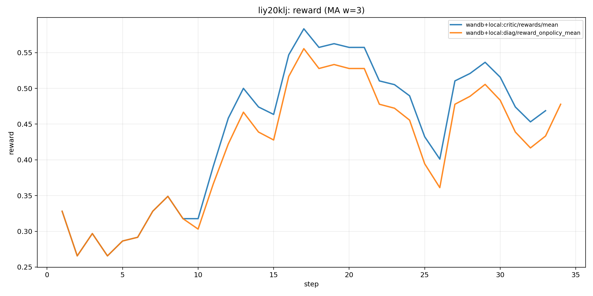
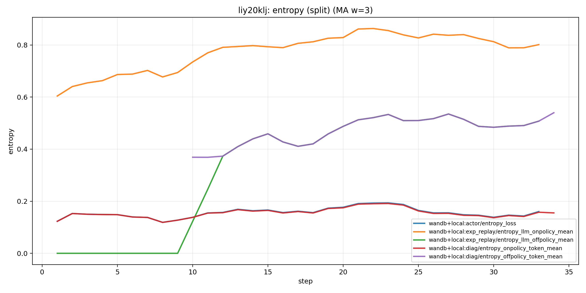
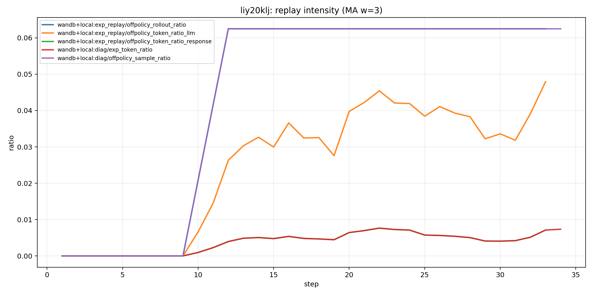
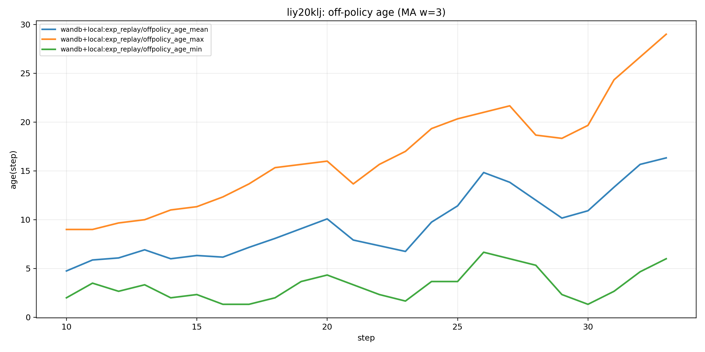
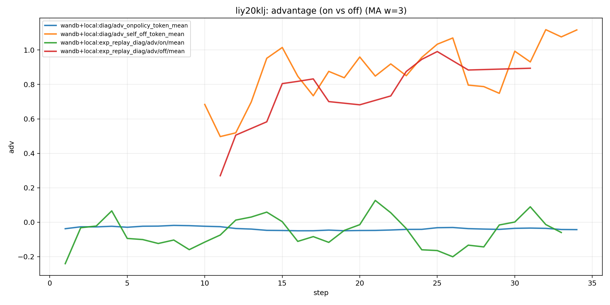
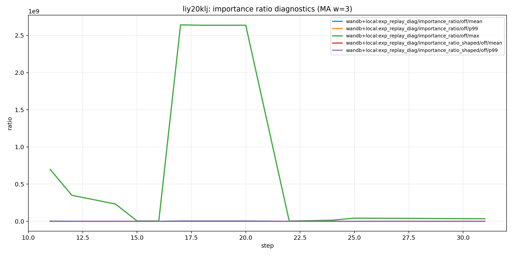
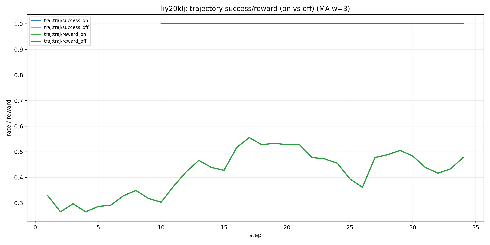
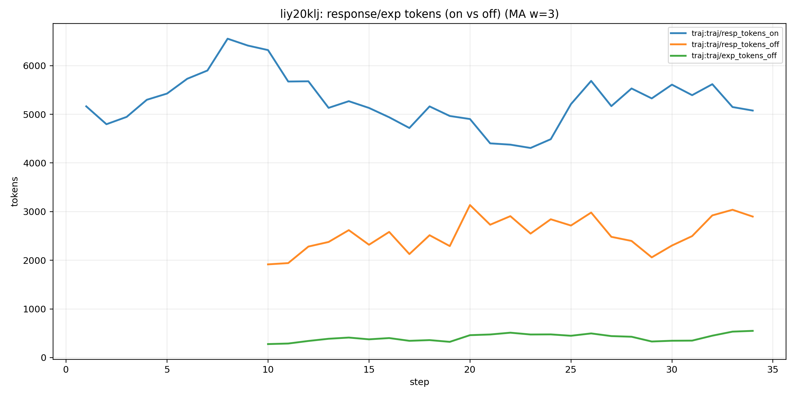

# 2026-01-14：`liy20klj` 前 34 步 Endogenous Replay 机制分析（early-step）

本报告只使用 **34 步早期数据**（服务器中断前），目标不是下结论，而是做 **机制信号探测**：replay 何时真正“点亮”、它影响熵/优势/年龄/ratio 的路径是什么、以及下一轮重跑最值得优先验证哪些优化点。

## 1. 数据来源与对齐
- **W&B**: run `liy20klj`（已拉取到本地 compiled CSV）
- **本地轨迹诊断**: `analysis/endogenous_exp_replay_compare/out/local_liy20klj/batch_diag_steps_1_34.csv`（按 step 聚合的 token/sample 级诊断）

## 2. Replay 何时真正开始起作用？（关键事件点）
- **W&B 检测**（`exp_replay/offpolicy_rollout_ratio>0`）：10
- **本地诊断检测**（`diag/offpolicy_sample_ratio>0`）：10
- **综合认为 replay 开始 step**：10

解释：在 early 阶段 replay 需要先在 pool 里积累到可复用的成功轨迹，因此即便配置了 `replay_start_ratio`，也可能出现“**配置允许 replay，但实际要到更后面才有 off-policy 样本**”的现象。

## 3. 可视化（只看前 34 步）
### 3.1 reward：训练曲线与 on-policy reward（若有）

### 3.2 熵拆分：on-policy vs off-policy（W&B + 本地诊断）

### 3.3 replay 强度：rollout 比例 & token 比例

### 3.4 staleness：off-policy age

### 3.5 advantage：on vs off（用于 baseline 污染/学习信号诊断）

### 3.6 importance ratio（如果该 run 记录了 exp_replay_diag）

### 3.7 轨迹级：on-policy vs off-policy 的 success/reward

### 3.8 轨迹级：on vs off 的 response token 与 exp token

## 4. Early vs Post（以 replay 开始 step 为分界）的均值对比

| segment | lo | hi | n | critic/rewards/mean | actor/entropy_loss | actor/kl_loss | exp_replay/offpolicy_token_ratio_llm | exp_replay/offpolicy_rollout_ratio | exp_replay/offpolicy_age_mean | exp_replay/entropy_llm_onpolicy_mean | exp_replay/entropy_llm_offpolicy_mean | diag/exp_token_ratio | diag/offpolicy_sample_ratio | diag/entropy_onpolicy_token_mean | diag/entropy_offpolicy_token_mean | diag/adv_onpolicy_token_mean | diag/adv_self_off_token_mean |
|---|---|---|---|---|---|---|---|---|---|---|---|---|---|---|---|---|---|
| pre (step 1-9) | 1.000000 | 9.000000 | 9.000000 | 0.302083 | 0.138948 | 0.007877 | 0.000000 | 0.000000 |  | 0.679135 | 0.000000 | 0.000000 | 0.000000 | 0.138948 |  | -0.023412 |  |
| post (step 10-34) | 10.000000 | 34.000000 | 25.000000 | 0.502604 | 0.164006 | 0.207271 | 0.036726 | 0.062500 | 9.906250 | 0.818655 | 0.475160 | 0.005467 | 0.062500 | 0.161173 | 0.479142 | -0.041317 | 0.888015 |

## 5. 34 步内已经出现的“机制信号”与解读（数据 + 数学视角）
### 5.1 小剂量 replay 也能明显抬升熵（重要）
从本地诊断看，replay 启动后 `diag/exp_token_ratio` 只有约 **0.3%–1%**，但它与 **on-policy token 熵**存在可见同向相关（post 段 `corr(diag/exp_token_ratio, diag/entropy_onpolicy_token_mean)`）。
这支持一个关键观点：**replay 的作用不只是“off-policy token 自己更散”，而可能通过共享参数的梯度把 on-policy 分布也一起“摊开”**。

数学上可以用一个简化的混合梯度来解释（忽略 clip/baseline 等实现细节）：

$$\n\nabla_\theta J(\theta)\;\approx\;\mathbb{E}_{D_{\text{on}}}[\nabla\log\pi_\theta\cdot \hat A]+\lambda\,\mathbb{E}_{D_{\text{replay}}}[\nabla\log\pi_\theta\cdot \hat A\cdot g(w)]\n$$

当 replay 开始提供“当前策略下概率偏低但能成功”的 token/动作时，第二项会对这些区域产生增益，从宏观上表现为 **熵上升（上冲）**；随后 on-policy 学习把概率质量集中到更确定的模式上，又会 **熵回落**。

### 5.2 off-policy 熵显著高于 on-policy：更像“探索注入”而非“收缩模板”
在这 34 步里，post 段本地诊断显示 `diag/entropy_offpolicy_token_mean` 明显高于 `diag/entropy_onpolicy_token_mean`。这通常意味着 replay 样本更“分散/不确定”，更符合“探索注入”的解释。
但要注意：**这也可能是 ratio/staleness 导致的高方差信号**，需要结合 importance ratio 的尾部（p99/max）一起看。

### 5.3 staleness 已经可见：age 均值在十几步量级
W&B 里 `exp_replay/offpolicy_age_mean` 在 post 段已经到 **十几步**量级（相对 34 步总长已经不算小）。这说明即使是短跑，staleness 也会出现，后续重跑可以更系统地验证 age 与 ratio 尾部/熵波动之间的关系。

### 5.4 轨迹级对比：off-policy 样本更“成功/更短/更确定”还是更“探索”？
我们可以直接用本地 `trajectories_step_*.jsonl` 将每步 64 条 rollout 按 `diag.offpolicy_ratio>0` 分成 on/off 两组，查看 success/reward/长度等差异。
这能直接回答一个关键机制问题：**replay 注入到底是在“喂高质量成功样本”（可能带来 baseline 污染）还是在“引入更分散的探索样本”（可能抬升熵）**。

下面是（按推断 replay 开始 step 之后的）轨迹级均值对比：

| split | n_rollouts | success_rate | reward_outcome_mean | response_valid_tokens_mean | offpolicy_ratio_mean | exp_tokens_mean |
|---|---|---|---|---|---|---|
| onpolicy | 1500.000000 | 0.467333 | 0.467333 | 5132.388667 | 0.000000 | 0.000000 |
| offpolicy | 100.000000 | 1.000000 | 1.000000 | 2555.980000 | 0.173751 | 418.690000 |

## 6. 基于这 34 步就能提出的“可操作优化点”（优先级排序）
- **优化点 A（最高优先）**：做 **age-aware weighting / sampling**（例如对 age 做指数衰减权重，或限制 max-age）。理由：短跑里 age 已到十几步，且这是 replay 不稳的首要来源。
- **优化点 B**：把 replay 启动从“配置比例”改为“**池内有效样本阈值**”（例如 pool 中 solved 轨迹数 / 覆盖任务数达到阈值才开始注入），避免前期 batch 里 off-policy 极少却带来高方差。
- **优化点 C**：若后续看到 `importance_ratio/off/p99|max` 很大，优先尝试更强的 **policy shaping/clip**（或 ratio-dependent damping），把尾部压住再谈更高 exp_ratio。
- **优化点 D**：用 `exp_replay/entropy_llm_onpolicy_mean` 判断熵上冲是否真的发生在 on-policy；如果只在 off-policy，上冲可能是“数据侧更散”而非策略探索增强。

## 7. 附：post 段相关性（用于机制假说筛选）

| a | b | corr |
|---|---|---|
| diag/exp_token_ratio | diag/entropy_onpolicy_token_mean | 0.570625 |
| diag/exp_token_ratio | diag/entropy_offpolicy_token_mean | 0.444045 |
| exp_replay/offpolicy_token_ratio_llm | exp_replay/entropy_llm_onpolicy_mean | 0.368870 |
| exp_replay/offpolicy_token_ratio_llm | exp_replay/entropy_llm_offpolicy_mean | 0.495682 |
| exp_replay/offpolicy_age_mean | exp_replay_diag/importance_ratio/off/p99 | -0.103174 |
| exp_replay/offpolicy_age_mean | exp_replay_diag/importance_ratio/off/max | -0.189283 |
| exp_replay/entropy_llm_offpolicy_mean | exp_replay_diag/importance_ratio/off/p99 | -0.029862 |

## 8. 下一步：你重跑后我会重点补齐的证据链
- replay-on vs replay-off 对照（你计划重跑的 baseline）
- importance ratio 的尾部分布随 age 变化（staleness → ratio 尾部 → 熵/kl 波动）
- advantage(on) 是否系统性变差（baseline 污染信号）
- 熵上冲主要发生在 on-policy 还是 off-policy token（探索 vs 方差）
