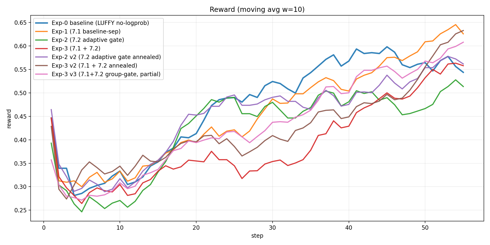
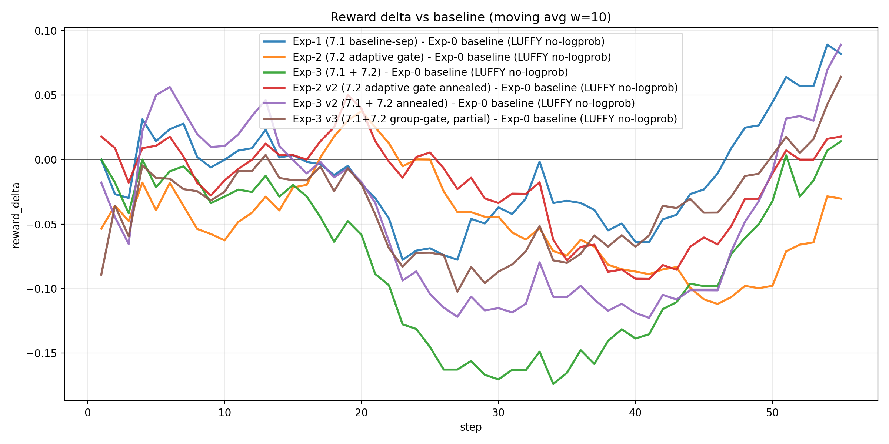
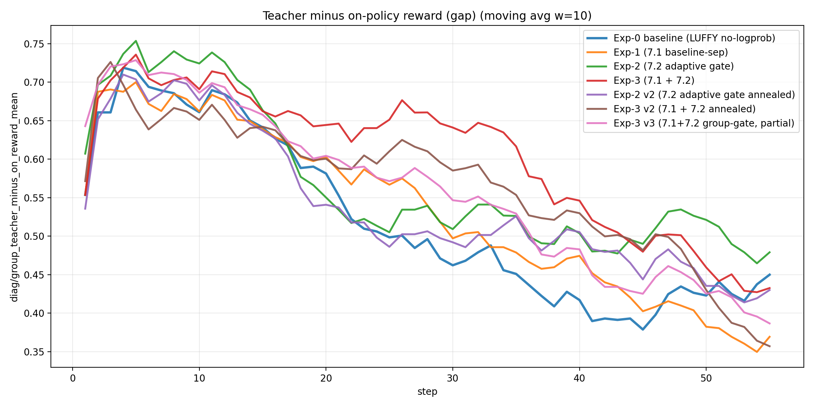
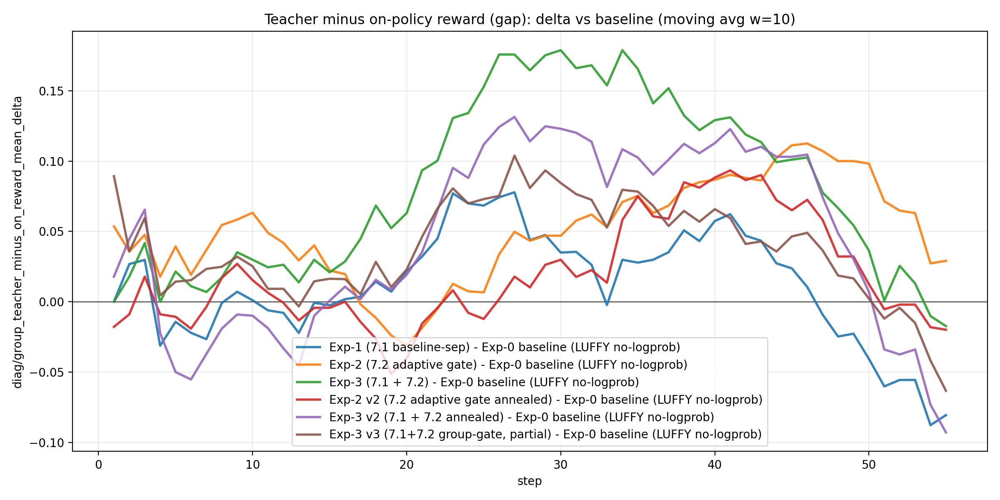
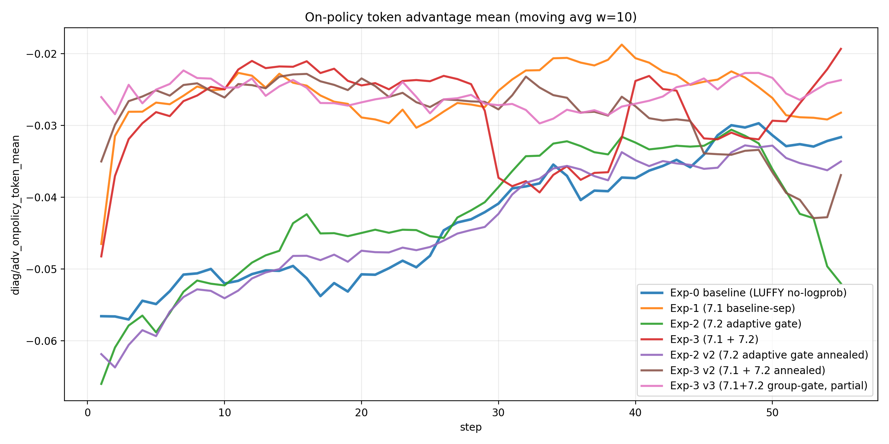
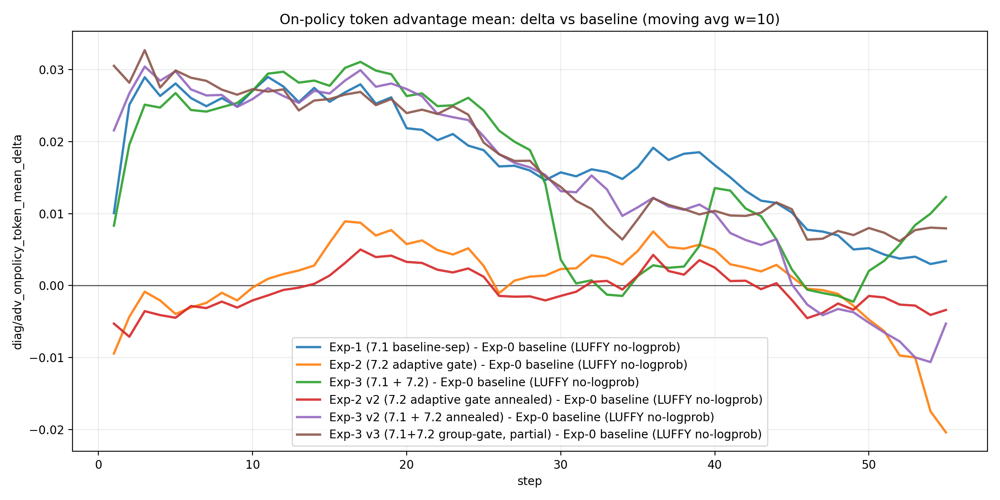
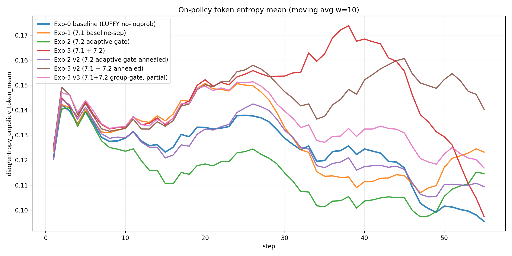
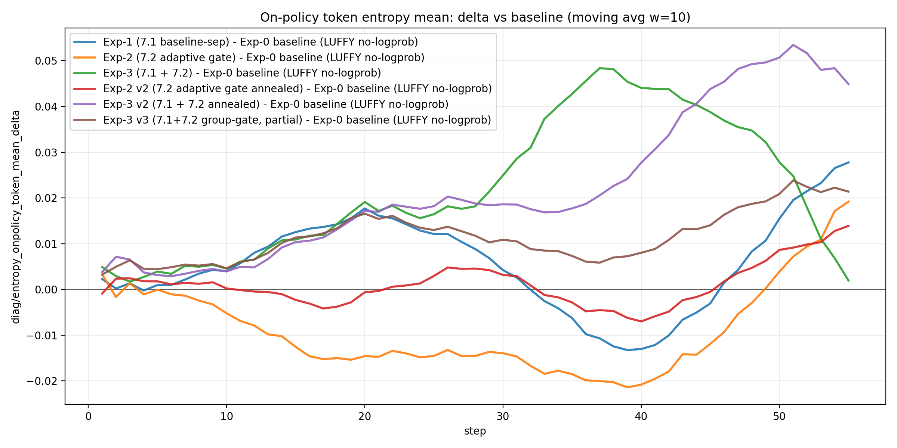
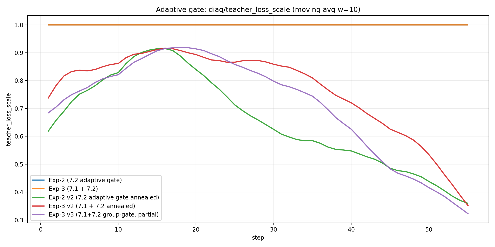
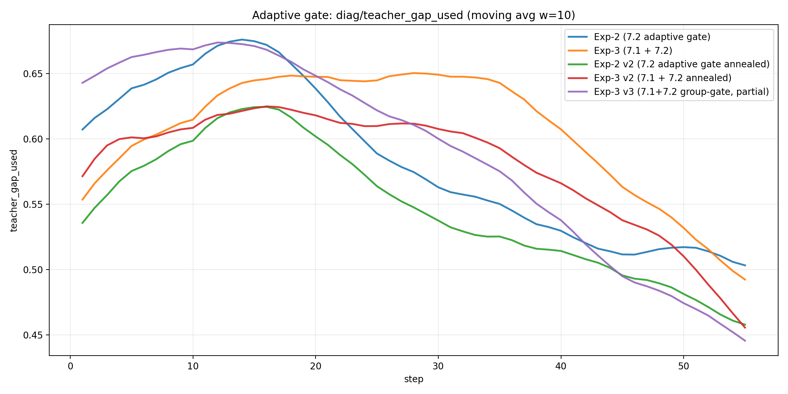

# 2026-01-13：LUFFY no-logprob（baseline）vs 两项改进（7.1/7.2）综合分析报告（含 v2 退火复跑）（仅统计 step<= 55）

## -1. 7.1 / 7.2 的改进设计原理（先讲清机制，再看数据）

本报告涉及两条改进：**7.1：GRPO advantage/baseline teacher-separation** 与 **7.2：teacher loss 自适应门控/退火**（分为 **v2：batch-level 退火** 与 **v3：per-task(per-group) 退火**）。

为了让后续图表解读有“可推导的锚点”，先把关键机制用最小数学形式写清楚。

### -1.1 问题来源：rollout-level teacher 混入会系统性抬高 baseline

在 rollout-level LUFFY 里，每个 task（一个 group）内有 \(n\) 条 rollout，其中 \(k\) 条是 teacher，\(n-k\) 条是 on-policy。令：

- teacher 平均回报：\(\mu_T\)
- on-policy 平均回报：\(\mu_O\)

组内均值 baseline 为：

\[
\bar{R}=\frac{k\mu_T+(n-k)\mu_O}{n}=\mu_O+\frac{k}{n}(\mu_T-\mu_O)
\]

若 teacher 更强（\(\mu_T>\mu_O\)），则 on-policy 在组内的期望优势（抽象为“去均值”形式）满足：

\[
\mathbb{E}[A_O]=\mu_O-\bar{R}=-\frac{k}{n}(\mu_T-\mu_O)<0
\]

这就是你们在日志里看到的结构性现象：`diag/group_teacher_minus_on_reward_mean` 长期为正、同时 `diag/adv_onpolicy_token_mean` 容易长期偏负，进而导致 **探索被惩罚 → 熵下降/塌陷 → late 回落**。

### -1.2 7.1：teacher-separation baseline（改 advantage 统计，不直接改 teacher loss）

7.1 的核心思想：**teacher 可以继续作为示范信号存在，但不应进入 on-policy 的 baseline 计算**（否则会系统性压低 on-policy advantage）。

对 on-policy rollout，用“只含 on-policy”的组内均值当 baseline：

\[
\tilde{A}^{(\pi)}_{i}=R^{(\pi)}_{i}-\underbrace{\frac{1}{n-k}\sum_{j\in \text{on-policy}}R^{(\pi)}_{j}}_{\bar{R}_{\pi}}
\]

这样就避免了 teacher 的高回报抬高 \(\bar{R}\) 并把 on-policy 的优势整体压成负值；从机制上切断 “baseline 污染 → adv 系统性偏负”。

### -1.3 7.2 v2：batch-level gap 退火（一个标量 \(\alpha_t\) 缩放整个 batch 的 teacher 梯度）

7.2 v2 的目标：当 on-policy 逐渐追上 teacher（gap 变小）时，teacher 的强牵引应自动减弱，释放探索与长尾修复空间。

定义 batch-level gap（日志里的 `diag/group_teacher_minus_on_reward_mean` 近似）：

\[
\mathrm{gap}_t \approx \mathbb{E}[R_T-R_\pi]
\]

线性门控得到 teacher loss 缩放系数：

\[
\alpha_t=\mathrm{clip}\left(\frac{\mathrm{gap}_t-\epsilon}{\tau},\,\alpha_{\min},\,\alpha_{\max}\right)\in[\alpha_{\min},\alpha_{\max}]
\]

并把 teacher 项的有效权重（实现里是对 teacher_ratio/shaping 后项）做缩放：

\[
\rho_T \leftarrow \alpha_t\cdot \rho_T
\]

于是：gap 大 → \(\alpha_t\approx 1\)（teacher 强）；gap 小 → \(\alpha_t\to 0\)（teacher 退火）。

### -1.4 7.2 v3：per-task(per-group) 退火（解决 batch-mean 误杀 hard tail）

你们已用现有日志验证：同一个 step 内 **per-task gap 分布是长尾的**（mean 不大但 p90/max 很大）。因此 batch-level 的 \(\alpha_t\) 会被 easy task “稀释”，从而在仍存在 hard tail 时过早退火（误杀 hard group 的 teacher 信号）。

v3 把 gate 从 batch 标量改为 **每个 task group 一个 \(\alpha_{t,g}\)**：

\[
\mathrm{gap}_{t,g}= \mathbb{E}[R_T\mid g]-\mathbb{E}[R_\pi\mid g]
\]

\[
\alpha_{t,g}=\mathrm{clip}\left(\frac{\mathrm{gap}_{t,g}-\epsilon}{\tau},\,\alpha_{\min},\,\alpha_{\max}\right)
\]

对属于该 group 的 teacher 样本做缩放：

\[
\rho_{T,g} \leftarrow \alpha_{t,g}\cdot \rho_{T,g}
\]

直觉：
- easy group：\(\alpha_{t,g}\to 0\)，减少不必要的 teacher 牵引
- hard group：\(\alpha_{t,g}\to 1\)，保留 tail 的样本效率与修复信号

这就是 v3 试图实现 **7.1 + 7.2 > 7.1** 的关键互补点：7.1 已移除 baseline 污染后，7.2 不应再用粗粒度 batch 均值整体压 teacher，而应把 teacher 预算集中投向 hard tail。

## 0. 实验设置与对比对象
本报告对齐了 4 个 run（相同任务/训练步数/teacher 配置，差异仅来自 7.1/7.2 开关），并使用两类数据源交叉验证：
- **W&B history**：reward、actor loss、以及 `diag/teacher_loss_scale` 等（门控专用）
- **本地 Trajectory**：`batch_diag_step_*.json`（包含 gap/adv/entropy 等核心因果链指标）

对比对象：
- **Exp-0 baseline (LUFFY no-logprob)**：run id `mp49ntmm`；trajectory `/home/qisheng/agent/AgentEvolver/checkpoints/agentevolver/alfworld_3b_grpo_teacher72b_only_bz8_mix1_no_logprob_random_analysis_v1/Trajectory`
- **Exp-1 (7.1 baseline-sep)**：run id `bjgtsf79`；trajectory `/home/qisheng/agent/AgentEvolver/checkpoints/agentevolver/alfworld_3b_grpo_teacher72b_only_bz8_mix1_no_logprob_random__grpo_teacher_baseline_sep_v1/Trajectory`
- **Exp-2 (7.2 adaptive gate)**：run id `ksy1eyh3`；trajectory `/home/qisheng/agent/AgentEvolver/checkpoints/agentevolver/alfworld_3b_grpo_teacher72b_only_bz8_mix1_no_logprob_random__teacher_adaptive_gate_v1/Trajectory`
- **Exp-3 (7.1 + 7.2)**：run id `0v8ecp6h`；trajectory `/home/qisheng/agent/AgentEvolver/checkpoints/agentevolver/alfworld_3b_grpo_teacher72b_only_bz8_mix1_no_logprob_random__baseline_sep_plus_adaptive_gate_v1/Trajectory`
- **Exp-2 v2 (7.2 adaptive gate annealed)**：run id `pciujkve`；trajectory `/home/qisheng/agent/AgentEvolver/checkpoints/agentevolver/alfworld_3b_grpo_teacher72b_only_bz8_mix1_no_logprob_random__teacher_adaptive_gate_v2/Trajectory`
- **Exp-3 v2 (7.1 + 7.2 annealed)**：run id `t7doz8ru`；trajectory `/home/qisheng/agent/AgentEvolver/checkpoints/agentevolver/alfworld_3b_grpo_teacher72b_only_bz8_mix1_no_logprob_random__baseline_sep_plus_adaptive_gate_v2/Trajectory`
- **Exp-3 v3 (7.1+7.2 group-gate, partial)**：run id `btxf74s2`；trajectory `/home/qisheng/agent/AgentEvolver/checkpoints/agentevolver/alfworld_3b_grpo_teacher72b_only_bz8_mix1_no_logprob_random__baseline_sep_plus_adaptive_gate_v3/Trajectory`

## 1. 一句话结论（先结论，后证据）
- **7.1（baseline/adv teacher-separation）是否有效**：看它是否显著降低 `diag/adv_onpolicy_token_mean` 的“系统性为负”程度、并改善 late 段 reward 回落。
- **7.2（teacher loss 自适应门控）是否有效**：看 `diag/teacher_loss_scale` 是否随 `diag/teacher_gap_used` 下降而自动退火，并在 late 段释放探索（entropy 不再塌陷/adv 不再长期负）。
- **7.1+7.2 是否互补**：看二者叠加是否同时做到“中期不掉速 + 后期不塌陷”。

## 2. 关键量化指标（可复现表格）
说明：`reward_auc_mean` 为对齐步数上的简单平均（可视为 AUC/steps）；分段均值使用 step 区间 early=1-20, mid=21-60, late=61-100。

| label | steps | reward_auc_mean | reward_best | reward_best_step | reward_last | reward_early_mean_1_20 | reward_mid_mean_21_60 | reward_late_mean_61_100 | run_id | reward_col | reward_auc_delta_vs_baseline | reward_last_delta_vs_baseline |
|---|---|---|---|---|---|---|---|---|---|---|---|---|
| Exp-0 baseline (LUFFY no-logprob) | 55.000000 | 0.485606 | 0.750000 | 50.000000 | 0.535714 | 0.373277 | 0.549794 |  | mp49ntmm | critic/rewards_onpolicy/mean | 0.000000 | 0.000000 |
| Exp-1 (7.1 baseline-sep) | 55.000000 | 0.479933 | 0.821429 | 50.000000 | 0.500000 | 0.363628 | 0.546393 |  | bjgtsf79 | critic/rewards_onpolicy/mean | -0.005673 | -0.035714 |
| Exp-2 (7.2 adaptive gate) | 55.000000 | 0.439371 | 0.714286 | 50.000000 | 0.446429 | 0.360714 | 0.484318 |  | ksy1eyh3 | critic/rewards_onpolicy/mean | -0.046235 | -0.089286 |
| Exp-3 (7.1 + 7.2) | 55.000000 | 0.408299 | 0.732143 | 50.000000 | 0.517857 | 0.329731 | 0.453195 |  | 0v8ecp6h | critic/rewards_onpolicy/mean | -0.077307 | -0.017857 |
| Exp-2 v2 (7.2 adaptive gate annealed) | 55.000000 | 0.466245 | 0.821429 | 50.000000 | 0.517857 | 0.384884 | 0.512737 |  | pciujkve | critic/rewards_onpolicy/mean | -0.019361 | -0.017857 |
| Exp-3 v2 (7.1 + 7.2 annealed) | 55.000000 | 0.449522 | 0.839286 | 50.000000 | 0.607143 | 0.369831 | 0.495059 |  | t7doz8ru | critic/rewards_onpolicy/mean | -0.036085 | 0.071429 |
| Exp-3 v3 (7.1+7.2 group-gate, partial) | 55.000000 | 0.457872 | 0.803571 | 50.000000 | 0.553571 | 0.351175 | 0.518842 |  | btxf74s2 | critic/rewards_onpolicy/mean | -0.027734 | 0.017857 |

## 3. 核心可视化（结论主要基于这些图）
### 3.1 reward 曲线（w=10 滑动平均）

### 3.2 reward 相对 baseline 的差值（w=10）

### 3.3 baseline 抬高强度：`diag/group_teacher_minus_on_reward_mean`

### 3.4 探索被压制的直接证据：`diag/adv_onpolicy_token_mean`

### 3.5 熵塌陷：`diag/entropy_onpolicy_token_mean`

### 3.6 7.2 门控是否真的在工作（只在 wandb 有）：`diag/teacher_loss_scale` 与 `diag/teacher_gap_used`

## 4. 机制解释（用最小数学形式把‘为什么有效/为什么可能有副作用’说清楚）
### 4.1 7.1：teacher-separation 为什么理论上应该改善 LUFFY 的 late 回落？
在 rollout-level LUFFY 里，每个 task 组内混入 teacher（高回报）会抬高组均值 baseline，从而把 on-policy 的相对优势系统性压成负值：

令每组共 $n$ 条 rollout，其中 $k$ 条是 teacher，on-policy 平均回报 $\mu_O$，teacher 平均回报 $\mu_T$，则组均值为 $\bar R=\mu_O+\frac{k}{n}(\mu_T-\mu_O)$，on-policy 的期望优势为 $\mathbb{E}[A_O]=\mu_O-\bar R=-\frac{k}{n}(\mu_T-\mu_O)<0$。

7.1 的目标就是：**让 on-policy baseline 只用 on-policy 自己的均值/方差**，避免 teacher 的高回报“以小搏大”地污染所有 on-policy 的优势符号。

### 4.2 7.2：自适应门控为什么可能同时带来“中期加速 + 后期不塌陷”？
7.2 本质是在 teacher loss 上乘一个随 gap 变化的系数：

$$\alpha_t=\mathrm{clip}\left(\frac{\mathrm{gap}_t-\epsilon}{\tau},\,\alpha_{\min},\,\alpha_{\max}\right),\quad \mathrm{gap}_t\approx \mathbb{E}[R_T-R_\pi]$$

当 on-policy 很弱（gap 大）时，teacher 信号强（α≈1）帮助快速进入可行策略子空间；当 on-policy 变强（gap 小）时，teacher 自动退火（α→0）释放探索与长尾修复空间，从而缓解 late 的熵塌陷与 reward 回落。

## 5. 改进
- **建议 A（结构性）**：把 LUFFY 明确写成“双分布/双目标”的优化：on-policy 目标保持纯 GRPO 组内比较；teacher 只作为一个受控的 shaping 项，且其权重由可观测 gap 自适应决定。
- **建议 B（诊断驱动的理论叙事）**：以本报告的三条因果链指标作为算法设计动机与验证闭环：
  - baseline 抬高：`group_teacher_minus_on_reward_mean`
  - 探索惩罚：`adv_onpolicy_token_mean`
  - 熵塌陷：`entropy_onpolicy_token_mean`
  再加上门控指标：`teacher_loss_scale` / `teacher_gap_used`，形成完整因果证据链。

