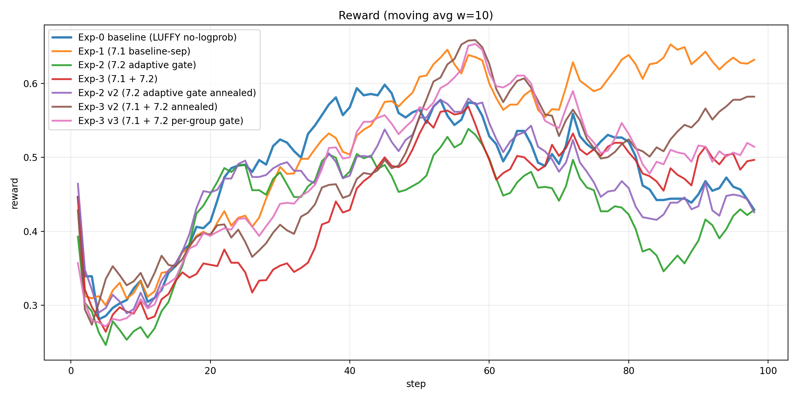
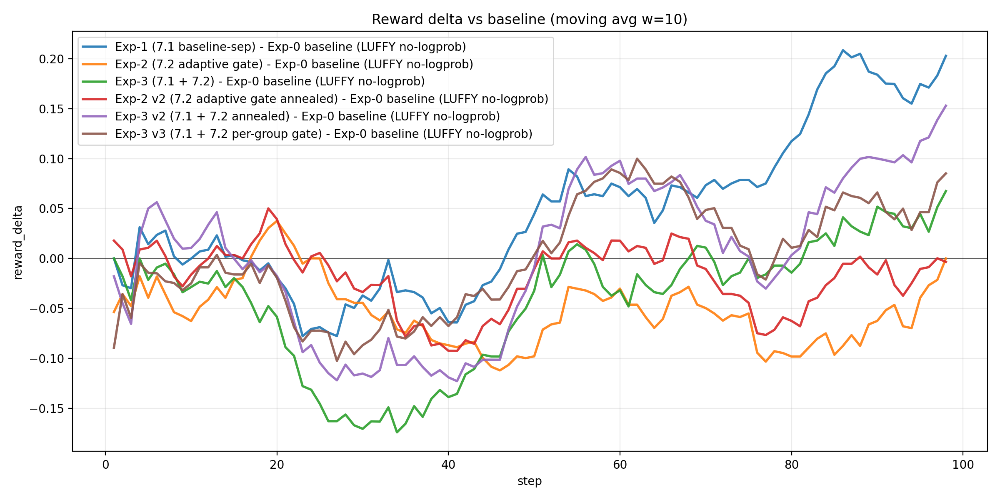
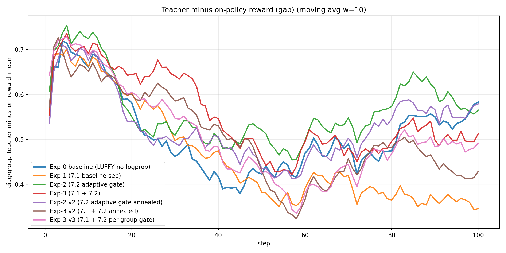
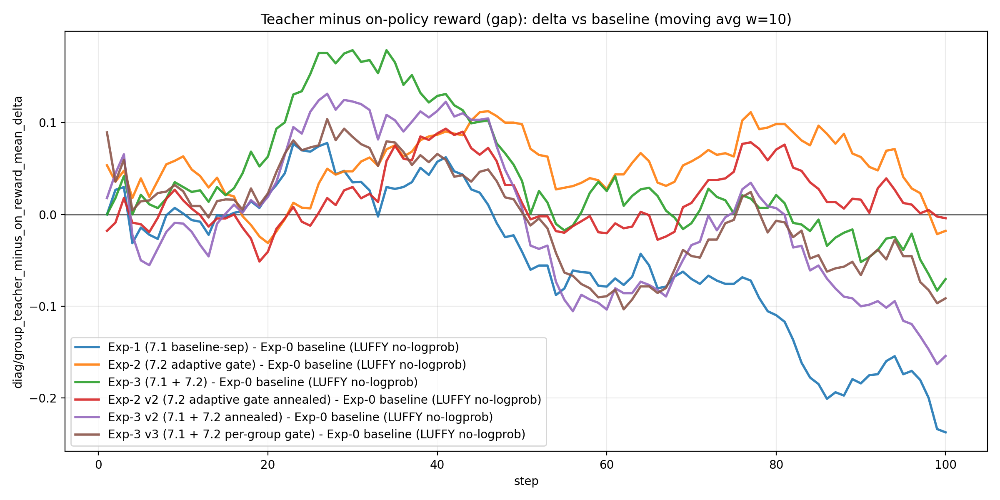
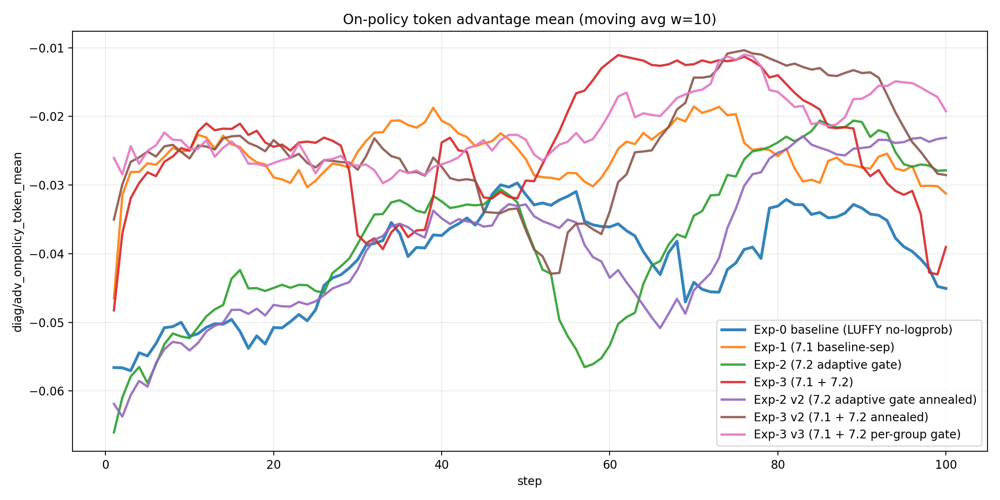
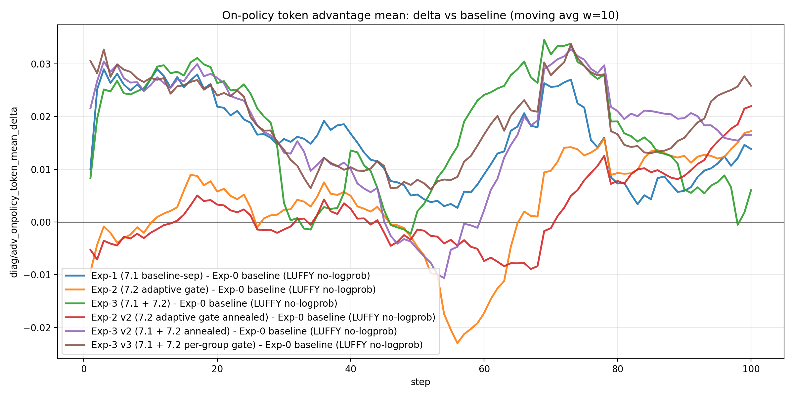
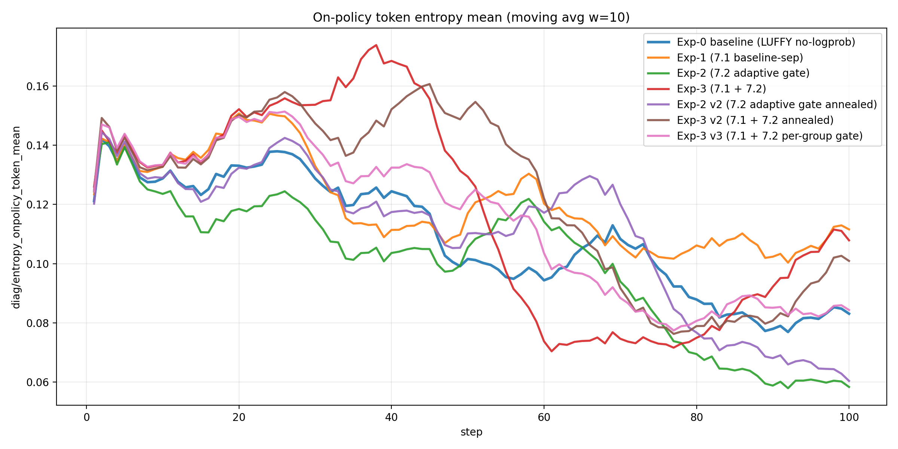
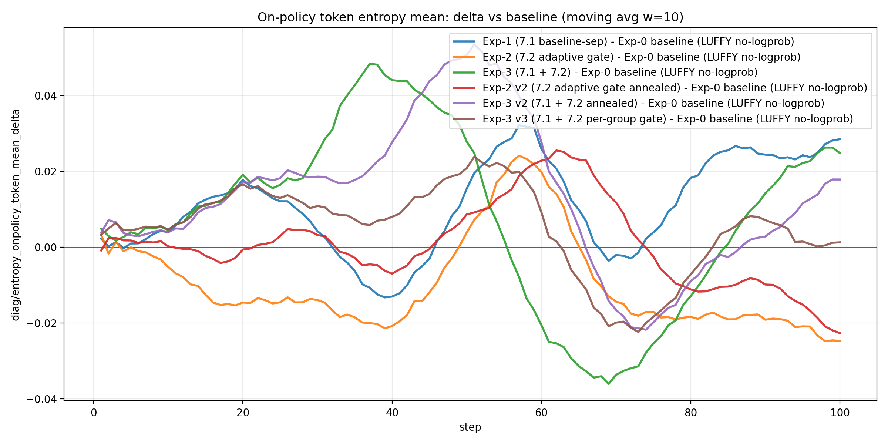
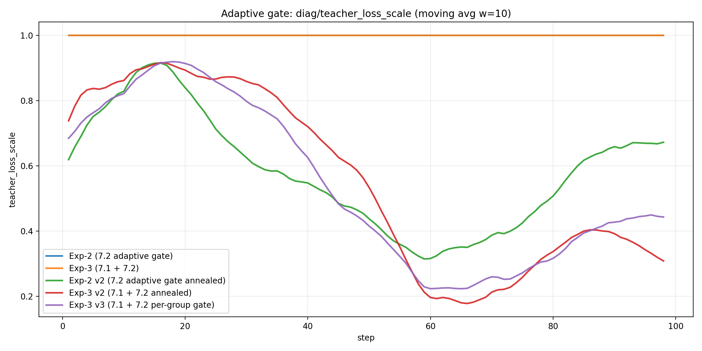
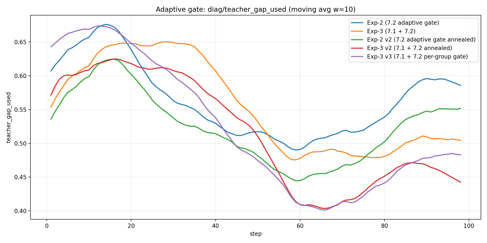

# 2026-01-14：LUFFY no-logprob（baseline）vs 7.1/7.2/v3 复盘 + 7.3 设计（token-level gate）
## 0. 实验设置与对比对象
本报告对齐了 7 个 run（相同任务/训练步数/teacher 配置，差异来自 7.1/7.2 的开关、7.2 的超参版本、以及 v3 gate 粒度），并使用两类数据源交叉验证：
- **W&B history**：reward、actor loss、以及 `diag/teacher_loss_scale` 等（门控专用）
- **本地 Trajectory**：`batch_diag_step_*.json`（包含 gap/adv/entropy 等核心因果链指标）

对比对象：
- **Exp-0 baseline (LUFFY no-logprob)**：run id `mp49ntmm`；trajectory `/home/qisheng/agent/AgentEvolver/checkpoints/agentevolver/alfworld_3b_grpo_teacher72b_only_bz8_mix1_no_logprob_random_analysis_v1/Trajectory`
- **Exp-1 (7.1 baseline-sep)**：run id `bjgtsf79`；trajectory `/home/qisheng/agent/AgentEvolver/checkpoints/agentevolver/alfworld_3b_grpo_teacher72b_only_bz8_mix1_no_logprob_random__grpo_teacher_baseline_sep_v1/Trajectory`
- **Exp-2 (7.2 adaptive gate)**：run id `ksy1eyh3`；trajectory `/home/qisheng/agent/AgentEvolver/checkpoints/agentevolver/alfworld_3b_grpo_teacher72b_only_bz8_mix1_no_logprob_random__teacher_adaptive_gate_v1/Trajectory`
- **Exp-3 (7.1 + 7.2)**：run id `0v8ecp6h`；trajectory `/home/qisheng/agent/AgentEvolver/checkpoints/agentevolver/alfworld_3b_grpo_teacher72b_only_bz8_mix1_no_logprob_random__baseline_sep_plus_adaptive_gate_v1/Trajectory`
- **Exp-2 v2 (7.2 adaptive gate annealed)**：run id `pciujkve`；trajectory `/home/qisheng/agent/AgentEvolver/checkpoints/agentevolver/alfworld_3b_grpo_teacher72b_only_bz8_mix1_no_logprob_random__teacher_adaptive_gate_v2/Trajectory`
- **Exp-3 v2 (7.1 + 7.2 annealed)**：run id `t7doz8ru`；trajectory `/home/qisheng/agent/AgentEvolver/checkpoints/agentevolver/alfworld_3b_grpo_teacher72b_only_bz8_mix1_no_logprob_random__baseline_sep_plus_adaptive_gate_v2/Trajectory`
- **Exp-3 v3 (7.1 + 7.2 per-group gate)**：run id `btxf74s2`；trajectory `/home/qisheng/agent/AgentEvolver/checkpoints/agentevolver/alfworld_3b_grpo_teacher72b_only_bz8_mix1_no_logprob_random__baseline_sep_plus_adaptive_gate_v3/Trajectory`

## 1. 一句话结论（先结论，后证据）
- **7.1（baseline/adv teacher-separation）是否有效**：看它是否显著降低 `diag/adv_onpolicy_token_mean` 的“系统性为负”程度、并改善 late 段 reward 回落。
- **7.2（teacher loss 自适应门控）是否有效**：看 `diag/teacher_loss_scale` 是否随 `diag/teacher_gap_used` 下降而自动退火，并在 late 段释放探索（entropy 不再塌陷/adv 不再长期负）。
- **7.1+7.2 是否互补**：看二者叠加是否同时做到“中期不掉速 + 后期不塌陷”。

## 2. 关键量化指标（可复现表格）
说明：`reward_auc_mean` 为对齐步数上的简单平均（可视为 AUC/steps）；分段均值使用 step 区间 early=1-20, mid=21-60, late=61-100。

| label | steps | reward_auc_mean | reward_best | reward_best_step | reward_last | reward_early_mean_1_20 | reward_mid_mean_21_60 | reward_late_mean_61_100 | run_id | reward_col | reward_auc_delta_vs_baseline | reward_last_delta_vs_baseline |
|---|---|---|---|---|---|---|---|---|---|---|---|---|
| Exp-0 baseline (LUFFY no-logprob) | 98.000000 | 0.483543 | 0.803571 | 72.000000 | 0.321429 | 0.373277 | 0.546241 | 0.475580 | mp49ntmm | critic/rewards_onpolicy/mean | 0.000000 | 0.000000 |
| Exp-1 (7.1 baseline-sep) | 98.000000 | 0.538713 | 0.857143 | 57.000000 | 0.696429 | 0.363628 | 0.549930 | 0.619056 | bjgtsf79 | critic/rewards_onpolicy/mean | 0.055170 | 0.375000 |
| Exp-2 (7.2 adaptive gate) | 98.000000 | 0.432861 | 0.714286 | 50.000000 | 0.446429 | 0.360714 | 0.481399 | 0.419740 | ksy1eyh3 | critic/rewards_onpolicy/mean | -0.050682 | 0.125000 |
| Exp-3 (7.1 + 7.2) | 98.000000 | 0.445258 | 0.732143 | 50.000000 | 0.482143 | 0.329731 | 0.452835 | 0.498087 | 0v8ecp6h | critic/rewards_onpolicy/mean | -0.038285 | 0.160714 |
| Exp-2 v2 (7.2 adaptive gate annealed) | 98.000000 | 0.465599 | 0.821429 | 50.000000 | 0.357143 | 0.384884 | 0.516479 | 0.454524 | pciujkve | critic/rewards_onpolicy/mean | -0.017944 | 0.035714 |
| Exp-3 v2 (7.1 + 7.2 annealed) | 98.000000 | 0.495611 | 0.839286 | 50.000000 | 0.607143 | 0.369831 | 0.509853 | 0.546818 | t7doz8ru | critic/rewards_onpolicy/mean | 0.012067 | 0.285714 |
| Exp-3 v3 (7.1 + 7.2 per-group gate) | 98.000000 | 0.491435 | 0.803571 | 50.000000 | 0.500000 | 0.351175 | 0.529832 | 0.524839 | btxf74s2 | critic/rewards_onpolicy/mean | 0.007892 | 0.178571 |

## 3. 核心可视化（结论主要基于这些图）
### 3.1 reward 曲线（w=10 滑动平均）

### 3.2 reward 相对 baseline 的差值（w=10）

### 3.3 baseline 抬高强度：`diag/group_teacher_minus_on_reward_mean`

### 3.4 探索被压制的直接证据：`diag/adv_onpolicy_token_mean`

### 3.5 熵塌陷：`diag/entropy_onpolicy_token_mean`

### 3.6 7.2 门控是否真的在工作（只在 wandb 有）：`diag/teacher_loss_scale` 与 `diag/teacher_gap_used`

## 4. 机制解释（用最小数学形式把‘为什么有效/为什么可能有副作用’说清楚）
### 4.1 7.1：teacher-separation 为什么理论上应该改善 LUFFY 的 late 回落？
在 rollout-level LUFFY 里，每个 task 组内混入 teacher（高回报）会抬高组均值 baseline，从而把 on-policy 的相对优势系统性压成负值：

令每组共 $n$ 条 rollout，其中 $k$ 条是 teacher，on-policy 平均回报 $\mu_O$，teacher 平均回报 $\mu_T$，则组均值为 $\bar R=\mu_O+\frac{k}{n}(\mu_T-\mu_O)$，on-policy 的期望优势为 $\mathbb{E}[A_O]=\mu_O-\bar R=-\frac{k}{n}(\mu_T-\mu_O)<0$。

7.1 的目标就是：**让 on-policy baseline 只用 on-policy 自己的均值/方差**，避免 teacher 的高回报“以小搏大”地污染所有 on-policy 的优势符号。

### 4.2 7.2：自适应门控为什么可能同时带来“中期加速 + 后期不塌陷”？
7.2 本质是在 teacher loss 上乘一个随 gap 变化的系数：

$$\alpha_t=\mathrm{clip}\left(\frac{\mathrm{gap}_t-\epsilon}{\tau},\,\alpha_{\min},\,\alpha_{\max}\right),\quad \mathrm{gap}_t\approx \mathbb{E}[R_T-R_\pi]$$

当 on-policy 很弱（gap 大）时，teacher 信号强（α≈1）帮助快速进入可行策略子空间；当 on-policy 变强（gap 小）时，teacher 自动退火（α→0）释放探索与长尾修复空间，从而缓解 late 的熵塌陷与 reward 回落。

## 5. 针对 ICML 算法化的下一步（从这两条改进抽象出‘新算法’）
- **建议 A（结构性）**：把 LUFFY 明确写成“双分布/双目标”的优化：on-policy 目标保持纯 GRPO 组内比较；teacher 只作为一个受控的 shaping 项，且其权重由可观测 gap 自适应决定。
- **建议 B（诊断驱动的理论叙事）**：以本报告的三条因果链指标作为算法设计动机与验证闭环：
  - baseline 抬高：`group_teacher_minus_on_reward_mean`
  - 探索惩罚：`adv_onpolicy_token_mean`
  - 熵塌陷：`entropy_onpolicy_token_mean`
  再加上门控指标：`teacher_loss_scale` / `teacher_gap_used`，形成完整因果证据链。

## 6. 为什么 7.1+7.2（甚至 v3 per-group）仍可能不如 7.1？（把机制说清楚）
本节回答一个关键现象：**直觉上 7.2 是“减弱 teacher 影响、释放探索”，但在 7.1 已经修复结构性主因后，7.2/7.1+7.2 反而可能降低 reward**。核心原因不是“门控有没有生效”，而是**门控信号与作用粒度的错配**。

### 6.1 先明确：7.2/7.3 的系数到底如何作用到 loss/gradient？
在当前实现里，teacher 的更新不是独立一个 loss 再做加权求和，而是更底层地在 *token level* 改写 teacher surrogate 的有效权重：

- Teacher (no-logprob LUFFY) 的重要性比率近似为 \(\rho_T=\exp(\log\pi_\theta(a^T|s))\)（再做 policy shaping）。
- 7.2 会把 `teacher_loss_scale` 乘到 `teacher_ratio` 上，即等价于在 teacher token 上乘一个标量/向量 \(\alpha\)。
- 最终的 policy gradient（省略 PPO clip 细节）可抽象为：

\[
\nabla_\theta L \;\propto\;
\sum_{(i,t)\in \text{teacher tokens}} \alpha_{(i,t)} \cdot \big(\cdots\big)\nabla_\theta \log\pi_\theta
\;+\;
\sum_{(i,t)\in \text{on-policy tokens}} \big(\cdots\big)\nabla_\theta \log\pi_\theta
\]

因此，**门控变小**并不只是“少用 teacher”，它会直接导致 teacher token 对梯度的贡献衰减；如果 teacher 在此阶段仍是有效 shaping/anchor，则容易造成整体效果变差。

### 6.2 7.1 已解决“结构性主因”后，7.2 的收益空间缩小，副作用更显著
7.1 通过 teacher-separation 修复了 LUFFY 里最致命的结构性项（teacher 抬高 baseline 导致 on-policy 优势系统性为负）。在这一前提下：
- teacher 更可能变成“**帮助对齐可行轨迹**”的正向信号；
- 7.2 继续按 gap 去退火 teacher，相当于把这份“正向 anchor”削弱；
- 尤其在 reward 稀疏/长序列任务里，anchor 变弱可能表现为 late 段更漂、更不稳。

### 6.3 v3 per-group gate 解决的是“组间异质性”，但没有解决“组内/轨迹内异质性”
v3 的动机是：batch-mean gap 会误杀 hard-tail group，于是改成 per-group \(\alpha_g\)。这确实能避免一部分“误杀 hard group”，但仍存在关键限制：

- gate 仍然是 **按 group 的 outcome gap（0/1 成功率差）** 来决定整条 teacher 轨迹的缩放；
- Alfworld 常见“组内异质性”：大部分步骤已会，但少数关键决策点仍不会，失败就全盘皆输；
- 当 \(\alpha_g\) 变小，**整条 teacher trajectory 的所有 tokens 都一起被缩放**，从而把关键 token 的 teacher 梯度一起砍掉（即使这些 token 仍然是 hard corner）。

这解释了为什么“v3 生效”并不等价于“v3 一定提升 reward”：它改对了粒度的一部分（group），但 gate 的信号与更新粒度仍不够细（token/state）。

### 6.4 为什么 gap/outcome 作为 gate 信号可能过粗、噪声偏大？
在二值回报（成功/失败）场景里，\(\Delta_g=\bar R_T-\bar R_\pi\) 是小样本成功率差。其统计噪声较大，且难以反映“到底是哪一步导致失败”。当把它用于更细粒度控制（per-group）时，可能反而引入更大的更新噪声与不稳定性。

### 6.5 “v3 生效”到底是什么意思？（生效 ≠ 一定提升 reward）
我们在讨论中强调：**v3 生效**指的是“训练代码确实走到了 per-group gate 的分支，并在同一 step/batch 内产生了可观测的组间差异”，而不是指 reward 必然更高。

对 v3（`btxf74s2`）而言，生效证据链主要来自 W&B 指标（合并到 `btxf74s2_merged.csv`）：
- `diag/teacher_gate_level == 1`：表示 **group gate 分支被启用**（0=batch gate）。
- `diag/teacher_loss_scale_min < diag/teacher_loss_scale_max` 且长期分离：表示同一 step 内不同 group 的 \(\alpha_g\) 不同，而不是整个 batch 只有一个 \(\alpha\)。
- `diag/teacher_gap_used_p90 / diag/teacher_gap_used_max`：用于确认 gate 使用的 gap 存在 hard-tail（避免被 mean-gap 掩盖）。

这条证据链能证明“机制按设计执行”，但并不保证“机制带来净增益”。净增益还取决于 gate 的信号是否足够细、是否会误伤关键 token、以及退火是否在正确阶段发生。

## 7. 7.3 设计：token-level teacher gate（按置信度自适应）——为何理论上更可能做到 7.1+7.3 > 7.1
本节总结我们讨论中提出的 7.3：**把 gate 的信号从 outcome-gap（粗）换成“当前策略对 teacher action 的置信度”（细），并把 gate 的作用粒度从 group/batch 提升到 token level。**

### 7.3.1 设计动机：只教“不会的 token”，避免“已会 token 的过度锚定”
直觉上，teacher 的边际收益主要来自模型尚未学会的状态/动作。若模型已经对 teacher action 给出高概率，那么继续用 teacher 更新往往是冗余的，甚至可能过度锚定探索。

因此定义 token-level gate：

\[
w_t = \sigma\left(\frac{\ell^* - \log\pi_\theta(a^T_t|s_t)}{T}\right)\in[0,1]
\]

- \(\log\pi\) 低（不自信）→ \(w_t\approx 1\) → 保留 teacher 梯度
- \(\log\pi\) 高（已学会）→ \(w_t\approx 0\) → 关闭 teacher 梯度

### 7.3.2 与现有实现的兼容性：与 7.2 的 `teacher_loss_scale` 是“相乘”关系
在实现上，7.3 也只是把 gate 乘到 `teacher_ratio` 上；如果你同时打开 7.2，则 teacher 的有效权重变为：

\[
\rho_T' \;=\; \rho_T \cdot w_t \cdot \alpha
\]

这保证：
- 7.3 默认关闭，不影响现有实验；
- 7.2 与 7.3 可做消融组合（单独开/同时开）。

### 7.3.3 与 importance sampling / importance ratio 的关系（避免被误解为“就是个 ratio”）
我们确实在 teacher token 的梯度上**又乘了一个权重** \(w_t\)，因此“形式上看起来像又加了一个 ratio”。但这与 off-policy 的 **importance sampling (IS) 校正**有本质差异：

- **信号不同**：
  - IS 的 ratio 是分布校正项：\(\rho=\pi_\theta(a|s)/\mu(a|s)\)，依赖 **行为策略 \(\mu\)** 的概率。
  - 7.3 的 \(w_t\) 是 **置信度门控**：只依赖当前策略对 teacher action 的置信度 \(\log\pi_\theta(a^T_t|s_t)\)，不需要也不试图估计 \(\mu\)。

- **目标不同**：
  - IS 的目标是让基于 \(\mu\) 采样的数据对 \(\pi\) 的期望估计“无偏/一致”（或至少更接近无偏）。
  - 7.3 的目标是做 **token-level curriculum / credit allocation**：只在模型不确定的 token 上保留强 teacher 梯度，避免“已学会 token 的过度锚定”和由此带来的探索抑制。

- **bias/variance 取舍不同**：
  - IS 强调“校正偏差”，但常引入高方差，需 clip/normalize 才能稳定。
  - 7.3 明确接受“带偏的加权”（启发式 schedule），换取更稳定的训练动力学与更好的样本效率；它不是一个 off-policy 无偏估计器。

一句话可直接写进论文/报告里避免 reviewer 误解：
> **7.3 is not an off-policy importance sampling correction; it is a confidence-based token-level curriculum weighting on teacher tokens.**

### 7.3.3 可证伪预测（跑完即可验证）
若 7.3 有效，通常应观察到：
- `teacher_gate_w/mean` 随训练下降（更多 token 被“判定已学会”而退火）
- `teacher_gate_w` 呈长尾：少量 token 接近 1（hard corner），多数 token 接近 0（easy parts）
- late 段 reward 更稳、回撤减少；同时 `adv_onpolicy_token_mean` 不被重新压回长期负值。

## 8. 工程落地状态与可直接运行的配置
### 8.1 代码实现（默认关闭，安全）
- **7.3 token gate 的实现点**：`agentevolver/module/exp_manager/het_core_algos.py` 的 `het_compute_teacher_aware_loss`。
  - 新增可选参数：`teacher_token_gate_enable/mode/threshold_logprob/temperature/min/max/stop_grad`
  - 在 teacher 分支构造 `teacher_gate_w` 并做 `teacher_ratio *= teacher_gate_w`
  - 在 `teacher_diag_stats` 中记录 `teacher_gate_w/*` 统计，便于 W&B 验证 gate 工作形态
- **参数传递**：`agentevolver/module/exp_manager/het_actor.py` 从 actor config 读取 `teacher_token_gate_*` 并传给 loss。

### 8.2 可直接运行的 YAML
- **7.1 + 7.3**：`config/alfworld_grpo_3b_teacher_only_no_logprob__baseline_sep_plus_token_gate.yaml`
  - 启用 7.1：`algorithm.grpo.teacher_baseline_separation.enable: true`
  - 关闭 7.2：`exp_manager.teacher_experience.adaptive_weight.enable: false`
  - 启用 7.3：`exp_manager.teacher_experience.token_gate.enable: true`
- **7.3 only（消融）**：`config/alfworld_grpo_3b_teacher_only_no_logprob__token_gate_only.yaml`
  - 不启用 7.1 / 不启用 7.2，只启用 7.3

### 8.3 7.3 参数的保守默认值（建议先这样跑）
在当前 YAML 中：
- `threshold_logprob: -2.0`（约等于 \(p\approx 0.135\)，不容易过早把 teacher 全关掉）
- `temperature: 1.0`（平滑、减少 gate 抖动）
- `stop_grad: true`（把 gate 当 schedule，避免额外耦合路径）
