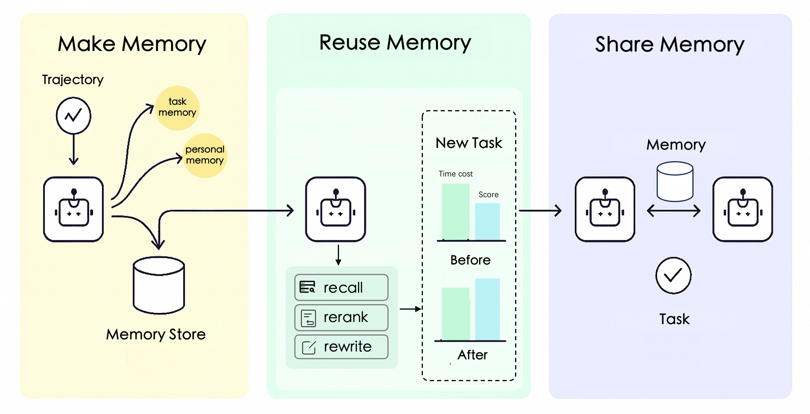

<p align="center">
 
</p>

<p align="center">
  <a href="https://pypi.org/project/reme-ai/"></a>
  <a href="https://pypi.org/project/reme-ai/"></a>
  <a href="./LICENSE"></a>
  <a href="./README.md"></a>
  <a href="./README_ZH.md"></a>
  <a href="https://github.com/agentscope-ai/ReMe"></a>
</p>

<p align="center">
  <strong>Memory Management Kit for Agents, Remember Me, Refine Me.</strong><br>
  <em><sub>If you find it useful, please give us a ⭐ Star.</sub></em>
</p>

---

ReMe is a **modular memory management kit** that provides AI agents with unified memory capabilities—enabling the ability to extract, reuse, and share memories across users, tasks, and agents.
Agent memory can be viewed as:

```text
Agent Memory = Long-Term Memory + Short-Term Memory
             = (Personal + Task + Tool) Memory + (Working Memory)
```

- **Personal Memory**: Understand user preferences and adapt to context
- **Task Memory**: Learn from experience and perform better on similar tasks
- **Tool Memory**: Optimize tool selection and parameter usage based on historical performance
- **Working Memory**: Manage short-term context for long-running agents without context overflow

---

## 📰 Latest Updates

- **[2025-12]** 📄 Our procedural (task) memory paper has been released on [arXiv](https://arxiv.org/abs/2512.10696)
- **[2025-11]** 🧠 React-agent with working-memory demo ([Intro](docs/work_memory/message_offload.md)) with ([Quick Start](docs/cookbook/working/quick_start.md)) and ([Code](cookbook/working_memory/work_memory_demo.py))
- **[2025-10]** 🚀 Direct Python import support: use `from reme_ai import ReMeApp` without HTTP/MCP service
- **[2025-10]** 🔧 Tool Memory: data-driven tool selection and parameter optimization ([Guide](docs/tool_memory/tool_memory.md))
- **[2025-09]** 🎉 Async operations support, integrated into agentscope-runtime
- **[2025-09]** 🎉 Task memory and personal memory integration
- **[2025-09]** 🧪 Validated effectiveness in appworld, bfcl(v3), and frozenlake ([Experiments](docs/cookbook))
- **[2025-08]** 🚀 MCP protocol support ([Quick Start](docs/mcp_quick_start.md))
- **[2025-06]** 🚀 Multiple backend vector storage (Elasticsearch & ChromaDB) ([Guide](docs/vector_store_api_guide.md))
- **[2024-09]** 🧠 Personalized and time-aware memory storage

---

## ✨ Architecture Design

<p align="center">
 
</p>

ReMe provides a **modular memory management kit** with pluggable components that can be integrated into any agent framework. The system consists of:

#### 🧠 **Task Memory/Experience**

Procedural knowledge reused across agents

- **Success Pattern Recognition**: Identify effective strategies and understand their underlying principles
- **Failure Analysis Learning**: Learn from mistakes and avoid repeating the same issues
- **Comparative Patterns**: Different sampling trajectories provide more valuable memories through comparison
- **Validation Patterns**: Confirm the effectiveness of extracted memories through validation modules

Learn more about how to use task memory from [task memory](docs/task_memory/task_memory.md)

#### 👤 **Personal Memory**

Contextualized memory for specific users

- **Individual Preferences**: User habits, preferences, and interaction styles
- **Contextual Adaptation**: Intelligent memory management based on time and context
- **Progressive Learning**: Gradually build deep understanding through long-term interaction
- **Time Awareness**: Time sensitivity in both retrieval and integration

Learn more about how to use personal memory from [personal memory](docs/personal_memory/personal_memory.md)

#### 🔧 **Tool Memory**

Data-driven tool selection and usage optimization

- **Historical Performance Tracking**: Success rates, execution times, and token costs from real usage
- **LLM-as-Judge Evaluation**: Qualitative insights on why tools succeed or fail
- **Parameter Optimization**: Learn optimal parameter configurations from successful calls
- **Dynamic Guidelines**: Transform static tool descriptions into living, learned manuals

Learn more about how to use tool memory from [tool memory](docs/tool_memory/tool_memory.md)

#### 🧠 Working Memory

Short‑term contextual memory for long‑running agents via **message offload & reload**:
- **Message Offload**: Compact large tool outputs to external files or LLM summaries
- **Message Reload**: Search (`grep_working_memory`) and read (`read_working_memory`) offloaded content on demand
📖 **Concept & API**:
- Message offload overview: [Message Offload](docs/work_memory/message_offload.md)
- Offload / reload operators: [Message Offload Ops](docs/work_memory/message_offload_ops.md), [Message Reload Ops](docs/work_memory/message_reload_ops.md)
💻 **End‑to‑End Demo**:
- Working memory quick start: [Working Memory Quick Start](docs/cookbook/working/quick_start.md)
- ReAct agent with working memory: [react_agent_with_working_memory.py](cookbook/working_memory/react_agent_with_working_memory.py)
- Runnable demo: [work_memory_demo.py](cookbook/working_memory/work_memory_demo.py)

---

## 🛠️ Installation

### Install from PyPI (Recommended)

```bash
pip install reme-ai
```

### Install from Source

```bash
git clone https://github.com/agentscope-ai/ReMe.git
cd ReMe
pip install .
```

### Environment Configuration

ReMe requires LLM and embedding model configurations. Copy `example.env` to `.env` and configure:

```bash
FLOW_LLM_API_KEY=sk-xxxx
FLOW_LLM_BASE_URL=https://xxxx/v1
FLOW_EMBEDDING_API_KEY=sk-xxxx
FLOW_EMBEDDING_BASE_URL=https://xxxx/v1
```

---

## 🚀 Quick Start

### HTTP Service Startup

```bash
reme \
  backend=http \
  http.port=8002 \
  llm.default.model_name=qwen3-30b-a3b-thinking-2507 \
  embedding_model.default.model_name=text-embedding-v4 \
  vector_store.default.backend=local
```

### MCP Server Support

```bash
reme \
  backend=mcp \
  mcp.transport=stdio \
  llm.default.model_name=qwen3-30b-a3b-thinking-2507 \
  embedding_model.default.model_name=text-embedding-v4 \
  vector_store.default.backend=local
```

### Core API Usage

#### Task Memory Management

```python
import requests

# Experience Summarizer: Learn from execution trajectories
response = requests.post("http://localhost:8002/summary_task_memory", json={
    "workspace_id": "task_workspace",
    "trajectories": [
        {"messages": [{"role": "user", "content": "Help me create a project plan"}], "score": 1.0}
    ]
})

# Retriever: Get relevant memories
response = requests.post("http://localhost:8002/retrieve_task_memory", json={
    "workspace_id": "task_workspace",
    "query": "How to efficiently manage project progress?",
    "top_k": 1
})
```

<details>
<summary>Python import version</summary>

```python
import asyncio
from reme_ai import ReMeApp

async def main():
    async with ReMeApp(
        "llm.default.model_name=qwen3-30b-a3b-thinking-2507",
        "embedding_model.default.model_name=text-embedding-v4",
        "vector_store.default.backend=memory"
    ) as app:
        # Experience Summarizer: Learn from execution trajectories
        result = await app.async_execute(
            name="summary_task_memory",
            workspace_id="task_workspace",
            trajectories=[
                {
                    "messages": [
                        {"role": "user", "content": "Help me create a project plan"}
                    ],
                    "score": 1.0
                }
            ]
        )
        print(result)

        # Retriever: Get relevant memories
        result = await app.async_execute(
            name="retrieve_task_memory",
            workspace_id="task_workspace",
            query="How to efficiently manage project progress?",
            top_k=1
        )
        print(result)

if __name__ == "__main__":
    asyncio.run(main())
```

</details>

<details>
<summary>curl version</summary>

```bash
# Experience Summarizer: Learn from execution trajectories
curl -X POST http://localhost:8002/summary_task_memory \
  -H "Content-Type: application/json" \
  -d '{
    "workspace_id": "task_workspace",
    "trajectories": [
      {"messages": [{"role": "user", "content": "Help me create a project plan"}], "score": 1.0}
    ]
  }'

# Retriever: Get relevant memories
curl -X POST http://localhost:8002/retrieve_task_memory \
  -H "Content-Type: application/json" \
  -d '{
    "workspace_id": "task_workspace",
    "query": "How to efficiently manage project progress?",
    "top_k": 1
  }'
```

</details>

#### Personal Memory Management

```python
# Memory Integration: Learn from user interactions
response = requests.post("http://localhost:8002/summary_personal_memory", json={
    "workspace_id": "task_workspace",
    "trajectories": [
        {"messages":
            [
                {"role": "user", "content": "I like to drink coffee while working in the morning"},
                {"role": "assistant",
                 "content": "I understand, you prefer to start your workday with coffee to stay energized"}
            ]
        }
    ]
})

# Memory Retrieval: Get personal memory fragments
response = requests.post("http://localhost:8002/retrieve_personal_memory", json={
    "workspace_id": "task_workspace",
    "query": "What are the user's work habits?",
    "top_k": 5
})
```

<details>
<summary>Python import version</summary>

```python
import asyncio
from reme_ai import ReMeApp

async def main():
    async with ReMeApp(
        "llm.default.model_name=qwen3-30b-a3b-thinking-2507",
        "embedding_model.default.model_name=text-embedding-v4",
        "vector_store.default.backend=memory"
    ) as app:
        # Memory Integration: Learn from user interactions
        result = await app.async_execute(
            name="summary_personal_memory",
            workspace_id="task_workspace",
            trajectories=[
                {
                    "messages": [
                        {"role": "user", "content": "I like to drink coffee while working in the morning"},
                        {"role": "assistant",
                         "content": "I understand, you prefer to start your workday with coffee to stay energized"}
                    ]
                }
            ]
        )
        print(result)

        # Memory Retrieval: Get personal memory fragments
        result = await app.async_execute(
            name="retrieve_personal_memory",
            workspace_id="task_workspace",
            query="What are the user's work habits?",
            top_k=5
        )
        print(result)

if __name__ == "__main__":
    asyncio.run(main())
```

</details>

<details>
<summary>curl version</summary>

```bash
# Memory Integration: Learn from user interactions
curl -X POST http://localhost:8002/summary_personal_memory \
  -H "Content-Type: application/json" \
  -d '{
    "workspace_id": "task_workspace",
    "trajectories": [
      {"messages": [
        {"role": "user", "content": "I like to drink coffee while working in the morning"},
        {"role": "assistant", "content": "I understand, you prefer to start your workday with coffee to stay energized"}
      ]}
    ]
  }'

# Memory Retrieval: Get personal memory fragments
curl -X POST http://localhost:8002/retrieve_personal_memory \
  -H "Content-Type: application/json" \
  -d '{
    "workspace_id": "task_workspace",
    "query": "What are the user'\''s work habits?",
    "top_k": 5
  }'
```

</details>

#### Tool Memory Management

```python
import requests

# Record tool execution results
response = requests.post("http://localhost:8002/add_tool_call_result", json={
    "workspace_id": "tool_workspace",
    "tool_call_results": [
        {
            "create_time": "2025-10-21 10:30:00",
            "tool_name": "web_search",
            "input": {"query": "Python asyncio tutorial", "max_results": 10},
            "output": "Found 10 relevant results...",
            "token_cost": 150,
            "success": True,
            "time_cost": 2.3
        }
    ]
})

# Generate usage guidelines from history
response = requests.post("http://localhost:8002/summary_tool_memory", json={
    "workspace_id": "tool_workspace",
    "tool_names": "web_search"
})

# Retrieve tool guidelines before use
response = requests.post("http://localhost:8002/retrieve_tool_memory", json={
    "workspace_id": "tool_workspace",
    "tool_names": "web_search"
})
```

<details>
<summary>Python import version</summary>

```python
import asyncio
from reme_ai import ReMeApp

async def main():
    async with ReMeApp(
        "llm.default.model_name=qwen3-30b-a3b-thinking-2507",
        "embedding_model.default.model_name=text-embedding-v4",
        "vector_store.default.backend=memory"
    ) as app:
        # Record tool execution results
        result = await app.async_execute(
            name="add_tool_call_result",
            workspace_id="tool_workspace",
            tool_call_results=[
                {
                    "create_time": "2025-10-21 10:30:00",
                    "tool_name": "web_search",
                    "input": {"query": "Python asyncio tutorial", "max_results": 10},
                    "output": "Found 10 relevant results...",
                    "token_cost": 150,
                    "success": True,
                    "time_cost": 2.3
                }
            ]
        )
        print(result)

        # Generate usage guidelines from history
        result = await app.async_execute(
            name="summary_tool_memory",
            workspace_id="tool_workspace",
            tool_names="web_search"
        )
        print(result)

        # Retrieve tool guidelines before use
        result = await app.async_execute(
            name="retrieve_tool_memory",
            workspace_id="tool_workspace",
            tool_names="web_search"
        )
        print(result)

if __name__ == "__main__":
    asyncio.run(main())
```

</details>

<details>
<summary>curl version</summary>

```bash
# Record tool execution results
curl -X POST http://localhost:8002/add_tool_call_result \
  -H "Content-Type: application/json" \
  -d '{
    "workspace_id": "tool_workspace",
    "tool_call_results": [
      {
        "create_time": "2025-10-21 10:30:00",
        "tool_name": "web_search",
        "input": {"query": "Python asyncio tutorial", "max_results": 10},
        "output": "Found 10 relevant results...",
        "token_cost": 150,
        "success": true,
        "time_cost": 2.3
      }
    ]
  }'

# Generate usage guidelines from history
curl -X POST http://localhost:8002/summary_tool_memory \
  -H "Content-Type: application/json" \
  -d '{
    "workspace_id": "tool_workspace",
    "tool_names": "web_search"
  }'

# Retrieve tool guidelines before use
curl -X POST http://localhost:8002/retrieve_tool_memory \
  -H "Content-Type: application/json" \
  -d '{
    "workspace_id": "tool_workspace",
    "tool_names": "web_search"
  }'
```

</details>

#### Working Memory Management

```python
import requests

# Summarize and compact working memory for a long-running conversation
response = requests.post("http://localhost:8002/summary_working_memory", json={
    "messages": [
        {
            "role": "system",
            "content": "You are a helpful assistant. First use `Grep` to find the line numbers that match the keywords or regular expressions, and then use `ReadFile` to read the code around those locations. If no matches are found, never give up; try different parameters, such as searching with only part of the keywords. After `Grep`, use the `ReadFile` command to view content starting from a specified `offset` and `limit`, and do not exceed 100 lines. If the current content is insufficient, you can continue trying different `offset` and `limit` values with the `ReadFile` command."
        },
        {
            "role": "user",
            "content": "搜索下reme项目的的README内容"
        },
        {
            "role": "assistant",
            "content": "",
            "tool_calls": [
                {
                    "index": 0,
                    "id": "call_6596dafa2a6a46f7a217da",
                    "function": {
                        "arguments": "{\"query\": \"readme\"}",
                        "name": "web_search"
                    },
                    "type": "function"
                }
            ]
        },
        {
            "role": "tool",
            "content": "ultra large context , over 50000 tokens......"
        },
        {
            "role": "user",
            "content": "根据readme回答task memory在appworld的效果是多少，需要具体的数值"
        }
    ],
    "working_summary_mode": "auto",
    "compact_ratio_threshold": 0.75,
    "max_total_tokens": 20000,
    "max_tool_message_tokens": 2000,
    "group_token_threshold": 4000,
    "keep_recent_count": 2,
    "store_dir": "test_working_memory",
    "chat_id": "demo_chat_id"
})
```

<details>
<summary>Python import version</summary>

```python
import asyncio
from reme_ai import ReMeApp


async def main():
    async with ReMeApp(
        "llm.default.model_name=qwen3-30b-a3b-thinking-2507",
        "embedding_model.default.model_name=text-embedding-v4",
        "vector_store.default.backend=memory"
    ) as app:
        # Summarize and compact working memory for a long-running conversation
        result = await app.async_execute(
            name="summary_working_memory",
            messages=[
                {
                    "role": "system",
                    "content": "You are a helpful assistant. First use `Grep` to find the line numbers that match the keywords or regular expressions, and then use `ReadFile` to read the code around those locations. If no matches are found, never give up; try different parameters, such as searching with only part of the keywords. After `Grep`, use the `ReadFile` command to view content starting from a specified `offset` and `limit`, and do not exceed 100 lines. If the current content is insufficient, you can continue trying different `offset` and `limit` values with the `ReadFile` command."
                },
                {
                    "role": "user",
                    "content": "搜索下reme项目的的README内容"
                },
                {
                    "role": "assistant",
                    "content": "",
                    "tool_calls": [
                        {
                            "index": 0,
                            "id": "call_6596dafa2a6a46f7a217da",
                            "function": {
                                "arguments": "{\"query\": \"readme\"}",
                                "name": "web_search"
                            },
                            "type": "function"
                        }
                    ]
                },
                {
                    "role": "tool",
                    "content": "ultra large context , over 50000 tokens......"
                },
                {
                    "role": "user",
                    "content": "根据readme回答task memory在appworld的效果是多少，需要具体的数值"
                }
            ],
            working_summary_mode="auto",
            compact_ratio_threshold=0.75,
            max_total_tokens=20000,
            max_tool_message_tokens=2000,
            group_token_threshold=4000,
            keep_recent_count=2,
            store_dir="test_working_memory",
            chat_id="demo_chat_id",
        )
        print(result)


if __name__ == "__main__":
    asyncio.run(main())
```

</details>

<details>
<summary>curl version</summary>

```bash
curl -X POST http://localhost:8002/summary_working_memory \
  -H "Content-Type: application/json" \
  -d '{
    "messages": [
      {
        "role": "system",
        "content": "You are a helpful assistant. First use `Grep` to find the line numbers that match the keywords or regular expressions, and then use `ReadFile` to read the code around those locations. If no matches are found, never give up; try different parameters, such as searching with only part of the keywords. After `Grep`, use the `ReadFile` command to view content starting from a specified `offset` and `limit`, and do not exceed 100 lines. If the current content is insufficient, you can continue trying different `offset` and `limit` values with the `ReadFile` command."
      },
      {
        "role": "user",
        "content": "搜索下reme项目的的README内容"
      },
      {
        "role": "assistant",
        "content": "",
        "tool_calls": [
          {
            "index": 0,
            "id": "call_6596dafa2a6a46f7a217da",
            "function": {
              "arguments": "{\"query\": \"readme\"}",
              "name": "web_search"
            },
            "type": "function"
          }
        ]
      },
      {
        "role": "tool",
        "content": "ultra large context , over 50000 tokens......"
      },
      {
        "role": "user",
        "content": "根据readme回答task memory在appworld的效果是多少，需要具体的数值"
      }
    ],
    "working_summary_mode": "auto",
    "compact_ratio_threshold": 0.75,
    "max_total_tokens": 20000,
    "max_tool_message_tokens": 2000,
    "group_token_threshold": 4000,
    "keep_recent_count": 2,
    "store_dir": "test_working_memory",
    "chat_id": "demo_chat_id"
  }'
```

</details>

---

## 📦 Pre-built Memory Library

ReMe provides a **memory library** with pre-extracted, production-ready memories that agents can load and use immediately:

### Available Memory Packs

| Memory Pack          | Domain         | Size          | Description                                                                         |
|----------------------|----------------|---------------|-------------------------------------------------------------------------------------|
| **`appworld.jsonl`** | Task Execution | ~100 memories | Complex task planning patterns, multi-step workflows, and error recovery strategies |
| **`bfcl_v3.jsonl`**  | Tool Usage     | ~150 memories | Function calling patterns, parameter optimization, and tool selection strategies    |

### Loading Pre-built Memories

```python
# Load pre-built memories
response = requests.post("http://localhost:8002/vector_store", json={
    "workspace_id": "appworld",
    "action": "load",
    "path": "./docs/library/"
})

# Query relevant memories
response = requests.post("http://localhost:8002/retrieve_task_memory", json={
    "workspace_id": "appworld",
    "query": "How to navigate to settings and update user profile?",
    "top_k": 1
})
```

<details>
<summary>Python import version</summary>

```python
import asyncio
from reme_ai import ReMeApp

async def main():
    async with ReMeApp(
        "llm.default.model_name=qwen3-30b-a3b-thinking-2507",
        "embedding_model.default.model_name=text-embedding-v4",
        "vector_store.default.backend=memory"
    ) as app:
        # Load pre-built memories
        result = await app.async_execute(
            name="vector_store",
            workspace_id="appworld",
            action="load",
            path="./docs/library/"
        )
        print(result)

        # Query relevant memories
        result = await app.async_execute(
            name="retrieve_task_memory",
            workspace_id="appworld",
            query="How to navigate to settings and update user profile?",
            top_k=1
        )
        print(result)

if __name__ == "__main__":
    asyncio.run(main())
```

</details>

## 🧪 Experiments

### 🌍 [Appworld Experiment](docs/cookbook/appworld/quickstart.md)

We tested ReMe on Appworld using qwen3-8b:

| Method       | pass@1            | pass@2            | pass@4            |
|--------------|-------------------|-------------------|-------------------|
| without ReMe | 0.083             | 0.140             | 0.228             |
| with ReMe    | 0.109 **(+2.6%)** | 0.175 **(+3.5%)** | 0.281 **(+5.3%)** |

Pass@K measures the probability that at least one of the K generated samples successfully completes the task (
score=1).
The current experiment uses an internal AppWorld environment, which may have slight differences.

You can find more details on reproducing the experiment in [quickstart.md](docs/cookbook/appworld/quickstart.md).

### 🧊 [Frozenlake Experiment](docs/cookbook/frozenlake/quickstart.md)

|                                             without ReMe                                             |                                              with ReMe                                               |
|:----------------------------------------------------------------------------------------------------:|:----------------------------------------------------------------------------------------------------:|
| <p align="center"></p> | <p align="center"></p> |

We tested on 100 random frozenlake maps using qwen3-8b:

| Method       | pass rate        |
|--------------|------------------|
| without ReMe | 0.66             |
| with ReMe    | 0.72 **(+6.0%)** |

You can find more details on reproducing the experiment in [quickstart.md](docs/cookbook/frozenlake/quickstart.md).

### 🔧 [BFCL-V3 Experiment](docs/cookbook/bfcl/quickstart.md)

We tested ReMe on BFCL-V3 multi-turn-base (randomly split 50train/150val) using qwen3-8b:

| Method       | pass@1              | pass@2              | pass@4              |
|--------------|---------------------|---------------------|---------------------|
| without ReMe | 0.2472              | 0.2733              | 0.2922              |
| with ReMe    | 0.3061 **(+5.89%)** | 0.3500 **(+7.67%)** | 0.3888 **(+9.66%)** |

### 🛠️ [Tool Memory Benchmark](docs/tool_memory/tool_bench.md)

We evaluated Tool Memory effectiveness using a controlled benchmark with three mock search tools using Qwen3-30B-Instruct:

| Scenario               | Avg Score | Improvement |
|------------------------|-----------|-------------|
| Train (No Memory)      | 0.650     | -           |
| Test (No Memory)       | 0.672     | Baseline    |
| **Test (With Memory)** | **0.772** | **+14.88%** |

**Key Findings:**
- Tool Memory enables data-driven tool selection based on historical performance
- Success rates improved by ~15% with learned parameter configurations

You can find more details in [tool_bench.md](docs/tool_memory/tool_bench.md) and the implementation at [run_reme_tool_bench.py](cookbook/tool_memory/run_reme_tool_bench.py).

## 📚 Resources

### Getting Started
- **[Quick Start](./cookbook/simple_demo)**: Practical examples for immediate use
  - [Tool Memory Demo](cookbook/simple_demo/use_tool_memory_demo.py): Complete lifecycle demonstration of tool memory
  - [Tool Memory Benchmark](cookbook/tool_memory/run_reme_tool_bench.py): Evaluate tool memory effectiveness

### Integration Guides
- **[Direct Python Import](docs/cookbook/working/quick_start.md)**: Embed ReMe directly into your agent code
- **[HTTP Service API](docs/vector_store_api_guide.md)**: RESTful API for multi-agent systems
- **[MCP Protocol](docs/mcp_quick_start.md)**: Integration with Claude Desktop and MCP-compatible clients

### Memory System Configuration
- **[Personal Memory](docs/personal_memory)**: User preference learning and contextual adaptation
- **[Task Memory](docs/task_memory)**: Procedural knowledge extraction and reuse
- **[Tool Memory](docs/tool_memory)**: Data-driven tool selection and optimization
- **[Working Memory](docs/work_memory/message_offload.md)**: Short-term context management for long-running agents

### Advanced Topics
- **[Operator Pipelines](reme_ai/config/default.yaml)**: Customize memory processing workflows by modifying operator chains
- **[Vector Store Backends](docs/vector_store_api_guide.md)**: Configure local, Elasticsearch, Qdrant, or ChromaDB storage
- **[Example Collection](./cookbook)**: Real-world use cases and best practices

---

## ⭐ Support & Community

- **Star & Watch**: Stars surface ReMe to more agent builders; watching keeps you updated on new releases.
- **Share your wins**: Open an issue or discussion with what ReMe unlocked for your agents—we love showcasing community builds.
- **Need a feature?** File a request and we’ll help shape it together.

---

## 🤝 Contribution

We believe the best memory systems come from collective wisdom. Contributions welcome 👉[Guide](docs/contribution.md):

### Code Contributions

- **New Operators**: Develop custom memory processing operators (retrieval, summarization, etc.)
- **Backend Implementations**: Add support for new vector stores or LLM providers
- **Memory Services**: Extend with new memory types or capabilities
- **API Enhancements**: Improve existing endpoints or add new ones

### Documentation Improvements

- **Integration Examples**: Show how to integrate ReMe with different agent frameworks
- **Operator Tutorials**: Document custom operator development
- **Best Practice Guides**: Share effective memory management patterns
- **Use Case Studies**: Demonstrate ReMe in real-world applications


---

## 📄 Citation

```bibtex
@software{AgentscopeReMe2025,
  title = {AgentscopeReMe: Memory Management Kit for Agents},
  author = {Li Yu and
            Jiaji Deng and
            Zouying Cao and
            Weikang Zhou and
            Tiancheng Qin and
            Qingxu Fu and
            Sen Huang and
            Xianzhe Xu and
            Zhaoyang Liu and
            Boyin Liu},
  url = {https://reme.agentscope.io},
  year = {2025}
}

@misc{AgentscopeReMe2025Paper,
  title={Remember Me, Refine Me: A Dynamic Procedural Memory Framework for Experience-Driven Agent Evolution},
  author={Zouying Cao and
          Jiaji Deng and
          Li Yu and
          Weikang Zhou and
          Zhaoyang Liu and
          Bolin Ding and
          Hai Zhao},
  year={2025},
  eprint={2512.10696},
  archivePrefix={arXiv},
  primaryClass={cs.AI},
  url={https://arxiv.org/abs/2512.10696},
}
```

---

## ⚖️ License

This project is licensed under the Apache License 2.0 - see the [LICENSE](./LICENSE) file for details.

---

## Star History

[](https://www.star-history.com/#agentscope-ai/ReMe&Date)

