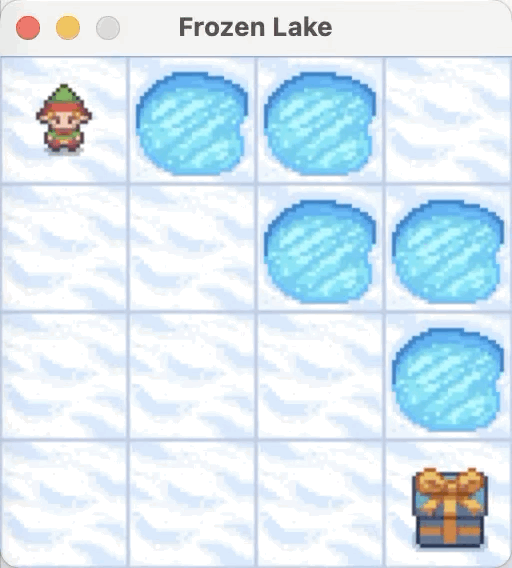
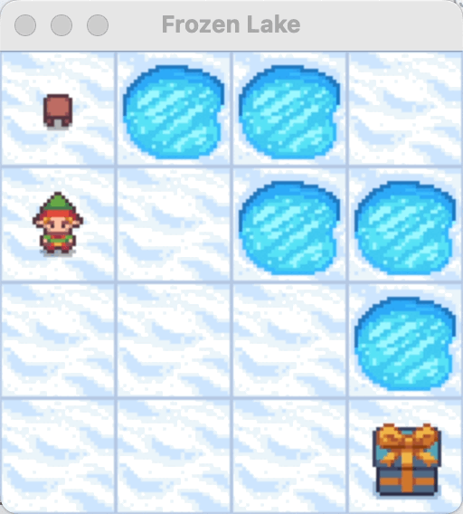

# Experiement Overview

### 🌍 [Appworld Experiment](appworld/quickstart.md)

We tested ReMe on Appworld using qwen3-8b:

| Method       | pass@1            | pass@2            | pass@4            |
|--------------|-------------------|-------------------|-------------------|
| without ReMe | 0.083             | 0.140             | 0.228             |
| with ReMe    | 0.109 **(+2.6%)** | 0.175 **(+3.5%)** | 0.281 **(+5.3%)** |

Pass@K measures the probability that at least one of the K generated samples successfully completes the task (
score=1).
The current experiment uses an internal AppWorld environment, which may have slight differences.

You can find more details on reproducing the experiment in [quickstart.md](appworld/quickstart.md).

### 🧊 [Frozenlake Experiment](frozenlake/quickstart.md)

|                                            without ReMe                                            |                                             with ReMe                                              |
|:--------------------------------------------------------------------------------------------------:|:--------------------------------------------------------------------------------------------------:|
| 

 | 

 |

We tested on 100 random frozenlake maps using qwen3-8b:

| Method       | pass rate        |
|--------------|------------------|
| without ReMe | 0.66             |
| with ReMe    | 0.72 **(+6.0%)** |

You can find more details on reproducing the experiment in [quickstart.md](frozenlake/quickstart.md).

### 🔧 [BFCL-V3 Experiment](bfcl/quickstart.md)

We tested ReMe on BFCL-V3 multi-turn-base (randomly split 50train/150val) using qwen3-8b:

| Method       | pass@1              | pass@2              | pass@4              |
|--------------|---------------------|---------------------|---------------------|
| without ReMe | 0.2472              | 0.2733              | 0.2922              |
| with ReMe    | 0.3061 **(+5.89%)** | 0.3500 **(+7.67%)** | 0.3888 **(+9.66%)** |

### 🛠️ [Tool Memory Benchmark](../tool_memory/tool_bench.md)

We evaluated Tool Memory effectiveness using a controlled benchmark with three mock search tools using Qwen3-30B-Instruct:

| Scenario               | Avg Score | Improvement |
|------------------------|-----------|-------------|
| Train (No Memory)      | 0.650     | -           |
| Test (No Memory)       | 0.672     | Baseline    |
| **Test (With Memory)** | **0.772** | **+14.88%** |

**Key Findings:**
- Tool Memory enables data-driven tool selection based on historical performance
- Success rates improved by ~15% with learned parameter configurations

You can find more details in [tool_bench.md](../tool_memory/tool_bench.md) and the implementation at [run_reme_tool_bench.py](https://github.com/agentscope-ai/ReMe/tree/main/cookbook/tool_memory/run_reme_tool_bench.py).
