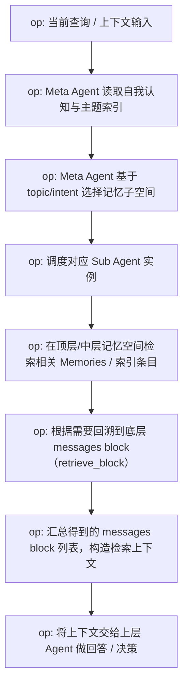
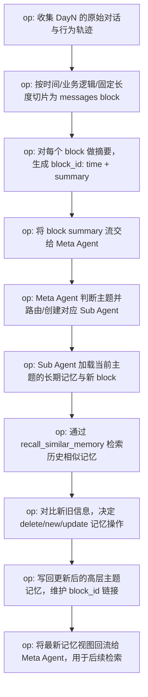

# ReMeV2 - agent memory kit design

ReMeV2 是一个面向智能体（Agent）的分层记忆系统，用于从连续的对话与交互中，逐步沉淀出稳定、可检索、可更新的长期记忆。
系统强调从**原始轨迹 → 事件索引 → 高维抽象记忆**的分层存储，并通过**检索器（Retriever）**与**总结器（Summarizer）**实现动态更新。

---

## 设计目标

本设计旨在构建一个可嵌入任意智能体框架（如对话 Agent、任务 Agent 等）的记忆子系统，使其具备以下能力：

- **支持多天、多会话的长期记忆积累**，不丢失原始细节。
- **在推理时按需检索**与当前问题高度相关的记忆片段。
- **在后台持续做分层总结与压缩**，提炼出抽象的“世界观 / 自我认知 / 用户画像 / 任务知识 / 工具经验”。
- **支持记忆的增删改**，能够对过时或冲突信息进行更新，保持长期记忆的时效性与一致性。
- **支持渐进式检索**，从高层抽象记忆逐步回溯到中层事件索引与底层原始轨迹，按需展开细节、控制上下文长度与推理成本。
- **支持渐进式总结**，从最新对话开始按块增量总结并更新索引与主题记忆，而非每次对全量历史做重复总结。

---

## 架构概览

系统整体可以分为两个维度来看：

- **静态维度**：记忆如何被分层存储（底层消息块 → 中层索引 → 顶层主题记忆）。
- **动态维度**：记忆如何被检索与更新（上行 Summarizer、下行 Retriever）。

核心组件包括：

- **底层记忆层（Raw Dialogue Store）**：多天对话轨迹切分成 `messages block`。
- **中层索引层（Index & Summary Store）**：为每个 `messages block` 生成 `block_id: time + summary`。
- **顶层主题记忆层（High-level Memories）**：自我认知、任务记忆、工具记忆、用户画像等高维抽象。
- **Meta Agent（记忆中枢）**：持有高层记忆视图与索引，负责路由检索与更新请求。
- **Sub Agents（记忆子智能体）**：面向具体主题（如某个用户、某类任务、某组工具）的记忆管理单元。
- **Retriever（检索器）**：从高层到低层，渐进式查找相关记忆。
- **Summarizer（总结器）**：从低层到高层，渐进式抽象和更新长期记忆。

---

## 静态记忆三层架构

### 垂直层级划分

系统将记忆分为自下而上的三个层级，抽象程度逐级升高：

- **底层：记忆碎片（历史对话 / 轨迹）**
  - 存放原始的、未经压缩的对话与交互记录。
  - **规则**：不去重、不解冲突，只做追加与切片。

- **中层：记忆索引（事件总结）**
  - 对原始消息块做首轮总结，形成“时间 + 简要摘要”的事件索引。
  - 连接底层细节与顶层抽象。
  - **规则**：允许存在部分冗余与矛盾，主要目标是加速检索。

- **顶层：主题记忆（高维抽象知识）**
  - 聚合并抽象出关于“自我、任务、工具、用户”等长期知识。
  - **规则**：需要去重（Deduplication）与解冲突（Resolve Conflict），追求紧凑、一致、可解释。

### 底层：原始对话与轨迹（Raw Dialogue）

- 按时间顺序堆叠的对话与行为轨迹：
  - `Day1 Messages → Day2 Messages → ... → DayN Messages`
- 通过时间窗口、业务逻辑、固定长度（可重叠）等策略切分为多个 `messages block`：
  - `Day1 Messages Block1`
  - `Day1 Messages Block2`
  - `DayN Messages BlockN`
- 特性：
  - 不丢失任何历史细节。
  - 支持后续回溯、审计与再训练。

### 中层：记忆索引与事件总结（Index & Summary）

- 对每个 `messages block` 生成一个结构化索引：
  - 格式：`block_id: time + summary`
- 示例：
  - `block_id1: 2025-11-11 + 用户提到他非常喜欢吃西瓜。`
  - `block_id2: 2025-11-12 + 用户表达自己很孤独。`
- 作用：
  - 作为底层原始消息与顶层抽象记忆之间的“桥梁”与“目录”。
  - 为时间感知检索、语义检索提供最小粒度的事件单元。

### 顶层：主题记忆（High-Dimensional Abstraction）

顶层记忆由多个“记忆气泡”（Memory Bubble）构成，每个气泡代表一类主题知识，并通过关联的 `block_id` 与中层索引相连。主要包括：

- **自我认知记忆（Self-Cognition Memory）**
  - 示例：
    - “我叫 Remy”
    - “我每天需要上班”
    - “我是一名面向长期陪伴的智能助手”
  - 位置：处于记忆拓扑中心，与其他记忆类别广泛连接。

- **金融任务记忆（Financial Task Memory）**
  - 示例：
    - “做财报分析前需要调研企业的经营数据”
    - “估值时可以优先考虑 forward PE”
  - 作用：支撑在特定领域（如金融）的任务推理能力。

- **工具记忆（Tool Memory）**
  - 示例：
    - “`bing_search` 很不稳定，经常失败”
    - “`tongyi_search` 的结果质量较好，常需要配合 `web_extract` 使用”
  - 作用：让智能体在工具选择、调用顺序和错误预期上具有“经验”。

- **用户画像记忆（Per-User Memory，如用户 A / 用户 B）**
  - 对用户 A 的记忆示例：
    - “A 很喜欢吃西瓜”
    - “A 非常有礼貌”
    - “A 计划下周出行”
  - 与中层事件关联：
    - 顶层的“喜欢吃西瓜”记忆与 `block_id1` 建立逻辑连接。
  - 每个用户独立维护一套长期画像，避免混淆。

---

## 动态流程一：ReMeV2 Retriever（检索流程）

检索流程是一个**自上而下**的渐进式过程：从高维抽象出发，逐步定位到具体事件甚至原始对话块，为当前问答或决策提供证据。



### Meta Agent：记忆入口与路由

- 持有：
  - **常驻的自我认知记忆**（总是加载在工作内存中）。
  - 各类主题记忆的**名称 + 描述索引**，例如：
    - `1. 金融任务记忆`
    - `2. 工具记忆`
    - `3. 用户A记忆`
    - `4. 用户B记忆`
- 职责：
  - 根据当前查询的 **topic / intent**，选择合适的记忆子空间。
  - 按需创建或调度具体的 `Sub_Agent` 来完成深入检索。

### Sub Agent：按主题检索

- **预定义子智能体**（如：工具记忆 Agent、某个用户画像 Agent 等）：
  - 支持接口：
    - `retrieve_by_query(query)`：基于语义相似度的检索。
    - `time_aware_retrieve(time)`：基于时间的窗口检索（适合用户时间线类记忆）。
- **自定义子智能体**：
  - 可以实现更复杂的检索逻辑（例如结合时间衰减、多源融合等）。

### 渐进式检索与回溯

- 子智能体首先在顶层 / 中层记忆空间中找到语义相关的 **Memories / 索引条目**：
  - 每条记忆通常携带 `block_id` 与简要 summary。
- 若需要更细节的证据，系统可以进一步调用：
  - `retrieve_block(block_id)`：回溯到底层 `messages block`。
  - `time_match_memories(time_range)`：根据时间窗口获取原始对话块。
- 最终输出：
  - 一组与当前问题高度相关的 `messages block List`，作为上下文，供 Agent 生成回答或做决策。

---

## 动态流程二：ReMeV2 Summarizer（总结流程）

总结流程是一个**自下而上**的学习与更新过程：将新发生的对话转化为结构化事件，再进一步纳入长期记忆。



### 输入与切片

- 输入源：
  - `DayN Messages / Trajectory`（第 N 天的完整对话与行为轨迹）。
- 切片策略：
  - 按时间窗口切片（例如每 5 分钟一个 block）。
  - 按业务逻辑边界切片（如一个任务完成即成一个 block）。
  - 按固定长度（可带重叠）切片，兼顾局部上下文。
- 结果：
  - `messages block1, block2, ... blockN`

### 初步总结：生成索引条目

- 对每个 `messages block` 进行摘要，形成：
  - `block_id: time + summary`
- 示例：
  - `id: 20251111_01 - 用户询问“什么是 AI”并表达对技术的好奇。`
- 这一阶段的目标：
  - 为中层索引层提供结构化事件单元，尚不过度抽象。

### Meta Agent 路由与子智能体更新

- Meta Agent 接收新的 `block summary` 流：
  - 根据内容判断其归属主题（例如用户相关、任务相关、工具体验相关等）。
  - 调用 `create_sub_agent(topic)` 或路由到已有的 `Sub_Agent`。
- 子智能体内的处理步骤：
  - **Step 1：加载上下文记忆**
    - 加载与当前主题相关的长期记忆（如“对用户 A 的记忆”）与当前 `messages block`。
  - **Step 2：回忆（Recall）**
    - 通过 `recall_similar_memory(query)` 拉取历史相似记忆，用于对比新旧信息。
  - **Step 3：更新（Update）**
    - 基于新旧信息的对比，决定对顶层记忆的操作：
      - `delete_memory(mem_id)`：删除已过时或被否定的记忆。
      - `new_memory(mem_content)`：新增一条新的长期记忆。
      - `update_memory(mem_id, mem_content)`：对既有记忆做内容更新或细化。

### 输出与闭环

- Summarizer 输出一批新的或更新后的 **高层记忆项（New Memories）**，并附带 `block_id` 链接。
- 这些记忆将：
  - 被 Meta Agent 纳入其主题索引中。
  - 为后续 Retriever 流程提供可检索的抽象知识。
- 至此，形成从“原始对话 → 索引总结 → 高维记忆 → 检索使用 → 再次总结更新”的完整闭环。

---

## 总结

- **分层存储**：底层保留原始细节，中层作为事件索引，顶层沉淀抽象认知；中层通过 `block_id` 将两端连通。
- **按需调用**：检索时从高层主题记忆出发，由 Meta Agent 路由到 Sub Agent，再逐级回溯到底层对话。
- **动态增删改**：新对话先被切片与总结，再与旧记忆对比，通过新增、更新、删除操作保持长期记忆“准确 + 精简 + 有时序感”。
- **渐进式检索与总结**：在检索方向自上而下逐级展开，在学习方向自下而上逐级抽象，实现“用多少展开多少、学多少沉淀多少”的流式记忆管理。


``` python code
base_memory中增加
# block_id: str = Field(default=..., description="block_id")
block_ids: List[str] = Field(default=..., description="block_id")


from typing import List, Tuple

from flowllm.core.schema import Message
from pydantic import BaseModel, Field

class MessageModel(Message):
    """
    被存储到传统的db中的数据结构，一行一条message
    def retrieve_message(key_word=None, time_start=None, limit: int=50):
    支持关键字检索和时间检索
    content like %{key_word}%
    暂时不支持向量检索，向量只做抽取的memory的
    """
    name: str = Field(default="", description="The name of the character who actually outputs this message")
    message_id: str = Field(default=..., description="message_id, uuid，每一条message不重样")
    block_id: str = Field(default=..., description="block_id，message分块的id，用户链接summary")


from reme_ai.schema.memory import BaseMemory

"""
基本和原来一致，增加block compress的memory

工具记忆放到传统db中
BlockCompress放到向量库中
Personal + Task + Self-Cognition 放到向量库中
"""


class BlockCompressMemory(BaseMemory):
    start_time: str = Field(default=..., description="block的开始时间")
    end_time: str = Field(default=..., description="block的结束时间")

class SelfCognitionMemory(BaseMemory):
    target_name: str = Field(default="自我认知")
    memory_type: str = Field(default="self")

class ToolMemory(BaseMemory):
    target_name: str = Field(default="", description="工具名称")
    memory_type: str = Field(default="tool")

class PersonalMemory(BaseMemory):
    target_name: str = Field(default="", description="这是记录谁的记忆？比如TOM、Jerry？")
    memory_type: str = Field(default="personal")

class TaskMemory(BaseMemory):
    target_name: str = Field(default="", description="这是什么任务的记忆、比如bfcl、appworld、金融?")
    memory_type: str = Field(default="task")


# Handoffs allow meta agent to delegate tasks to another agent.
"""
summarizer
"""

def compress_message_block(message_block: List[Message]) -> BlockCompressMemory:
    """
    压缩message_block信息到BlockCompressMemory
    """

def handoff_to_summary_agent(agent_name: str) -> str:
    """
    如果agent_name是存在的，那直接使用现成的，否则可以创建新的agent(默认是不开启的)
    """

def retrieve_memory_by_query(query: str, limit_size: int = 50, threshold = 0.5) -> List[BaseMemory]:
    """
    如果之前使用过handoff_to_summary_agent
    在自我认知
    """

def datetime_tool(**kwargs)
    """
    时间工具
    Returns:

    """

def delete_memory(memory_id: str):
    ...

# 做实验
def update_memory(memory_id: str, content: str, time_stamp: str):
    ...


def new_memory(content: str, time_stamp: str) -> BaseMemory:
    ...


"""
summary reviser / Reward Model
"""

def revise_memory(messages: List[Message],
                  origin_memory: List[BaseMemory],
                  output_memory: List[BaseMemory]) -> Tuple["", bool]:
    """
    reasoning and result
    是否所有信息都加入了？
    当前结果是不是有冲突和重复。
    如果有问题，就重新react或者重试
    """

"""
retriever
"""

def retrieve_memory_by_query(query: str, limit_size: int = 50, threshold = 0.5) -> List[BaseMemory]:
    """
    和上面不一致的在于，这里可以搜索到compress的记忆
    """

def retrieve_message(key_word=None, time_offset=None, time_limit=None):
    """
    支持关键字检索和时间检索
    content like %{key_word}%
    暂时不支持向量检索，向量只做抽取的memory的
    """

def retrieve_block_id(block_id):
    """
    支持关键字检索和时间检索
    content like %{key_word}%
    暂时不支持向量检索，向量只做抽取的memory的
    """

```