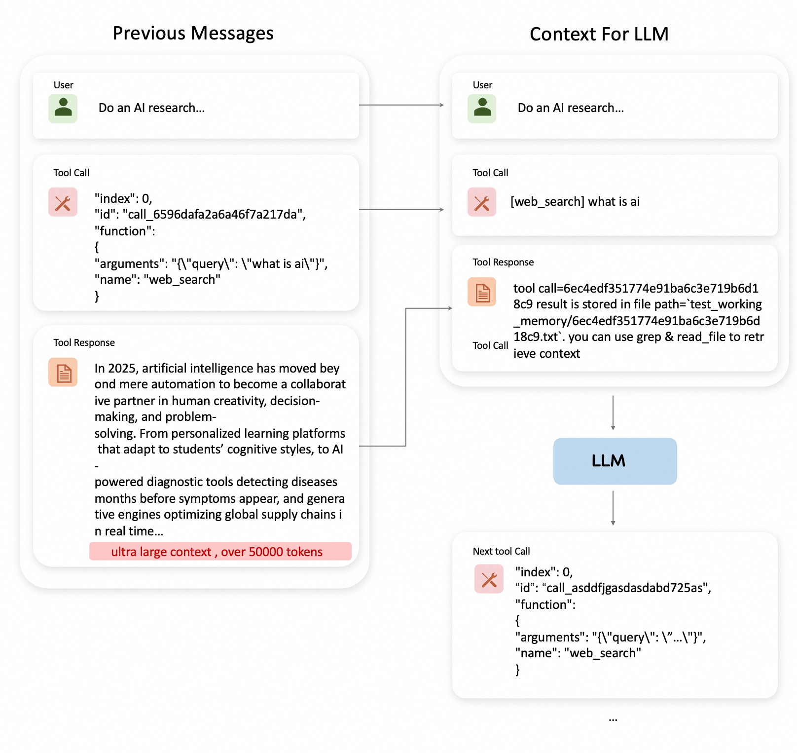

---
jupytext:
  formats: md:myst
  text_representation:
    extension: .md
    format_name: myst
    format_version: 0.13
    jupytext_version: 1.11.5
kernelspec:
  display_name: Python 3
  language: python
  name: python3
---

# Message Offload

## 1. Background: Why Message Offload?

### The Agent Context Challenge

In modern AI agent systems, LLMs interact with tools through iterative loops, accumulating conversation history and tool results. With each iteration, a critical problem emerges:

**The Core Problem: Context Window Explosion**

When an agent executes complex tasks, it relies on maintaining conversation history to track progress and make informed decisions. However:

- **Rapid Context Growth**: Each tool call appends input parameters and output results to message history
- **Token Consumption**: A single tool call can consume hundreds or thousands of tokens, especially for data-heavy operations
- **Context Window Limits**: Most LLMs have finite context windows (e.g., 128K, 200K tokens)
- **Context Rot**: As context grows beyond optimal thresholds, model performance degrades significantly

**Example: Web Research Agent**

<p align="center">
 
</p>

Imagine an agent performing research across multiple sources:
```
Iteration 1: web_search("AI context management") → 3,500 tokens
Iteration 2: read_webpage(url_1) → 8,200 tokens
Iteration 3: web_search("context compression techniques") → 4,100 tokens
Iteration 4: read_webpage(url_2) → 7,800 tokens
...
Iteration 15: summarize_findings() → Total context: 95,000 tokens
```

As context accumulates:
- **At 50K tokens**: Agent performs normally, accurate responses
- **At 100K tokens**: Responses become repetitive, slower inference
- **At 150K tokens**: Significant quality degradation, "context rot" sets in
- **At 200K tokens**: Context window exhausted, cannot continue

**Without context management, agents hit walls after just 15-20 complex tool calls.**

### The Solution: Message Offload as Context Engineering

Message Offload solves this by **intelligently moving non-essential information out of active context**, allowing agents to operate indefinitely while maintaining optimal performance:

**1. Message Compaction** (Reversible Strategy)
- **Selective Storage**: Large tool results stored in external files
- **Reference Retention**: Only file paths kept in message history
- **On-Demand Retrieval**: Full content can be retrieved when needed

**2. Message Compression** (LLM-Based Strategy)
- **Intelligent Summarization**: LLM generates concise summaries of older message groups
- **Priority Preservation**: Recent messages and system prompts remain intact
- **Information Density**: Maintains key information while reducing token count

**3. Hybrid Auto Mode** (Adaptive Strategy)
- **Compaction First**: Applies compaction to tool messages
- **Compression When Needed**: Triggers compression if compaction ratio exceeds threshold
- **Dynamic Adjustment**: Adapts strategy based on context characteristics

### Enhanced work memory management

Instead of letting context grow uncontrollably, the agent now benefits from:

```
Traditional Approach (No Context Management):
50 messages → 95,000 tokens → Context rot begins
- Response quality: Degraded
- Inference speed: Slow
- Can continue: No (approaching limit)
- Information lost: No, but unusable

+ Message Offload Approach:
50 messages → 15,000 tokens (after offload) → Optimal performance maintained
- Response quality: High
- Inference speed: Fast
- Can continue: Yes (85% headroom remaining)
- Information lost: No (stored externally, retrievable)

Offload Details:
- 20 tool messages compacted → Stored in /context_store/
- 15 older messages compressed → Summarized in system message
- 5 recent messages preserved → Full content intact
- External storage: 80,000 tokens offloaded
- Active context: 15,000 tokens (84% reduction)
```

This managed context enables the agent to:
- **Operate Indefinitely**: No hard limit on conversation length
- **Maintain Performance**: Stay within optimal token range (10-30K tokens)
- **Preserve Information**: All data accessible through file system or summaries
- **Optimize Costs**: Reduce token consumption by 70-90% in long conversations

### The Impact: From Context Explosion to Controlled Growth

**Traditional Approach (No Work Memory Management):**
```
Agent: "I've executed 20 tool calls, context is now 100K tokens"
→ Performance degradation begins
→ Slower responses, repetitive outputs
→ Cannot continue beyond 30 calls
→ Task abandoned due to context limits
```

**Message Offload Approach (Intelligent Management):**
```
Agent: "I've executed 100 tool calls, active context maintained at 18K tokens"
→ Optimal performance throughout
→ Fast, accurate responses
→ Can continue indefinitely
→ All historical data accessible when needed
```

**Real-World Impact:**

```
Before Message Offload (20 tool calls):
- Active context: 95,000 tokens
- Performance: Degraded (context rot)
- Can continue: No (near limit)
- Response quality: 6/10
- Inference time: 8-12 seconds
- Max task complexity: Low (15-20 calls)

After Message Offload (100 tool calls):
- Active context: 18,000 tokens (-81%)
- Performance: Optimal
- Can continue: Yes (90% headroom)
- Response quality: 9/10
- Inference time: 2-4 seconds (-70%)
- Max task complexity: High (100+ calls)
```
## 2. Implementation in ReMe

ReMe has fully implemented the above-mentioned message offload and reload mechanisms, inspired by [Context Engineering for AI Agents with LangChain and Manus](https://www.youtube.com/watch?v=6_BcCthVvb8). The implementation provides two core operation primitives:


### (1) Message Offload Operations

Operations for intelligently reducing context size through compaction and compression strategies.

📖 **Detailed Usage Guide**: [Message Offload Ops](message_offload_ops.md)

Key features:
- Three working summary modes: compact, compress, and auto
- Intelligent token threshold management
- Integration with file storage system
- Complete working examples in test files

### (2) Message Reload Operations

Operations for retrieving and accessing offloaded content when needed.

📖 **Detailed Usage Guide**: [Message Reload Ops](message_reload_ops.md)

Key features:
- Text search within offloaded files (GrepOp)
- Efficient file reading with pagination (ReadFileOp)
- Support for both absolute and relative paths
- Complete working examples in test files

Both operation primitives are production-ready and can be integrated into your agent workflows. Refer to the linked documentation for API specifications, parameter details, and practical usage examples.

## 3. Integrating Working Memory with Agents

ReMe provides a complete tutorial on integrating working memory mechanisms with agent workflows. This integration enables agents to handle long-running tasks efficiently while maintaining optimal context window usage.

### Resources

📖 **Tutorial Guide**: [Working Memory Quick Start](../cookbook/working/quick_start.md)
- Step-by-step guide on integrating working memory with agents
- Configuration examples and best practices
- Real-world usage scenarios

💻 **Implementation Reference**: [react_agent_with_working_memory.py](../../cookbook/working_memory/react_agent_with_working_memory.py)
- Complete implementation of a ReAct agent with working memory
- Shows how to configure message offload and reload operations
- Production-ready code template

🚀 **Demo Application**: [work_memory_demo.py](../../cookbook/working_memory/work_memory_demo.py)
- Runnable demonstration of working memory in action
- Practical examples with different scenarios
- Easy to adapt for your own use cases

These resources provide everything you need to add intelligent working memory management to your agent applications.